# 强化学习的数学原理 课程笔记 03 bellman optimal equation

## 一.内容概述

### 1. 第三章主要有两个内容

（1）核心概念：最优状态值（optimal state value）和最优策略（optimal policy），强化学习的目的就是寻找最优策略。

-   **最优策略定义：我沿着这个策略能得到最大的状态值**，沿着其他所有策略得到的状态值都没他大。

（2）基本工具：贝尔曼最优方程/公式（Bellman optimality equation）（BOE）：贝尔曼最优公式和最优策略有关系，使用贝尔曼最优公式分析最优策略，贝尔曼最优公式可以求解出最优策略和最优的 state value。

-   使用不动点原理分析，这个不动点原理告诉我们这个式子两个方面的性质：
-   第一个方面是我**要求解最优策略，最优 state value，那么它们到底是否存在呢**，这种存在性非常重要。虽然存在但是最优的策略不一定是唯一的，但是最优的状态值是唯一的，最优的策略可能是确定性的 deterministic，也可能是随机性的 stochastic；
-   另外一个方面是他能***\*给出一个算法求解贝尔曼最优公式，把这个公式求解出来了自然就得到了最优的策略和最优的 state value\****，强化学习的目标也就达到了

### 2. 第二章大纲

（1）激励性实例（Motivating examples）

（2）最优状态值（optimal state value）和最优策略（optimal policy）的定义

（3）贝尔曼最优公式（BOE）：简介

（4）贝尔曼最优公式（BOE）：右侧最大化

（5）贝尔曼最优公式（BOE）：改写为 v = f(v)

（6）收缩映射定理（Contraction mapping theorem）

（7）贝尔曼最优公式（BOE）：解决方案

（8）贝尔曼最优公式（BOE）：解的最优性

（9）分析最优策略（Analyzing optimal policies）

------

## 二.激励性实例（Motivating examples）

绿色箭头代表策略 Π

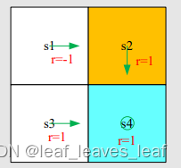

贝尔曼公式：

状态值（state value）： 设 γ = 0.9。那么可以计算出：

动作值（action value）可以通过状态值计算，或者根据第二章公式计算：考虑 s1，s1共有 5 个 action ，每个 action 都有一个 state value 

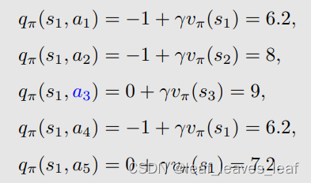

问题： 当前的策略（policy）不好，因为在 s1 的时候往右走了，进入禁区，那么如何改进？

答案： 我们可以根据动作值（action value）改进策略（policy）。

具体来说，当前策略 π(a|s1) 是

在这个策略下我们已经计算出来了 action value，观察我们刚才获得的动作值（action value）：

我们发现 a3 对应的动作值（action value）最大，那么能不能选择 a3 作为一个新的策略呢。如果我们选择最大的动作值（action value）呢？那么，新策略（policy）就是：

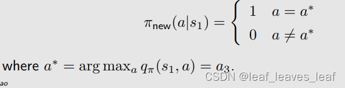

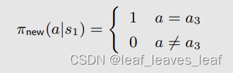

其中，a* 对应 action value 最大的那个 action，在这个例子里面是 a3 

------

 **问题：**为什么选择 action value 最大的 action 这样做能改进策略？

-   直觉：动作值（action value）可用于评估动作，动作值本身就代表了 action 的价值，如果选择一个 action ，他的 action value 很大，意味着之后能得到更多的 reward，相应策略也比较好。
-   数学：并不复杂，将在本讲座中介绍。
-   只要我们一遍一遍去做，不断迭代，最后一定会得到一个最优策略。也就是说，首先对每个状态都选择 action value 最大的 action，选择完了一次，然后再来一次迭代得到一个新的策略，再迭代得到一个新的策略，最后那个策略一定会趋向一个最优的策略

------

## 三.最优策略（optimal policy）的定义

状态值（state value）可用于评估策略好或者不好：如果有两个策略 π1 和 π2，它们在每个状态都有自己的状态值（state value），如果对所有的状态 s ，π1 得到的 state value 都大于 π2 得到的 state value，则 π1 比 π2 "更好"。

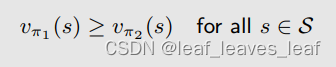

>   定义：如果对于所有状态 s ，策略 π∗ 得到的状态值（state value）相比任何其他策略 π 得到的状态值（state value）都要大，即 v_π∗ (s) ≥ v_π(s)，则策略 π∗ 是最优的。

这个定义引出了许多问题：

-   最优策略是否存在？因为定义里的最优策略非常理想，它比其他所有策略都要好，并且在所有状态上都能打败其它策略，那么是否存在这样的情况，最优策略在某些状态上能打败其它的策略，但是在某些状态上没法打败。
-   最优策略是唯一的吗？
-   最优策略是随机的（stochastic）还是确定的（deterministic）？
-   如何获得最优策略？

为了回答这些问题，我们研究了贝尔曼最优方程。

>   -   策略是对应很多不同状态的，如果一个策略只对应一个状态，那么如果想到达target就需要很多策略，这对算力要求非常大
>   -   策略是智能体在每个状态做不同动作的概率所组成的集合

------

## 四.贝尔曼最优公式（BOE）：简介

**贝尔曼公式：**（π(a|s) 是给定已知的，依赖于一个给定的 π）

 **贝尔曼最优方程（元素形式）：Bellman optimality equation (elementwise form)：**

在贝尔曼公式前面加上了 max_π，这时候 π 就不再是给定的了，因为这里面嵌套了一个优化问题，需要先解决这个优化问题求解出这个 π，再把这个 π 带到这个式子里面去，求解出状态值。

方程中已知与未知的值：p(r|s, a), p(s’ |s, a), r, γ 已知；v(s), v(s‘ ) 未知；π(s) 未知（贝尔曼公式依赖于一个给定的 π，而贝尔曼最优公式的 π 没有给定，需要求解）

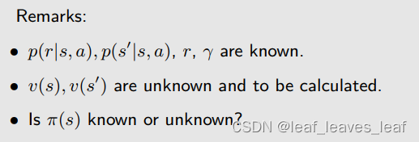

------

**贝尔曼最优方程（矩阵向量形式）Bellman optimality equation (matrix-vector form)：**也是在上一章（第二章）讲的贝尔曼方程的矩阵向量形式前面加上了max_π。状态值越大说明策略越好

其中与 s 或 s' 对应的元素是

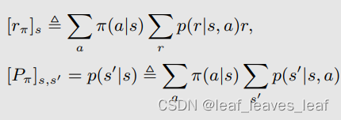

这里的 max_π 是以元素为单位进行的。

------

贝尔曼最优方程（BOE）既棘手又优雅！

-   为什么优雅？它以一种优雅的方式描述了最优策略（optimal policy）和最优状态值（optimal state value）。
-   为什么棘手？因为公式右侧有一个求最大化的最优问题，而如何计算这个最大化可能并不简单。

本课程将回答以下所有问题：

-   算法：如何求解这个方程？
-   存在性：这个方程有解吗？
-   唯一性：这个方程的解是否唯一？
-   最优性（Optimality）：它与最优策略（optimal policy）有何关系？

------

## 五.贝尔曼最优公式（BOE）：公式右侧求最大化的最优问题

在贝尔曼最优公式（BOE）中，有一个式子，却有两个未知量（状态值 v 和策略 π，对任意一个状态都要求出来最优的一个 π），如何求解呢？看如下例子：

-   Regardless the value of x：无论 x 的值是多少。这里的意思是（2x-1-a**）整体最大，所以（-a**）就得取最小。因为a的平方一定大于等于0，因此减去a的平方的那个数想要最大，必须要让a最小，a=0。
-   max_a(f(x,a)) 就是找到一个 a 使 f 最大

------

根据上面的例子得到启发，可以求解贝尔曼最优公式：

-   最初的方程中已知与未知的值：p(r|s, a), p(s’ |s, a), r, γ 已知；v(s), v(s‘ ) 未知；π(s) 未知
-   固定 v(s') 并求解 π，即给出 v(s') 的一个初始值，把初始值给定后，v(s') 变成已知的，第一行的大括号内部写成 q(s,a)，是已知的。下面要做的是把 π(a|s) 确定下来。
-   这里其实有多个 a，在网格世界中有 5 个 a，q(s, a1)，q(s, a2)，q(s, a3)，q(s, a4)，q(s, a5)

-   为了求解上述问题，再给出一个例子，假如已知三个 q 值，要解决的问题是求解三个系数或者叫三个权重，使得下面的目标函数（object function）达到最大
-   系数和权重应该满足和为 1 ，并且每个值都大于等于 0，之所以有这样的约束，是因为这个例子里面的系数对应上面的概率 π(a|s) ，概率 π 满足这样的性质
-   假设 q3 是最大的，最优解是 c3* = 1，c1*=c2*=0
-   下面这个例子的思路可以用在求解贝尔曼最优公式当中

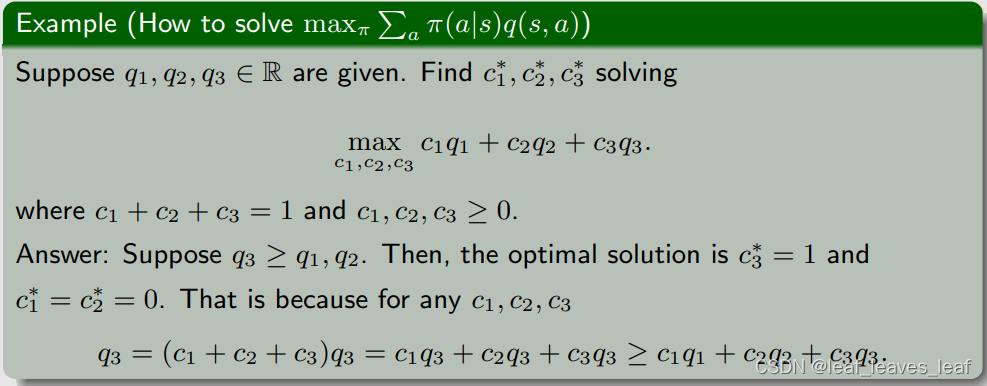

-   通过上面的例子，我们就知道了如果右边的 q(s,a) 确定了，如何求解最优的 π(a|s)，最后的结果就是右边这一项的最优值等于最大的 q(s,a) 值，这里 π(a|s) 的选取应该是对于 a* 等于 1，不是 a* 等于 0，这里 a* 对应最大的 q 值的 action，即 q(s，a*) 是所有 v 的取值里最大的

------

## 六.贝尔曼最优公式（BOE）：改写为 v = f(v)

可以把等式右侧写成一个函数 f(v)，之所以这样是因为求解等式右侧最大值 max_π 的方法是先固定 v ，就可以求出一个 π，至于这个 π 是什么样子，最后得到的最优值是什么我们不用太关心，我们知道右侧肯定是 v 的一个函数。本来右侧是 π 和 v 的函数，现在把 π 确定下来了，右侧就变成了 v 的函数（与上面第一个例子一样）

弹幕理解

-   对每一个v，都能求出一个max，这个max是和v有关的式子。那么把v看成变量，max就是v的函数了，把这个函数定义成f(v)
-   π 是 v 的函数，老师说了，所以右边整体都是v的函数
-   冒号等号代表定义的意思
-   其实就是分两步，第一步求max, 消掉pi; 第二步求出v
-   其实就是pi已知了，要开始求最大的state value
-   贝尔曼方程实际上是一组方程，对每一个状态都有一个贝尔曼方程
-   和选取的动作的概率无关，因为取最大值适合概率是1，所以只需要考虑v的值
-   参考前面向量形式的展开，这里f(v)第s个元素对应的是s下的最大v(s)

这样的话贝尔曼最优公式就化成了：

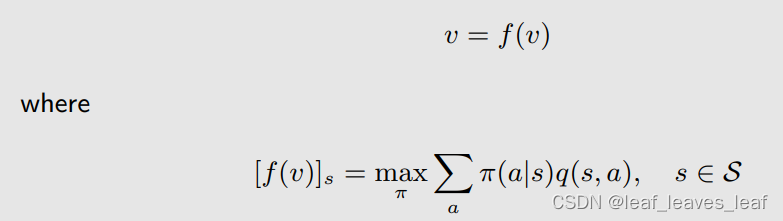

这里面的 f(v) 是一个向量，在这个向量中对应状态 s 的元素是

下面我们求解贝尔曼最优公式就求解 v = f(v) 即可

------

## 七.收缩映射定理（Contraction mapping theorem）

在求解 v = f(v) 之前，先介绍一个 Contraction mapping theorem，

**一些概念：**

-   **不动点（Fixed point）：**点 x 属于集合 X，f 是一个映射（或者叫函数），如果满足 f(x) = x，则 x 就被称为一个不动点

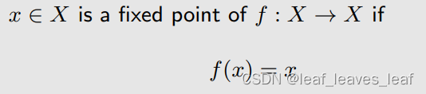

-   **收缩映射Contraction mapping（或收缩函数contractive function）（mapping 和 function其实是一回事）：**f 是收缩映射（contraction mapping），如果满足：（伽马可以自由选择的，只要在0到1之间）

考虑一个一维的例子：

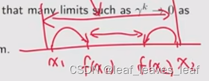

------

给一些例子解释上面的概念（伽马取值要求是0到1，但是这个contraction mapping成立是要求能够在0-1之间找到一个适合的伽马，因此在0.5-1之间的伽马当然符合定义）

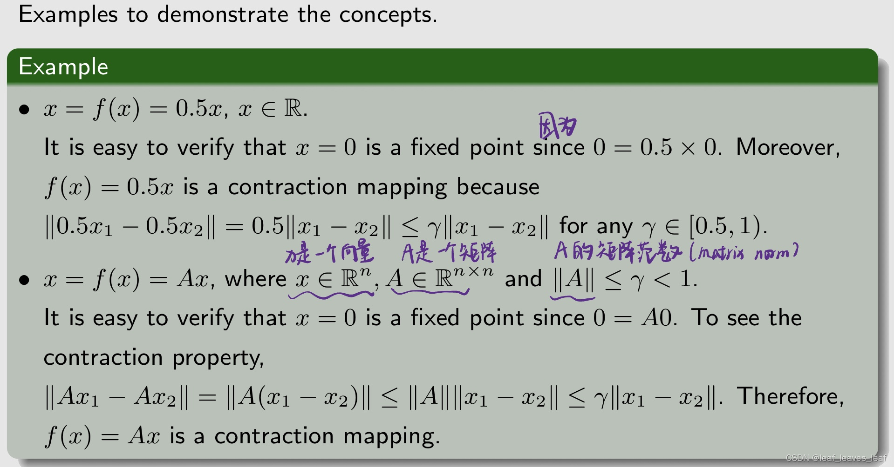

------

**Contraction mapping theorem定理：**

对于任何形式为 x = f(x) 的方程，如果 f 是收缩映射，那么满足

-   存在性：存在一个满足 f(x*) = x* 的不动点（fixed point） x*。我们不太关心 f 的表达式究竟是什么，只只要它是一个 Contraction mapping，就一定存在一个不动点（fixed point）满足 f(x*) = x*
-   唯一性：不动点（fixed point） x* 是唯一存在的
-   算法（求解这样的一个不动点（fixed point）的算法）： 考虑一个序列 {xk}，其中 xk+1 = f(xk) （迭代算法），则当 k → ∞ 时， xk → x*（即 xk 会收敛到 x*） 。此外，收敛速度是指数级的，非常快。（先给一个 x0，x1=f(x0) 求出 x1；再用 x2=f(x1)求出 x2，以此类推，求出的 xk 会收敛到 x*） 

------

**例子：**

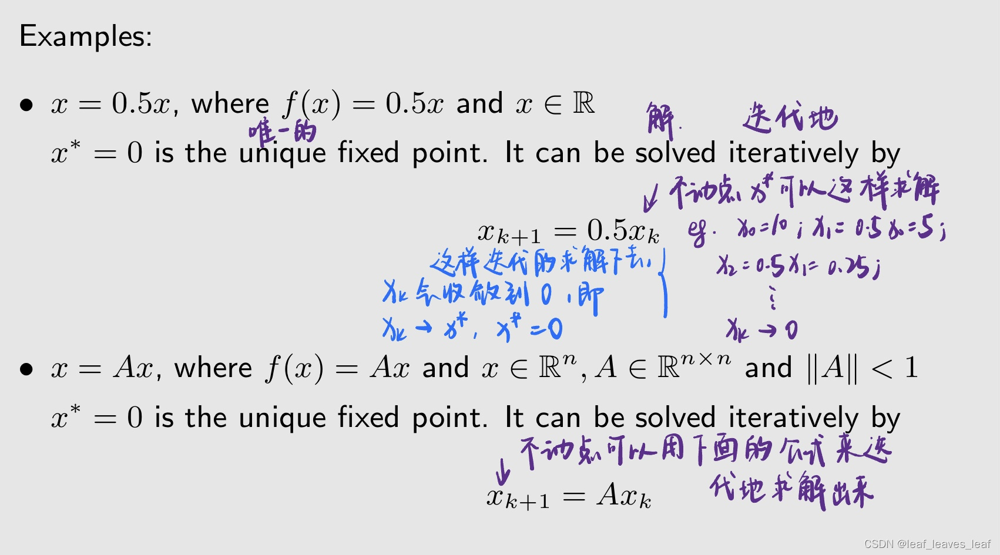

------

## 八.贝尔曼最优公式（BOE）：解决方案 

### 1.介绍

让我们再回到贝尔曼最优方程：v = f(v)，这个就是 Contraction mapping 要解决的那一类问题

为了应用 Contraction mapping theorem ，我们首先要证明贝尔曼最优公式里面的 f(v) 是一个 Contraction mapping：（下面定理的证明可以看赵老师写的书，这里不再详细介绍）

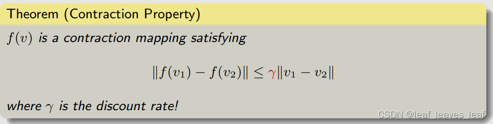

我们知道了 f(v) 是一个 Contraction mapping，那么贝尔曼最优公式就可以立刻用收缩映射定理（Contraction mapping theorem）来求解出来，可以得到以下结果：

重要：（1）中的算法称为值迭代算法。我们将在下一讲对其进行分析！本讲座更侧重于基本性质。

------

**下面详细解析一下由 Contraction mapping theorem 给出的迭代算法：**

迭代算法矩阵向量形式（Matrix-vector form）：

化成元素形式（Elementwise form）：即对于某一个具体的 s 状态这个算法是怎么运行的

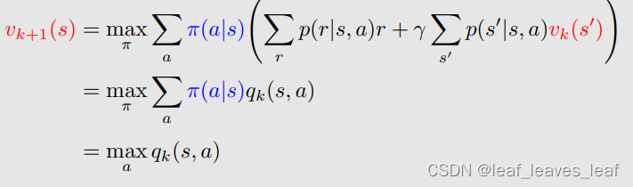

------

**下面再详细总结一下这个过程（Procedure summary）：**

-   对任意状态 s，即当前我们对解 v*(s) 有一个估计，这个估计是 v_k(s)，最开始可以是 v_0(s)，这个可以是任意的一个值
-   对任意状态 s 下的每一个 action，求解 q_k(s,a) ， v_k(s’) 是刚才第一步给定的（s' 是用来遍历的变量？？）
-   计算 s 的贪婪策略 πk+1 如下：基于 q_k(s,a) 我们得到一个新的策略，这个策略是 π_k+1(a|s) 会选择最大的 q_k(s,a) 对应的 a_k*（与第五部分思想一样）
-   计算 v_k+1(s) = max_a q_k(s, a) 

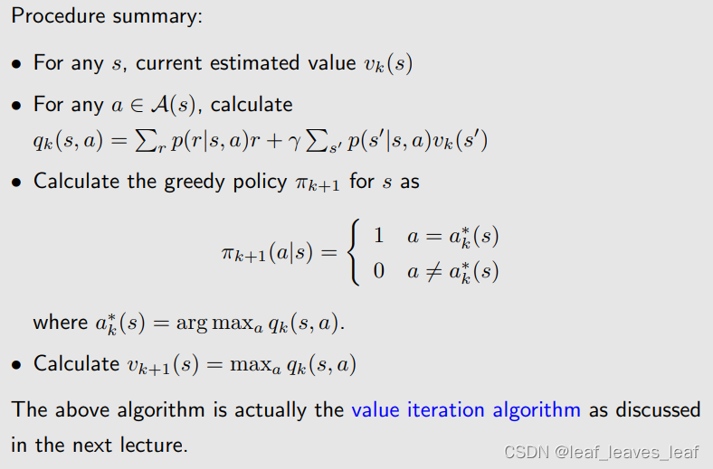

上述算法实际上就是下一讲中讨论的***\*值迭代算法（value iteration algorithm），这个算法其实计算由 Contraction mapping theorem 给出来的算法，只不过在下节课中我们会把它放到强化学习的一个上下文情境中去\****。

------

### 2.例子

举例说明： 手动解决 BOE 问题。

-   为什么要手动？可以更好地理解。
-   为什么例子这么简单？可以手动计算，方便大家更好理解。

动作：a_l、a_0、a_r 代表向左走、保持不变、向右走。
奖励：进入目标区域： +1；尝试走出边界：-1；其他：0

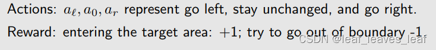

q(s, a) 的值（建立 q-value 的一个表 table）（这里的 q 是第五部分那个非常长的一串可以缩写成这样的一个 q）

>   q-value 其实可以理解为state value的一个action下的值，这里的 q-value 就是 action value

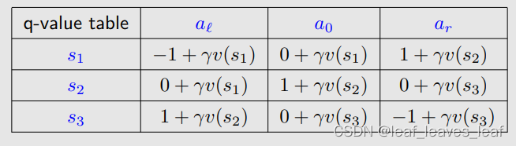

考虑 γ = 0.9

我们的目标是找到 v*(s_i) 和 π*（此时我们还没有将 v* 和 π*究竟是什么，我们只知道它是能够求解出贝尔曼最优公式对应的值和策略，之后我们会知道它们就是最优的状态值 state value 和最优的策略）

初始化v空间->找到各s处使v最大的a（得到policy）->更新v，重复

这个策略已经不错了，画出图后发现可以到达目标状态，已经达到了最优策略，但是 v 还没有达到贝尔曼最优公式的最优的解，所以还要继续迭代算下去，在考虑下一个 interation

可以无限迭代下去，如果要编程实现，可以写一个迭代终止条件，两者之差若小于一个很小的数字，我们任务再去迭代也没什么太大变化了，可以停下，认为 v_k 达到了贝尔曼最优公式的解

## 九.贝尔曼最优公式（BOE）：解的最优性

假设 v* 是贝尔曼最优方程（BOE）的解，可以用刚才介绍的算法求解出来。它满足：

假设：

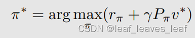

π* 是对应 v* 的一个最优的策略，也就是把 v* 固定住，可以求解出来一个 π ，这个 π 我们用 π* 来表示，那么把公式 2 代入公式 1，公式 1 可以化成下面的式子，也就是把前面的 max_π 去掉了，把它改成了 π* 

上面的公式 3 其实就是一个贝尔曼公式，因为贝尔曼公式一定是对应一个策略，那么上式就是对应 π* 的一个贝尔曼公式，这里的 v* = v_ π*，也就是 π* 对应的 state value，所以贝尔曼最优公式是一个特殊的贝尔曼公式，贝尔曼最优公式中对应的策略比较特殊，是一个最优的策略

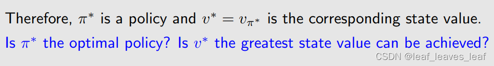

------

那么这个策略究竟是不是最优的，这个 state value v* = v_ π* 是不是最大的，下面的结论可以来证明：（只给结论，具体证明看书）

对于贝尔曼最优公式的解 v*，它是最大的 state value，对于任何一个其他的策略（policy）π，所得到的状态值（state value）v_ π 都没有 v* 大。那么相应的 π* 肯定是一个最优的策略，因为 π* 所对应的 v* 就是 v_ π*，它对应的 state value 达到最大。

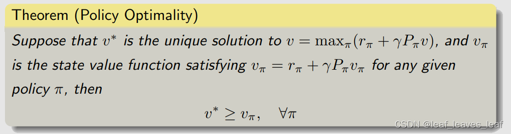

现在我们明白为什么要研究贝尔曼最优公式（BOE）了。这是因为它描述了最优状态值（optimal state value）和最优策略（optimal policy）。

------

**那么 π\* 长什么样子？**之前讲过，我们应该不陌生，也就是在状态 s 的时候 π* 会选择 a*，也就是在状态 s 对应的 action value 最大的那个 action，对这个 action 概率是 1，对其他 action 概率是 0.所以它是确定性 deterministic 的，也是贪婪 greedy 的，就是不论什么，反正就选择最大的。

------

## 十.分析最优策略（Analyzing optimal policies）

**哪些因素决定了最优策略（optimal policy）？**

从下面的贝尔曼最优公式（BOE）可以清晰地看到：

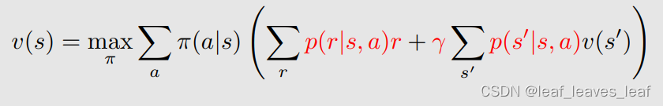

我们要做的是求出黑色字体的变量，它们分别对应了最优的策略和最优的 state value ；我们已知的是这些红色字体的变量，***\*它们分别对应了概率，这个概率就代表了系统的模型\****；r 是我们设计的奖励（reward）；γ 是折扣因子。

求解贝尔曼最优公式就是在已知红色的量的时候求出黑色的量，那么显然最优的策略和最优的 state value 就是由这些红色的量来决定：他们分别是怎么设计 r，怎么选择 γ，还有系统模型是什么样的

接下来，我们用实例来说明当我们改变 r 和 γ 的时候，最优策略会发生什么样的改变（因为系统模型一般很难改变，所以我们不考虑这个）

------

**举例：**

通过求解贝尔曼最优公式（BOE），可以得到最优策略（左图绿色箭头）和相应的最优状态值（state value）（右图格子上的数字）。

观察最优策略可以看出，最优策略没有绕开禁区（forbidden area），因为它发现进入禁区虽然暂时得到一个负数的惩罚，但是从长远来看我进入禁区到达目标所得到的回报（return）比绕一大圈再到达目标获得的回报（return）更大。最优策略敢于冒险：进入禁区！！

如果我们将 γ = 0.9 改为 γ = 0.5（其他参数不变，即设计的奖励 r 不变）

由左图绿色箭头可以看出，最优策略已经发生改变，(a) 的最优策略是进入禁区到达目标，而 (b) 的最优策略是绕一大圈到达目标，因为它衡量发现绕一大圈再到达目标获得的回报（return）比进入禁区到达目标所得到的回报（return）更大。最优策略变得目光短浅！避开所有禁区！

>   之所以这样是因为当 γ 比较大的时候，智能体比较远视，它会比较重视未来的 reward；当 γ 比较小的时候，智能体比较近视，return 里所得到的值的大小主要由近期所得到的 reward 来决定， γ 比较小它的幂次方就小，未来的 reward 会被打折的很厉害

如果我们将 γ 改为 0

最优策略变得极其短视！同时，只选择即时奖励（immediate reward）最大的动作！从很多状态出发根本无法达到目标！

如果我们在进入禁区时加大惩罚力度**（γ = 0.9）** 

最优策略也绕开了禁区

------

如果我们改变 r → ar + b，最优策略（optimal policy）会怎样呢？

例如：（给所有 r 全部 +1）

>   最优策略保持不变！因为重要的不是奖励（reward）的绝对值（absolute reward values）！而是它们的相对值（relative values）！

证明：（各位同学：应该满足a>0，否则最优对应求最小）

------

**举例：**

毫无意义的绕行？

通过求解贝尔曼最优公式可以得到图 (a) 左图的最优策略（绿色箭头）和右图的最优状态值（optimal state value）

(a) 中的策略是最优的，(b) 中的策略不是。

**问题：**为什么最优策略不是（b）？为什么最优策略不走毫无意义的弯路？我们定义从一个白色格子到另一个白色格子的 r=0，即走弯路不会受到惩罚。那么为什么最优策略不走毫无意义的弯路？

**答案：**因为折扣因子 γ 

-   自己的理解就是随着这一次没有惩罚，但是随着尝试次数变多，discount rate<1，后边获得相应的奖励就会变少。

>   由上面的例子得到的启发：在设计 reward 的时候，很多人可能会觉得每走一步应该给一个惩罚 r=-1，r=-1 代表能量的消耗，这样它就不会绕远路，就会尽可能走最短的路径到达目标，如果 r=0，没有 r=-1 好像就会绕远路，其实不是这样的，***\*因为除了 r 来约束它不要绕远路之外，还有 γ，因为越绕远路我们得到到达目标的奖励越晚，越晚那时候对应的 γ 的次方越小，奖励打折会很厉害，所有它自然会找一个最短的路径过去\****

------

## 十一.总结

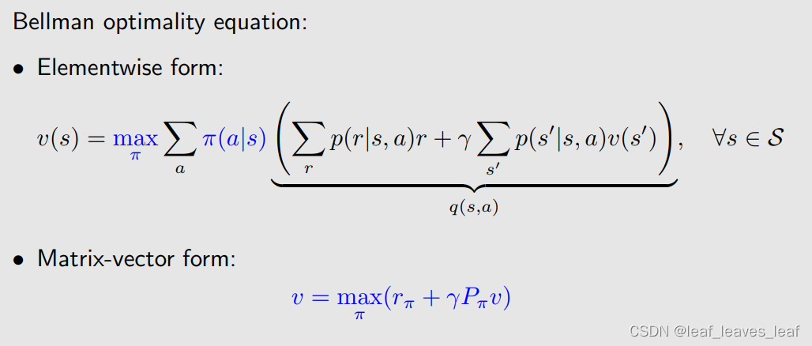

**有关贝尔曼最优方程的问题：**

-   存在性：这个方程有解吗？
-   有，根据收缩映射定理
-   唯一性：这个方程的解是否唯一？
-   是，根据收缩映射定理（最优状态值 optimal state value 这个解是唯一的，但是对应 optimal state value 的最优策略 π 不一定是唯一的）
-   算法：如何求解这个方程，如何求解最优策略和最优解？
-   根据收缩映射定理提出的迭代算法
-   最优性：我们为什么要研究这个方程
-   因为贝尔曼最优公式的解对应于最优状态值（state value）和最优策略（opyimal policy）

最后，我们明白了研究BOE的重要性！

