# 强化学习的数学原理 课程笔记 07 时序差分方法

### 一.内容概述

-   第五节课蒙特卡洛（Mento Carlo）方法是全课程中第一次介绍 model-free 的方法，本节课的 Temporal-difference learning（TD learning）是我们要介绍的第二种 model-free 的方法。
-   基于蒙特卡洛（Mento Carlo）的方法是一种非递增（non-incremental）的方法，Temporal-difference learning（TD learning）是一种迭代式（incremental）的方法
-   第六节课的内容是本节课的铺垫
-   下节课会介绍 value function approximation 的方法，这个是基于现在我们要介绍的 TD 算法，不过这节课介绍的是基于 table 的（tabular representation），下节课会介绍基于 function 的 representation。非常经典的 deep Q learning 也会在下节课介绍。

------

本节课内容：

-   激励性实例（Motivating examples）
-   估计 state value 的 TD 算法：（在第四章我们使用模型计算 state value（做 state value estimation），在第五章使用蒙特卡洛计算 state value（做 state value estimation），在这章使用时序差分计算 state value（做 state value estimation），所以它们都是在做类似的事情，但是用的方法不一样。）
-   估计 action value 的 TD 算法：（Sarsa 算法）：使用 TD 的思想来学习 action value，然后得到 action value 可以以此为据去更新策略，得到一个新的策略再计算它的 action value，这样不断循环下去就能够不断改进策略，直到最后找到最优的策略。
-   估计 action value 的 TD 算法：expected Sarsa （Sarsa 算法的变形）
-   估计 action value 的 TD 算法：n-step Sarsa （Sarsa 算法的变形）
-   估计最优 action value 的 TD 算法：Q-learning：直接计算 optimal action value，所以他是一个 off-policy 的算法。这就涉及到了 on-policy 和 off-policy 两个概念，在强化学习中有两个策略，一个是 behavior policy，它是用来生成经验数据的，一个是 target policy，这是我们的目标策略，我们不断改进希望这个 target policy 能够收敛到最优的策略。如果 behavior policy 和 target policy 这两个是相同的，那么它就是 on-policy，如果它们可以不同，那这个算法就是 off-policy。off-policy 的好处是，我可以用之前的别的策略所生成的数据为我所用，我可以拿过来进行学习然后得到最优的策略。
-   一个统一的观点：将这些算法进行比较
-   总结

------

### 二.激励性实例（Motivating examples）-随机问题（stochastic problems）

下面讲几个例子，讲这个例子的目的是为了建立起上节课和这节课的关系

接下来，我们将考虑一些随机问题（stochastic problems），并展示如何使用 RM 算法来解决这些问题

------

首先，考虑简单的均值估计问题（mean estimation problem）：（之前的课程都在反复讲这个问题，我们会从不同角度介绍这个问题）：mean estimation 问就是要求解一个 random variable X 的 expectation，用 w 来表示这样一个 expectation 的值，现在有的是 X 的独立同分布（iid）采样，用这些采样求 expectation。这个问题有很多算法可以求解，这里讲解 RM 算法

-   要求解 w，先把它写成一个函数 g(w)=w-E[X]，求解 g(w)=0 的方程，这个方程求解出来自然可以得到它的解 w*=E[X]
-   因为我们只能获得 X 的采样 {x}，w - x 是 g 的测量 g~

-   这么看的话\alpha_k的取值也是权衡历史值和当前采样，所以也有一种“记忆”的味道在里面 
-   每次考虑了期望值和结果采样值的差距进行考虑

------

第二，考虑一个稍微复杂一点的例子：

------

第三，考虑一个更复杂的例子：

下面这个式子的变量符号都是有目的使用的，R代表 reward，γ 代表 discounted rate，v 就是 state value，X 就是对应 state value 的 state。

-   这样就可以求出来 action value 了
-   可以model-free的方式求action value的期望！

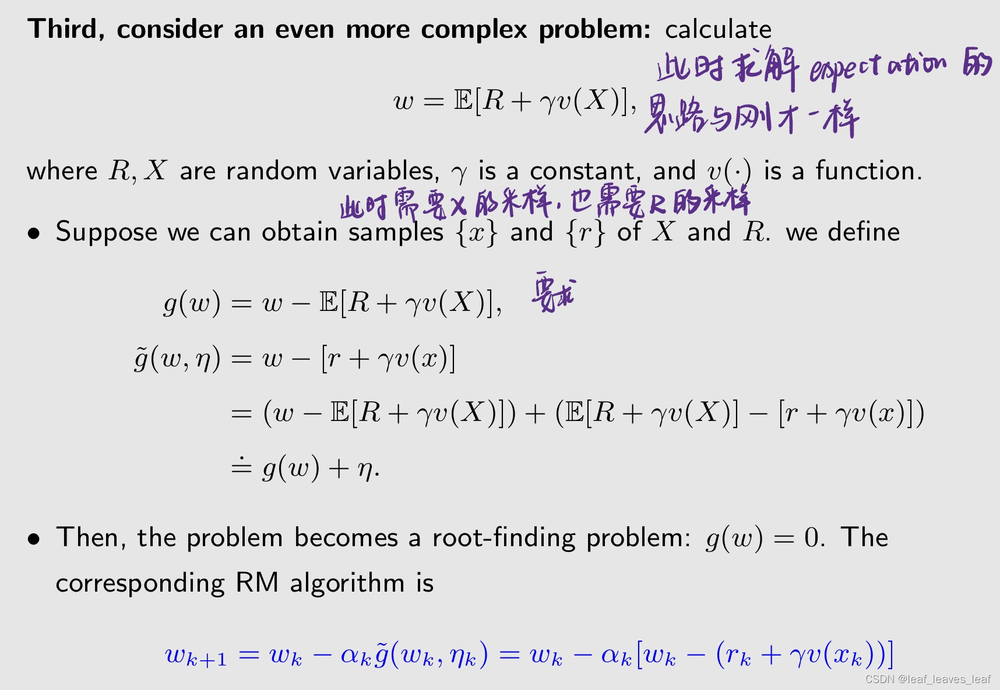

------

快速总结：

-   上述三个例子越来越复杂。
-   它们都可以用 RM 算法求解。
-   我们将看到 TD 算法也有类似的表达式。

------

### 三.估计 state value 的 TD 算法（TD learning of state values）

先学习如何用 TD 算法求解一个给定的策略 π 的 state value，之所以求解 state value，是因为求解出来了 state value 就相当于作了 policy evaluation，之后和 policy improvement 相结合，就可以去找最优的策略

**请注意**

-   TD 学习算法通常指的是一大类 RL 算法。今天这节课讲的所有的算法都是 TD 算法，包括 Q learning
-   TD 学习算法也指下面即将介绍的一种用于估计状态值（state value）的特定算法，下面即将讲的 TD 算法是最经典的 TD 算法，就是来估计 state value 的，有一个非常明确的表达式，这时候它是指一个特定的算法。 

**算法所需的数据/经验：TD 算法是基于数据，不基于模型实现强化学习的，算法使用的数据/经验（data/experience）如下：\**这些数据全都是由一个给定的策略 π 所产生的，下面的 TD 算法就是要用这些数据估计 π 所对应的 state value\****

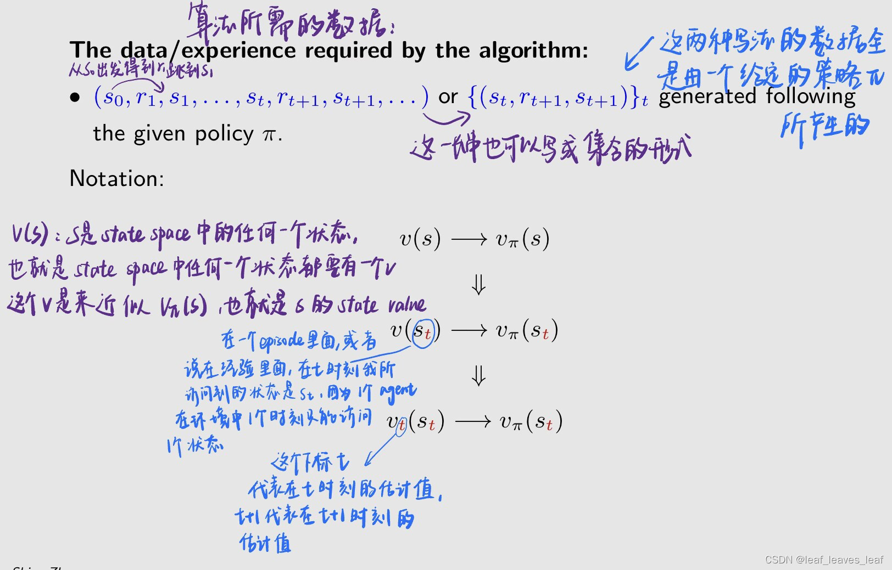

-   之前不理解为什么v_t(s_t)不写成v_k(s_t)，原来一组{s_t,r_t+1,s_t+1}刚好用来更新一次v，所以两个不同意义的下标k和t其实是同步的。 
-   v下边的t 和 s下边的t是一回事吗？感觉s是采样的时间点，v下边的t是迭代次数

下面 TD 算法就是要用这些数据来估计 π 对应的 state value，**下面正式的给出 TD 算法，包含两个式子：** 

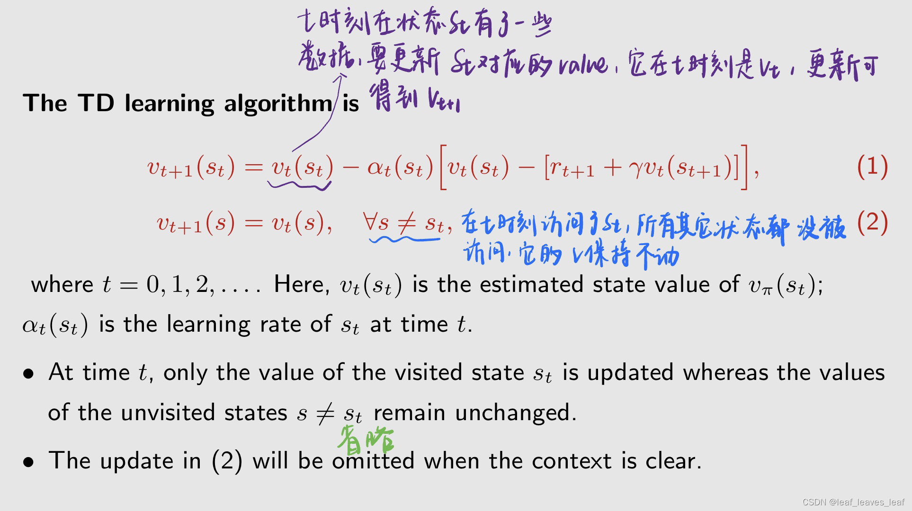

-   最下面两点的翻译：1)在时间t，只有访问状态st的值被更新，而未访问状态s≠st的值保持不变;2)当上下文清楚时，将省略公式（2）中的更新
-   实际上我们平时看 TD 算法的时候，看不到第二个式子，因为第二个式子隐含掉了，虽然忽略掉了，但是从数学上来讲，是有这样一个式子存在的

下面详细介绍第一个式子：

下面详细介绍上面式子中的两项：

为啥v的下标不用k呢？v下标里的t和s的下标不是同一个t吧

-    针对某一组数据的吧，同一时刻只能访问一个状态，所以下标一样
-   这里的t是指的某一时刻的各个变量的值，t+1就代表下一个时刻的值，即我们更新之后的值，没什么问题啊
-   v的脚标t代表迭代，s的脚标t代表位置
-   是把时间步当成迭代步
-   是同一个t，表示t时刻所在的状态

 为什么是t+1时刻的v朝着t时刻v的趋近?

-   这个Vtbar是不是也在随t而变化 
-   vtbar在t时刻是不变的，在下一个时刻会写作vt+1bar

s 的下标和v的下标都是用t表示，但是意义不同吧？v的下标t表示时间，s的下标表示第t个状态

-   我感觉都是表示时间，st+1和st可能根本就不是同一个状态
-   我个人认为在t时刻，v迭代到了第t次，visit的状态s也达到了第t个
-   感觉两个t是一样的，因为s每变一步，只更新一次v

 误差期望为啥是0呢

-   因为这就是自己减自己，贝尔曼公式嘛

V pi 是最优价值吗？

-   v_pi 是在给定策略pi下的state value. 定义记不清可以复习第二课
-   v_pi是对当前策略pi的评估，用来改进策略 

TD误差（TD error）可以解释为创新（innovation），当前我对 vπ 有一个估计，这个估计可能是不准确的，然后来了一个新的**数据/经验（data/experience）**，然后把这个**数据/经验（data/experience）**和我的估计联系到一起，就计算出来了 error，这个 error 的存在说明当前的估计是不准确的，可以用这个 error 来改进我当前的估计，这意味着新的从经验中获得的信息(st, rt+1, st+1)。

------

**下面介绍 TD 算法的一些其他性质:**

-   (3)中的TD算法仅估计给定的一个策略的状态值（state value），所以刚才介绍的 TD 算法只是估计 state value，只是来做 policy evaluation 这样的事情。
-   它不估计动作值（action value）。
-   它不寻求最优策略（optimal policies）。
-   稍后，马上会介绍一系列 TD 算法，他们能够估计 action value，并且和 policy improvement 的步骤结合，就能搜索最优策略。
-   尽管如此，(3)中的TD算法是理解的基础核心思想，之后介绍的 TD 算法和（3）中非常类似。

------

**问：这种 TD 算法在数学上有什么作用？
答：它求解给定策略 π 的贝尔曼方程。**

在介绍贝尔曼公式的时候我们已经给出了算法，给出了 closed-form solution 和 iterative solution，在那时候介绍的算法是依赖于模型的，现在是没有模型的。

 如何理解依赖模型和未依赖模型呢？

-   模型 model 提供了p(r|s,a)和p(s'|s,a)吧。
-   有模型是从一个状态到下一个状态有明确的概率
-   看有没有distribution吧
-   没有模型就用数据去逼近
-   模型是系统的先验知识

因此，**TD 算法是在没有模型的情况下求解贝尔曼公式**。下面要做的就是证明这句话：

**首先，引入一个新的贝尔曼公式**

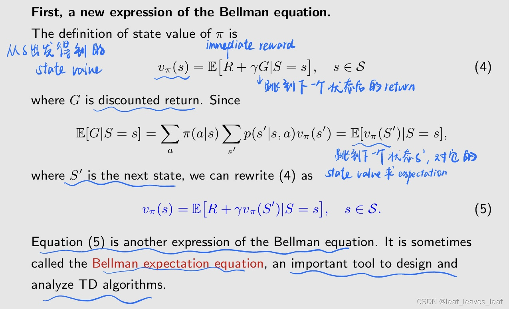

**之所以介绍这个贝尔曼公式是因为，TD 算法从本质上讲是求解公式（5）这样一个 equation**

公式(4)中的S=s和之前讲的S_t=s是一样的吗？

-   我理解这个t是在具体算法中应用时加上的，体现迭代过程，这部分在讲理论，不涉及迭代
-   这是换了个表达而已，你把时间下标还原回去就明白了，条件改成S=s_t, S'=s_t+1
-   G本来就是下个状态S
-   相当于是这一步=下一步之后的state value +这一步的immediate reward

------

***\*第二，使用 RM 算法求解公式（5）这样的贝尔曼公式。\****之后我们会看到，推导出的 RM 算法与刚才介绍的 TD 算法非常类似，通过这个可以知道，TD 算法就是求解贝尔曼公式的一个 RM 算法

>    所谓model less 就是把状态转移和策略这些未知的概率都积分掉了
>
>   -   老师的课可能刚开始有疑问，把问题记下来，课程后半部分基本都能解答了
>   -   哪里来的积分？就是不知道，只能通过采样拿到的数据去反推
>   -   应该讲是通过蒙特卡洛把概率变成了采样
>   -   除了MPC算法外，一般的model-free方法是通过与环境交互来学习策略，而不是通过积分掉未知的状态转移概率和策略。
>   -   不懂你说的积分掉是啥意思，我感觉是试出来的价值，也就是你说的和环境交互的学习

------

**因此，求解贝尔曼公式（5）的 RM 算法是公式（6）：**

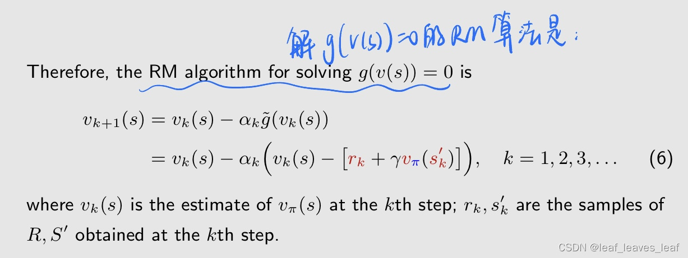

(6) 中的 RM 算法有两个假设值得特别注意。这个式子和刚才我们介绍的 TD 算法非常类似，但是有两个小的不同点：

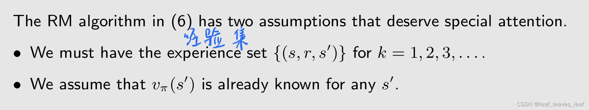

-   在这个公式中我们要反复得到 r 和 s' 的采样，当前时刻从 s 出发跳到 s'，下一时刻还得从 s 出发跳到 s'，要反复采样。这个和 TD 算法中使用 episode 这种时序的顺序的访问是不一样的
-   上面式子用蓝色标记出来了，在计算 v_k+1 的时候，要用到 v_π(sk')，也就是 sk' 真实的状态值 v_π，但是 v_π 是不知道的。

下面解决这两个不同点：

为了消除 RM 算法中的两个假设，我们可以对其进行修改。

-   要解决第一个问题就是要把一组采样 {(s, r, s')} 替换成一组序列  {(st, rt+1, st+1)} ，简而言之就是不是从 s 出发得到 r 然后得到 s'，然后再从 s 出发得到 r 然后得到 s'，而是得到一个 trajectory，如果这个 trajectory 恰巧访问到了 s，就去更新一下 s，如果不访问到 s，那么 s 对应的估计值就保持不动，这样就可以用一个序列对所有 s 的 v 都进行更新。
-   另一个修改是，因为我们事先不知道 v_π(s')，这是我们要求的，可以把这个 v_π(s') 替换成 v_k(s_k')，也就是替换成 s' 这个状态它的估计值 vk。即用对它的估计值来代替 v_π(s')。**（问题：在 v_π 的时候能够收敛，现在给了一个 v_k 是不准确的，还能确保收敛吗？答案是肯定的）**

对上面的问题的直观解释是：如果写成 v_π(sk')，其实只有一个式子，也就是对 s 的值进行不断地更新，如果写成 v_k(sk')，那对每一个状态都有这样一个估计值，虽然此时此刻这个估计值不准确，但是在其他地方会对估计值进行修正，最后所有状态的估计值都会收敛到 v_π

这里直观解释是为什么呢？为什么是所有的状态？

-   就是对于trajectory的每一个s都用这个公式更新到收敛，实际应用时我们的trajectory会取到所有的s

>   以上是用 RM 算法求解贝尔曼公式的一个思路，当然这个思路相对直观一些，下面会给出它的严格收敛性的分析

------

TD 算法严格的收敛结果是下面一个定理：

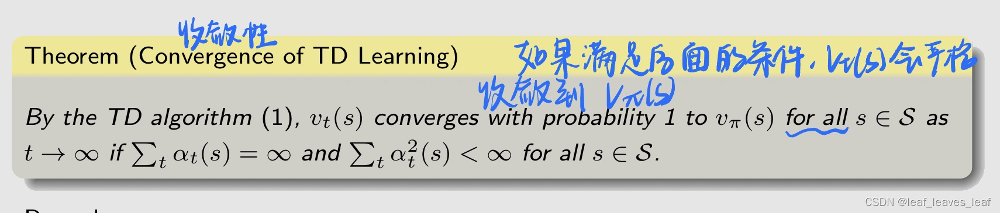

强调：

-   这个定理说的是，状态值 state value v_t(s) 会收敛到真实的状态值 v_t(s)，所以 TD 算法本质上还是在做一个 policy evaluation 的事情，而且是针对给定的一个策略 π。（该定理说明，对于给定的策略 π，TD 算法可以找到策略 π 的状态值）。那么我们怎么样去改进这个策略找到最优的策略呢，因为强化学习的最终目的是找到最优策略，之后我们会介绍，我们需要把 policy evaluation 和 policy improvement 两个相结合才可以）
-   αt 应该满足两个式子：
-   对任意一个 s，它的和 αt(s) 都应该趋于无穷，即每个状态 s 都应该被访问很多次。当每一个状态被访问的时候对应的 αt(s) 就是一个正数，当当前的 trajectory 是访问其他的状态，那么这个状态没被访问的时候对应的 αt(s) 就是 0，所以 αt(s) 求和等于无穷意味着它实际上被访问了很多次
-   第二个条件 α 2 t (s) < ∞ 要求 αt 最终收敛到 0，实际当中，学习率 αt 通常被选为一个小常数。在这种情况下，条件 （α 2 t (s) < ∞ 看图片）已经失效，即这个条件不成立（因为 αt 不等于 0），但是在实际当中为什么这么做呢，因为实际中是比较复杂的，我们希望很久之后我所得到的这些经验仍然能够派上用场，相反如果 αt 最后趋向于 0 了，那很久之后的经验就没用了，所以我们只是把它设置成一个很小的数，但是不让它收敛到完全是 0。当 α 为常数时，仍然可以证明算法在期望意义上收敛。

------

虽然 TD learning 和 MC learning 都是无模型（model-free）学习，但与 MC learning 相比，TD learning 有哪些优缺点？

下面表格里在 TD 的部分还写了 Sarsa，Sarsa 是接下来马上要讲的一个算法，可以用来估计 action value，Sarsa 和 TD 算法的表达式基本上一样

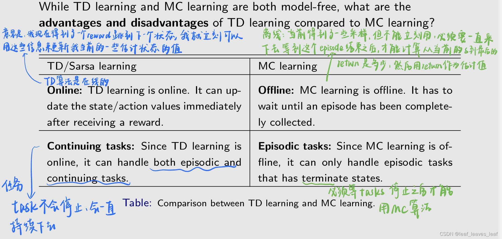

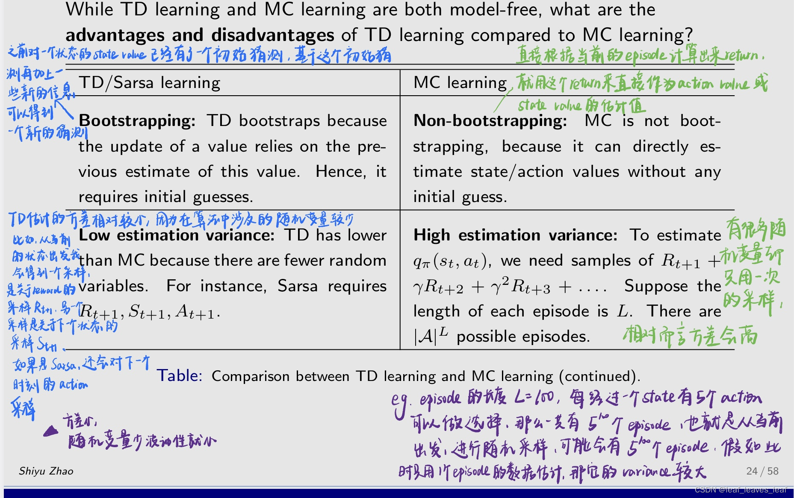

虽然 TD 算法的方差比较小，但它的 mean 或者 expectation 是有偏差（bias）的，就是因为它是 boostrapping，它依赖于初始的估计，如果初始的估计不太准确的话，那么这个不准确的估计会进入到估计的过程中造成 bias，但是随着越来越多的数据进来，会把这个 bias 给抵消掉，直到最后能够收敛到一个正确的估计值

相反 MC learning 虽然有较高的方差，但是因为它不涉及到任何的初始值，所以它的 expectation 直接等于它真实的 action value 或 state value，所以它是无偏估计

-   偏差和方差不可调和，只能折中
-   不是说最后都会收敛到Vpi吗

------

### 四.估计 action value 的 TD 算法（TD learning of action values – Sarsa）

接下来三个小结会（四到六）介绍 Sarsa 算法及其变形，然后第七章介绍 Q learning

-   Sarsa 算法及其变形在做的事情解释给定一个策略能够估计出 action value。所以他们能够做 policy evaluation，然后再结合 policy improvement，就可以找到最优的策略。
-   Q-learning 直接来求解 optimal action value，从而可以直接找到最优策略

------

-    上一节介绍的 TD 算法只能估计一个给定策略的 state value，但是我们知道要改进策略的时候需要估计出 action value，这样的话哪个 action value 大，就选择哪个作为新的策略。
-    接下来，我们将介绍一种可以直接估计 action value 的算法--Sarsa。Sarsa 和 TD 算法的形式非常类似，只不过估计得的是 action value。Sarsa 估计出 action value 之后，在做的其实就是 policy evaluation，就是你给我一个策略，如果把这个策略的 action value 估计出来，但这个还是不能找到最优的策略，强化学习的目的是找到最优策略。那么可以把 Sarsa policy evaluation 这个算法和 policy improvement 那个算法结合起来，就可以找到最优策略
-    我们还将了解如何使用 Sarsa 寻找最优策略。把 Sarsa policy evaluation 这个算法和 policy improvement 那个算法结合起来，就可以找到最优策略。**所以接下来我们会介绍两部分：**

第一部分我们先来看，如果你给我一个策略，怎么把 action value 估计出来。首先，我们的目标是估计给定政策 π 的行动值。

因为没有模型，所以要有数据，或者说要有经验 experience。假设我们有一些经验 {(st, at, rt+1, st+1, at+1)}t，这是一个集合，这个集合有很多个不同时刻的 t，每一个时刻所对应的经验是 st, at, rt+1, st+1, at+1

有了这些数据之后，我们可以使用下面的 Sarsa 算法来更新，来估计 action value：

 

------

**为什么这个算法叫 Sarsa？**

这是因为算法的每一步都涉及（st、at、rt+1、st+1、at+1）。Sarsa 是 state-action-reward-state-action 的缩写。

**Sarsa 与之前的 TD 学习算法有什么关系？**
我们可以用动作值估计 q(s, a) 代替 TD 算法中的状态值估计 v(s)，从而得到 Sarsa。因此，Sarsa 是动作值版本的 TD 算法。把 TD 算法对状态的估计改成对 action value 的估计，就得到了 Saesa 算法。

**Sarsa 算法在数学上是做什么的？Sarsa 算法在解决一个什么样的数学问题呢？**

刚才的 TD 算法是求解了一个贝尔曼公式，Sarsa 算法也是求解了一个贝尔曼公式，只不过这个贝尔曼公式的形式有所不同。从 Sarsa 算法的表达式来看，它是一种随机逼近（stochastic approximation）算法，可以求解以下方程（以下贝尔曼公式）：

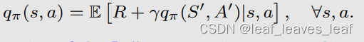

与之前我们看到的所有贝尔曼公式不同的是，它是用 action value 表达的，而不是 state value，所以这个贝尔曼公式刻画了不同的 action value 之间的关系。这是用行动值表示的贝尔曼方程的另一种表达方式。我在书中给出了证明。

------

**定理（Sarsa learning 算法的收敛性）**

这个定理和刚才的 TD 算法的收敛性一样

该定理说明，对于给定的策略 π，Sarsa 可以找到 action value。

这个定理告诉我们 q_t 只是收敛到了 q_π，就是给定一个策略，估计出来了了 action value，所以下面为了要得到最优的 policy，我们还需要把这个过程和一个 policy improvement 相结合才可以

------

RL 的最终目标是找到最优策略（optimal value）。

为此，我们可以将 Sarsa 与策略改进（policy improvement）步骤相结合。

这种组合算法也被称为 Sarsa，或者说在大多数情况下我们听到 Sarsa 的时候是把 policy evaluation 和 policy improvement 这两个结合之后的算法。

之前在网格世界中，如果到达了目标可以一直执行策略不需要停，现在我们更已关注的是从一个状态出发怎么样能够到达目标，也可以到达目标之后强行停下，也可以到达目标之后不要停，都可以，区别不大。

1.   收集给定（st，at）的经验样本（rt+1，st+1，at+1）：通过与环境互动生成 rt+1，st+1；根据 πt(st+1) 生成 at+1。

或 1. 在 t 时刻要得到一个经验 experience（st、at、rt+1、st+1、at+1）： 具体来说，在 st ，根据当前的策略 take action a_t 行动，得到 reward r_t+1，跳到下一个状态 s_t+1，在下一个状态的时候再根据那个状态的策略在进行一个 action 的采样得到 a_t+1，就得到了 Sarsa 的 experience。基于这个 experience，下面要做的就是这个 q value 的 update，或者叫 policy evaluation

2.更新（st，at）的 q 值：

3.做 policy update 进行更新，即 policy improvement

在更新了 q value 后，会立刻进行策略的更新。这和之前讲的 policy evaluation 不完全一样，因为 policy evaluation 是当前策略 π_t 要得到很多数据，然后把它的 action value 准确的给估计一下。但是这里只执行一下并没有得到很准确的 action value，就立刻切换到 policy update 当中。

------

**关于此算法的说明**

-    q(st, at) 更新后，st 的策略立即更新。这是基于广义策略迭代（generalized policy iteration）的思想。之前学的 policy iteration 在每一个 iteration 中都分为两个步骤：policy evaluation 和 policy improvement，但是我要计算 policy evaluation 准确的 state value 的时候需要无穷步，而实际当中只计算一步或者几步，没有得到精确的 state value，但是也会立刻切换到 policy 的更新中 policy improvement，刚才介绍的 Sarsa 也是基于这样的思想
-    策略是 -greedy 的，而不是 greedy 的，以很好地平衡开发和探索，能够尽可能访问到更多的 （s,a），然后找到更优的策略。

**强调：**

刚才讲了两部分，第一部分就是给定一个策略怎么求解对应的贝尔曼公式得到 Sarsa 这样一个迭代的算法，那个复杂的迭代的式子是用来做 policy evaluation 就是来求 action value 的。第二个是怎么把 policy evaluation 和 policy improvement 相结合然后找到最优策略，

**明确核心思想和复杂性：**

-    核心理念很简单：即使用算法求解给定策略的贝尔曼方程。
-    当我们试图找到最优策略并高效工作时，复杂性就出现了，因为我还需要迭代去改进策略，还需要让这个策略是 -greedy 的。

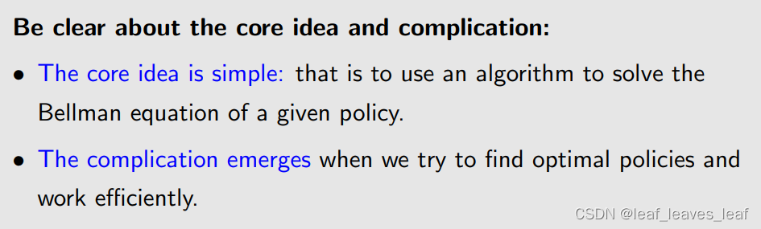

------

**下面通过一个例子来例证 Sarsa**

**任务描述**：任务是找到一条从特定起始状态到目标状态的良好路径。(The task is to find a good path from a specific starting state to the target state.)

-    这项任务不同于之前所有的网格世界的任务，之前所有网格世界的任务是需要为每个状态找出最优策略！但是在这个任务里，不已关注每一个状态，只已关注从一个特定的状态到目标的一个策略或者说路径
-    在这个例子里，每一个 episode 都从左上角的状态开始，以目标状态结束。
-    今后在学习课程的时候，请注意任务的内容。我们是要找一个从特定状态出发的情况，还是要找所有状态的最优策略。

下面的图是用 Sarsa 找到的最优策略，这个最优策略是从一个初始的不好的策略开始所得到的，初始的状态是从左上角出发，沿着策略中概率大的方向可以到达目标，但是很多其它的状态还没有达到最优策略，并不是所有状态的策略都是最优的。

并且有可能虽然找到的这条路径能到达目标，但是不是最短的或者最优的，而最优的恰好是在没有探索的地方，这是有可能的。所以这个问题就是你是想找到所有状态的最优策略，还是只想找到一个可行的路径就可以，如果你是想找到所有状态的最优策略，那你就必须去探索所有的 state action pair

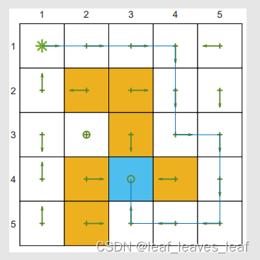

在这个任务中，我们进行了五百次探索，一共有五百个 episode，横坐标代表不断地根据改进的策略重新采集得到的 episode index。

纵坐标第一个图代表沿着每个 episode 我所得到的 total reward，最开始的 reward 比较负，因为最开始的策略不好，他可能是往墙上撞或者进入到 forbidden area，会有很多负的 reward 进来，随着策略不断改进，reward 也会变得越来越大，但是在这里并没有超过 0，那么到达目标应该是正数，为什么没有超过 0 呢，因为这里是 -greedy 的策略，或多或少还是会有负数的 reward 进来。

纵坐标第二个图代表 episode length，最开始的 episode 比较长，因为最开始的策略可能是不好的，可能走了很久才瞎猫碰到死耗子刚好碰到了 target area，但是随着不断改进，最开始可能好几百步才能到达目标，现在几十步就可以到了。

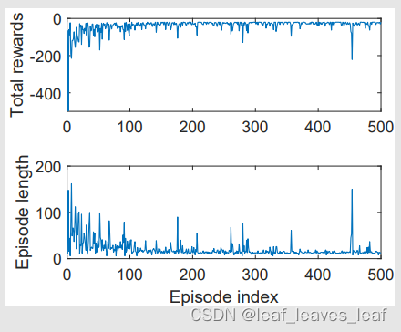

------

### 五.估计 action value 的 TD 算法（TD learning of action values: Expected Sarsa）

从 Sarsa 出发的改进算法，从一个经典的 Sarsa 算法出发，做改进，是做研究非常常见的思路。

Expected Sarsa 算法是 Sarsa 算法的一个变种：

**与 Sarsa 算法进行比较：**

-   第一条翻译：TD target 变了
-   第二条翻译：相比 Sarsa，计算量要求更大，因为要计算一个期望的式子。但是去掉了 a_t+1，不再需要对 a_t+1 进行采样，涉及到的随机变量个数减少了，相对而言随机性也会减少
-   第二条翻译：需要更多计算。但从减少估计方差的意义上来说，它是有益的，因为它将 Sarsa 中的随机变量从 {st, at, rt+1, st+1, at+1} 减少到 {st, at, rt+1, st+1} 。

------

**该算法在数学上有什么作用？在解决什么样的数学问题？**

我们知道 Sarsa 算法是在求解一个贝尔曼公式，Expected Sarsa 是一种随机逼近算法，也是在求解一个贝尔曼公式，只不过这个贝尔曼公式的形式又发生了一些变化：

把 expected Sarsa 用到之前提到的例子当中，任务是从左上角的初始状态出发，找到到达目标的一个轨迹或者策略，根据 expected Sarsa 得到的策略如下左图，沿着概率较大的方向走，能够到达目标。因为我们只需要找到从特定初始状态出发到达目标的路径，其它状态的策略可能不是最优的，但这并不是我们关心的。

下面右图展示了在这个过程中，随着逐渐学习，每个 episode 收集的 reward 越来越大，同时这个 episode 到达目标的长度所需要的步数也越来越少。

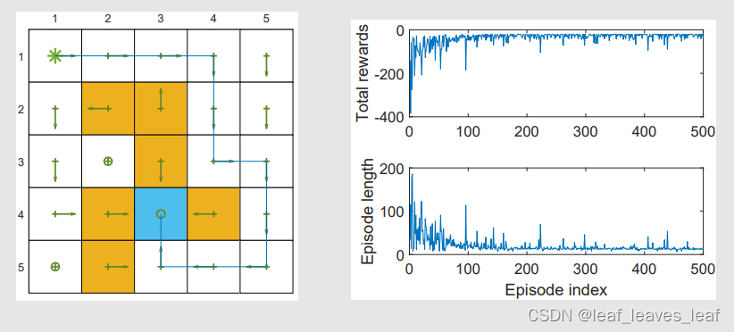

------

### 六.估计 action value 的 TD 算法（TD learning of action values: n-step Sarsa）

n-step Sarsa：可将 Sarsa 和蒙特卡罗学习（Monte Carlo learning）统一起来，包含了 Sarsa 和 Mento Carlo

-   就是用一个时间步以后的数据来估计上一个时间步还是用n个时间步的数据来估计上一个时间步的区别。
-   两者的区别是一个采样全路径，一个采样一点即用，折中就是nstep
-   可以想象成随机梯度下降和mini-batch的区别
-   又是truncated的思想是吧

大写的是随机变量，小写的 是一个采样

n-steps Sarsa 算法是：

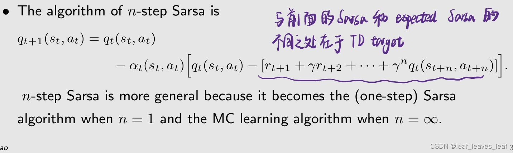

n 步 Sarsa 算法更为通用，因为当 n = 1 时，它变成了（一步）Sarsa 算法

而当 n = ∞ 时，若选取 α_t 恒等于 1，它变成了 MC 学习算法。

错了吧，蒙特卡洛需要采样多次，这个仅采样一次？

-   蒙特克罗是一次采样对应多个随机变量

这个为什么是1啊？

-   因为alpha代表每次迭代的步长，对于MC算法来说只是单纯的估计，没有所谓的多次迭代，步长就可以设置为1
-   alpha是人为取的，满足条件就可以收敛
-   MC是直接估计出expectation，不需要再用RM求解expectation，

------

-   所有算法都需要数据，Sarsa 需要下面序列里前五个数据 (st, at, rt+1, st+1, at+1），在 t 时刻我能得到这五个数据，就可以直接用；而蒙特卡洛需要下面序列里无穷多个，或者一直到 episode 结束所有的这些数据我才能计算 t 时刻 st 对应的 action value；那么 n-step Sarsa 是折中的，既不能只用前五个就来计算刚才那个式子，也不需要等到所有的后面都有了，在前五个之外，还需要到 t+n 时刻的测量才可以。
-   在 t 时刻不知道后面这些测量，需要等（在此我们知道，n 很大的时候 n-step 与蒙特卡洛方法接近，而蒙特卡洛也需要等，在 t 时刻虽然我得到了一些数据，但是不能立刻去更新，我必须等到 episode 结束，用后边所有的经验才能去更新，所以我们之前说蒙特卡洛方法是 offline 的）。而 n-step 方法既不是 offline 也不是 online，或者说是特殊的 online 方法，就是因为我需要等到 t+n 时刻才能对 st 和 at 对应的这个 q_t+n(st,at) 进行更新

由于 n-step Sarsa 包括 Sarsa 和 MC 学习这两种极端情况，因此其性质是 Sarsa 和蒙特卡洛方法的混合体：

-    如果 n 较大，其性质接近 MC 学习，因此方差（variance）较大，偏差（bias）较小。
-    如果 n 较小，其性质接近于 Sarsa，因此由于初始猜测，偏差相对较大，慢慢随着数据越来越多，偏差会消失掉；而方差相对较小。

最后，n-step Sarsa 还是在做 policy evaluation，也就是你给我一个测量我能估计出他的 action value。那么为了得到最优的测量，它可以与 policy improvement 相结合，以寻找最优策略。

------

### 七.估计最优 action value 的 TD 算法：Q-learning（TD learning of optimal action values: Q-learning）

之前介绍的三章所有的 Sarsa 算法本质上来说是用来估计一个给定策略的 action value，即做 policy evaluation，然后可以把它和 policy improvement 相结合，然后在 policy evaluation 和 policy improvement 之间相互迭 代，就可以得到一个寻找最优策略的算法。

Q learning 和 Sarsa 以及之前的算法主要区别是它是直接估计 optimal action value，它不需要去做 policy evaluation 和 policy improvement 这两个之间来回交替运行，因为直接就把最优的 action value 估计出来了，进而得到最优策略。

下面直接给出 Q learning 算法

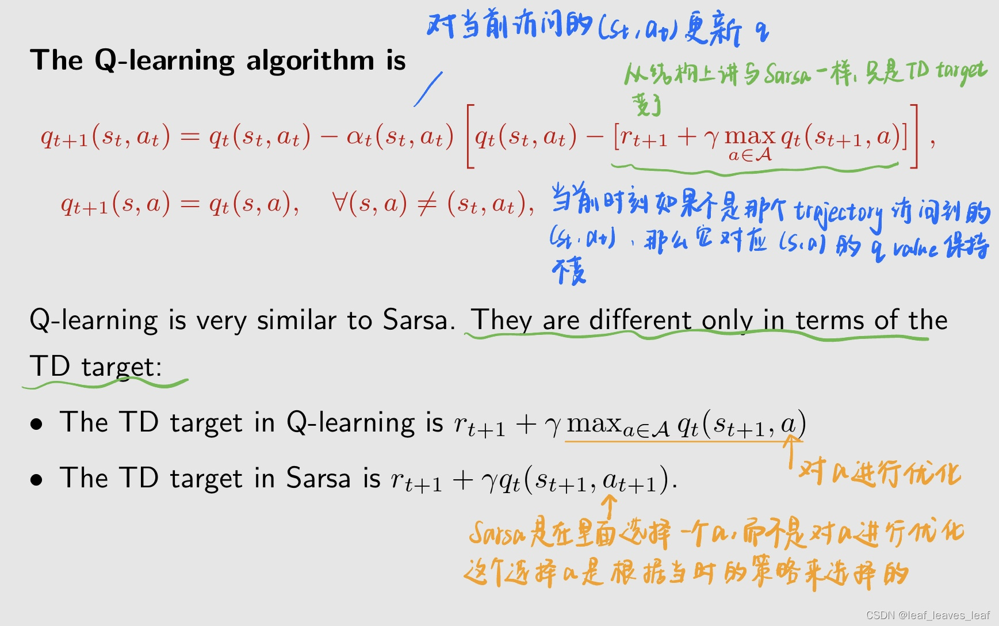

------

**Q-learning 在数学上有什么作用？在解决一个什么数学问题？**

Sarsa 在求解一个给定策略的贝尔曼方程，而 Q learning 不是求一个给定策略的贝尔曼方程的 action value，它是在求解一个贝尔曼最优方程

这就是用 action value 表示的贝尔曼最优方程。详细请看我书中的证明。

最后得到的 q 值不是说哪一个策略的 q 值，而是最优的 q 值，当然这个最优 q 值对应的最优的策略。

------

**Off-policy vs on-policy（所有强化学习算法都有这样的一个分类）**

在进一步研究 Q-learning 之前，我们首先要介绍两个重要的概念：策略学习（on-policy learning）和非策略学习（off-policy learning）。

在 TD learning 任务中存在两种策略：（之前学的 Sarsa 和 TD 方法已经涉及到这个了，但是并没有明确的提出来，现在把它提出来）

-    行为策略（behavior policy）与环境进行交互，用于生成经验样本（experience samples）。
-    目标策略（target policy）是我们一直在更新的，会不断更新，最后这个 target policy 就会达到我们想要的最优策略（optimal policy）。

基于 behavior 策略和 target 策略可以定义两大类强化学习的算法，就是 Off-policy 和 on-policy：

-   当行为策略（behavior policy）与目标策略（target policy）相同时，这种学习被称为 on-policy 学习。也就是说我用这个策略和环境进行交互，然后得到 experience，同时我再改进这个策略，改进完了之后我再用这个策略和环境进行交互，这个就叫 on policy
-   当两者不同时，这种学习被称为 Off-policy。比如我用一个策略和环境进行交互得到大量的经验，然后我用这些经验不断地改进一个策略，然后那个策略最后会收敛到一个最优的策略。
-   off-policy: 执行的策略和估计出来的策略可以不同，比如同时存在2个模型，我可以执行别人的策略

前面学到的 Sarsa 是 on-policy，行为策略（behavior policy）与目标策略（target policy）相同；而现在要学的 Q learning 是 off-policy，即行为策略（behavior policy）与目标策略（target policy）可以不同，也就是说既可以相同也可以不同

------

**off-policy learning 的优势，当 behavior policy 和 target policy 不同时候的优势：**

-    我们可以从之前别人的那些经验当中，它们采取了自己的策略积累了一些经验，我们可以拿过来然后去学习。它可以根据任何其他策略产生的经验样本搜索最佳策略 。
-    作为一个重要的特例（即一个比较典型的例子是），behavior policy 可以选择为探索性（exploratory）策略，就是探索性很强，能够探索所有的 state action pair，我们可以基于这种探索性非常好的估计出来每一个 state action pair 它们的 action value。
-   例如，如果我们想估算所有 state action pair 的 action value，我们可以使用探索性策略来生成访问每个状态-行动对的足够多的 episode。
-   相反，如果不是这样，如果必须要用 target policy作为 behavior policy 然后再去生成经验，因为 target policy 可能是 greedy 或者 -greedy 的，它的探索性比较弱，我看你很难探索到所有的 s 和 a，进而估计出所有的（s,a）的最优值

------

**如何判断 TD 算法是 Off-policy 还是 on-policy**？

从两个方面评估，下面的三个例子都是从这两个方面评估的：

-    首先，检查算法在数学上的作用，这个算法在解决什么样的数学问题。
-    其次，检查实现算法需要哪些东西才可以跑起来。这一点值得特别注意，因为它是初学者最困惑的问题之一。需要实施这个算法 需要什么样的测量

------

 

πt 就是 behavior policy，因为用它来进行采样；那么 target policy 是什么呢，这个就要用到刚才我们说到，需要知道他在干嘛，它是在估计 πt 对应的 action value，然后我用那个 action value 再去更新 πt 从而得到更好的策略。所以 πt 既是一个 behavior policy，也是 target policy

>   s和a不是采样得来的吧，因为不知道他们的概率分布？
>
>   -   你走的episode就是一个采样啊
>   -   采样不就知道概率了
>   -   就是不知道概率分布才要采样
>   -   知道呀，环境，和策略都知道
>   -   不知道概率就是不知道模型，这里不知道模型但知道模型的输出

>   -   那这两个p都是依赖于环境的，而不是依赖于模型的。环境和策略是独立的。
>   -   就是用于迭代的策略和用于与环境交互的是同一个
>   -   说白了就是在自己的基础上更新迭代自己

------

>   -    只要是需要进行策略评估的,都是on-policy
>   -   瞎说：off-policy中，behavior只用于估计（采样）R和S，而on-policy中，还同时估计（采样）了A

------

贝尔曼公式需要给的一个策略，然后通过贝尔曼公式求出给定策略对应的 action value 或者 state value，但是贝尔曼最优公式不涉及任何策略，只是一个含有 q 值的一个等式。当然贝尔曼最优公式对应的是最优策略，但是显式的不含有任何策略

Q learning 中的 behavior policy 是我需要从 st 出发根据一个测量得到一个 at；它的 target policy 就是我在计算 q，我会根据这个 q 来每一个状态看一看哪个 action 的 q 比较大，我就选择那个 action，这个所对应的策略就是 target policy，当这个 q 逐渐收敛到最优的 q 值的时候，也就是 optimal action value 对应的 target 策略，也就收敛到了最优策略

Q-learning 的 off-policy 也让他可以使用任何策略产生的数据而不影响自己的策略

>   那这两个概率是怎么得到的？还是说无模型的情况下不需要知道，我只需要采样把st+1的状态得到能代入进去算就可以？
>
>   -   不知道的，只需要通过采样得到
>   -   这两个概率是通过我们采样的到的
>   -   环境给的
>
>   判断依据就是说我在评估的到底是不是我已经采取的策略呗

------

由于 Q-learning 是 off-policy 的，因此可以以 off-policy 或 on-policy 的方式实施，即 behavior policy 和 target policy 可以不同也可以相同。

Q-learning 的 on-policy 的版本和 Sarsa 一样，唯一的区别是在更新 q 的公式不同

随着 q 的估计越来越准确， pi 的估计也会收敛到最优的策略

>   -   一条轨迹（episode）提前根据pi b 生成了，那么行为策略和目标策略当然是不同的啊， on plicy时，不是也应该是这样吗？回合（episode）又不是实时更新的 
>   -   我觉得应该注意两个算法的生成数据，一个是迭代生成的，一个是已经生成好的
>   -   懂了，off policy是两个不同的策略分别工作

------

**例子：**

任务描述：

-    这些例子的任务是为每一个状态找到最优策略，这和刚才的 Sarsa 例子不同

基本事实（Ground truth）：如下图，先给出最优策略和相应的最优状态值。待会我们用 Q learning 会算出来一个策略，看一下那个策略和这个策略是否相同

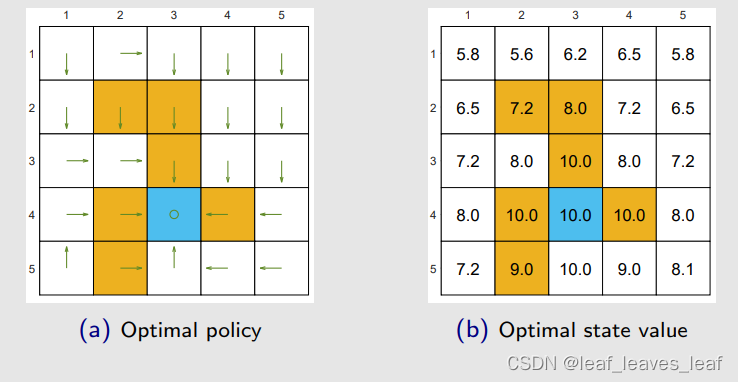

首先我们选定一个 behavior policy，用这个 behavior policy 产生很多的数据。下面的左图的 behavior policy 已经绘制出来了，它是一个均匀采样的策略，也就是在每个状态的 5 个 action 都各给 0.2 的概率，它的探索性比较强，如右图所示，如果 episode 有 100 万步的话，每一个 state action pair 都被访问到了很多次，所以这个数据比较好，下面看一下如何用这些数据进行 Q learning 的计算

当然，用上面这个 behavior policy 产生的数据来进行估计的话，肯定要用到 off-policy Q learning，下左图是最后给出的策略。这个策略的最优性可以用右图来展示，右图的纵坐标代表在估计的过程中，Q learning 给出了一系列策略，每个策略都对应一个 state value，然后我们又知道它的最优 state value，计算它俩的差再求模就是这个纵坐标。最开始这个策略不太好，和 optimal state value 有一段距离，最后就会越来越接近

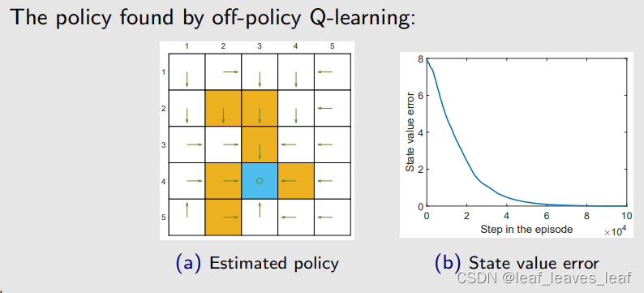

刚才用的 behavior policy 的探索性比较强，因为我们需要在每个（s,a）都找到最优策略，所以最好访问所有的 （s,a）很多次，所以 behavior policy 最好是探索性比较强的。下面看看探索性不是很强的

考虑探索性更弱的
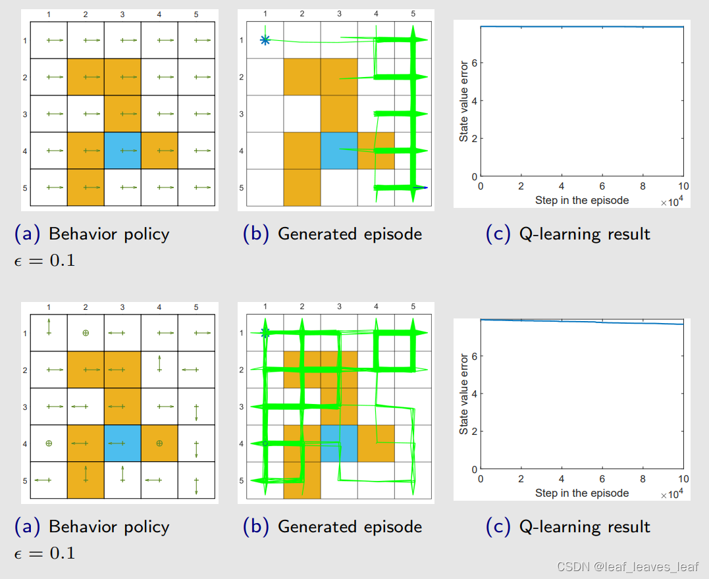

------

off policy 的性质非常重要，之后我们会学习 deep Q learning，为什么将神经网络和 TD 算法结合的时候会选择 Q learning 呢，这里面 Q learning 的 off policy 的性质发挥了重要作用

------

### 八.一个统一的观点：将这些算法进行比较（A unified point of view）

下面将之前学的所有算法进行总结

我们在本讲座中介绍的所有算法都可以用一个统一的表达式来表示：

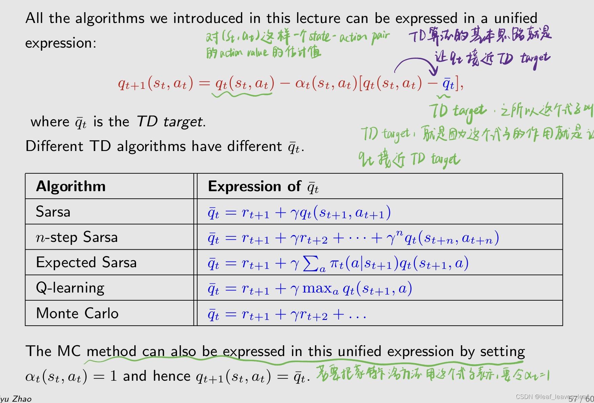

除了上面的统一的形式之外，他们在做的事情也可以统一的写出来。所有算法都可以看作是求解贝尔曼方程或贝尔曼最优方程的随机逼近算法（stochastic approximation algorithms）：（在这个意义上 TD 算法和之前介绍的求解值迭代和策略迭代的算法对应上了，值迭代和策略迭代是基于模型求解贝尔曼公式和贝尔曼最优公式的的，本节课是没有模型求解的）

本节课也学了贝尔曼公式的不同表达方式，Q learning 求解的是贝尔曼最优公式，直接把最优的 q value 求解出来，相对应所得到的 policy 也就是最优的

这些 TD 算法本质上是求解一个给定策略的贝尔曼公式，但是我怎么让它来搜素最优的策略呢，其实就是把 policy evaluation 和 policy improvement 相结合，就可以得到搜素最优的策略的算法

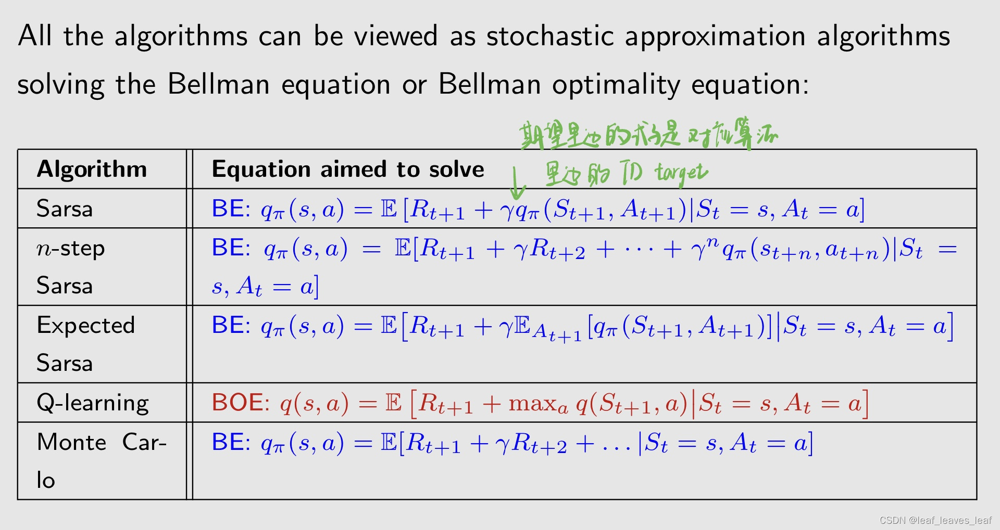

 最后一行的蒙特卡洛方法也是来求解这样一个式子，这个式子你可以说他是贝尔曼公式，其实他是 action value 的一个最基本的定义

### 九.总结

-   介绍各种 TD 学习算法
-   它们的表达式、数学解释、实现、关系、示例
-   统一观点

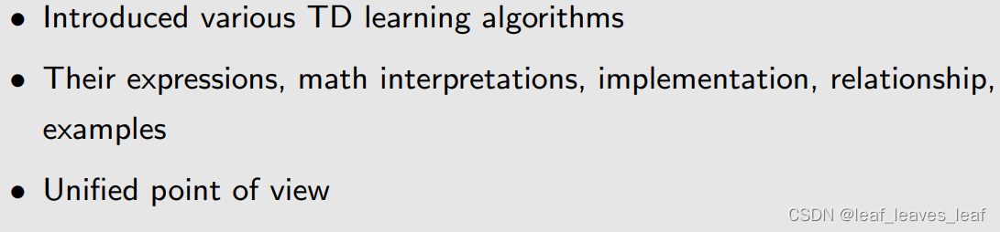