# 强化学习的数学原理 课程笔记 09 Policy Gradient Method

**目录**

[一.policy gradient 的基本思路（Basic idea of policy gradient）](#一.policy gradient 的基本思路（Basic idea of policy gradient）)

[二.定义最优策略的 metrics，也就是 objective function 是什么](#二.定义最优策略的 metrics，也就是 objective function 是什么)

[三.objective function 的 gradient](#三.objective function 的 gradient)

[四.梯度上升算法（REINFORCE）](#四.梯度上升算法（REINFORCE）)

[五.总结](#五.总结)

-   上节课介绍了 value function approximation，也就是 action value 或者是 state value 从表格形式变成函数形式来表达
-   这节课思想有些类似，之前我们用表格表达策略，现在我们也可以用函数表达策略
-   上节课到这节课有一个跳跃，之前所有的方法都被称为 value-based，这次以及下节课介绍的方法都是 policy-based，value-based 就是以 value 为核心，比如我估计一个策略他的 action value，这个就是 policy evaluation，在这个基础上我选择更好的策略，再去进行采样然后不断地迭代循环，这个过程中 value 发挥了重要作用。policy-based 方法是直接建立一个目标函数，这个目标函数是策略的函数，我通过优化这个目标函数就可以直接得到最优的策略
-   下节课介绍的 actor-critic 方法是把 policy gradient 和基于 value function approximation 这两种方法结合起来了

------

课程大纲：

1.   policy gradient 的基本思路（Basic idea of policy gradient）

2.   确定最优策略的衡量标准，metics 可以定义什么样的策略是最优的（Metrics to define optimal policies）

3.   计算 metric 对应的梯度（Gradients of the metrics）  metric 就是 objective function

4.   梯度上升算法，REINFORCE，是非常早期的 policy gradient 方法，但是很经典，在此基础上做推广：有了 metric 就可以做优化，最简单的方法是梯度上升，这里要最大化这个 metric，所以梯度上升。（Gradient-ascent algorithm (REINFORCE)）

5.   总结（summary）

### 一.policy gradient 的基本思路（Basic idea of policy gradient）

到目前位置，policy 是用表格来表示的：

-    所有状态的行动概率都存储在一个表 π(a|s) 中。表中的每个条目都以状态和行动为索引，每个 state 对应一行，每个 action 对应一列。直接去表格找每个状态下 take action a几 的概率即可
-   通过索引即可访问或改变一个量

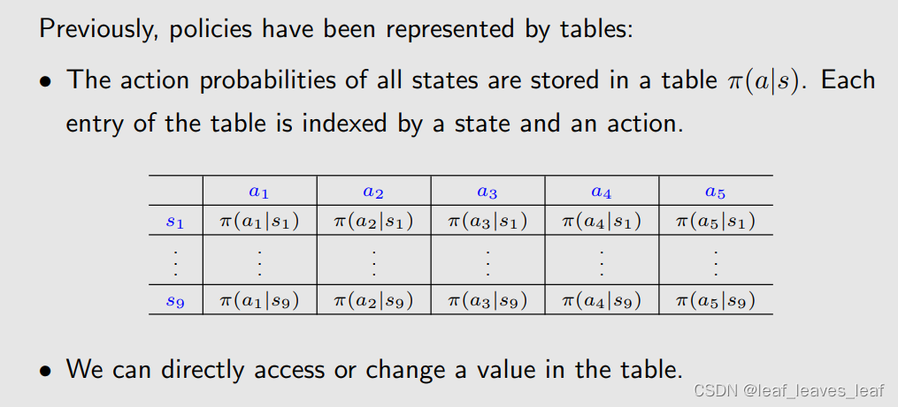

 现在，policy 可以用参数化的函数来表示：

θ 是一个向量，可以用来表示 π 这个函数里面的参数

-    例如，该函数可以是一个神经网络，现在用的最广泛的函数形式是神经网络。其输入为 s，输出为采取每个行动的概率（假如有 5 个行动），参数为 θ。

之前介绍 value function approximation 的时候，value function 的参数用 w 表示，policy 函数的时候参数用 θ 表示

-    优点：当状态空间较大时，表格表示法的**存储和泛化效率**较低。（泛化的意思是假如要更新 π(a|s)，如果用表格的话，我必须访问到 s 和 a 我才能去更新这个 π(a|s)，如果用函数的话就不需要，我访问了 (s,a) 旁边的那个 (s,a) 也可以，因为那个 (s,a) 我更改了这个函数的参数也会导致当前我感兴趣的 (s,a) 被改掉，也就是我用更少的数据就能得到一个比较好的结果）
-    函数表示法，也就是 π 的形式可以有多种，有时也写成 π(a,s,θ)、π_θ(a|s)或 π_θ(a,s)。

>   选q值大的策略，那么不就直接将pi(a|s,theta)等价于q(s,a,w)？

------

**表格表示法和函数表示法的区别：**

**1.首先，如何定义最优策略？**

-    用表格表示时，如果策略 π 能使每个状态值最大化，那么它就是最优的。最优策略 π* 的 state value 要比其它所有策略的 state value 都要大

-    用函数表示时，我们会定义一个 scalar metric，一个标量的目标函数，然后我们去优化这个目标函数，如果策略 π 能使这个标量指标最大化，那么它就是最优的。

**2.第二，如何获取一个 action 的 probability**

-    在表格的情况下，可以通过查找表格策略直接获取在 s 处取 a 的概率 π(a|s)。
-    在函数表示的情况下，我们不能直接获取，要算一下，需要根据函数结构和参数来计算 π(a|s,θ) 的值。比如是一个神经网络，我得把 s 输进去，让它向前传播一次计算一次，得到它的输出 π(a1|s,θ)，...，π(a5|s,θ)，才能知道概率

**3.第三，如何去更新 policy**

-    用表格表示时，可通过直接更改表格中的条目 π(a|s) 来更新策略 π。
-    当用参数化函数表示时，就不能再用这种方式更新策略 π 了。相反，只能通过改变参数 θ 来更新，因为函数是用 θ 表示的。

------

policy gradient 的基本思想很简单：

-    首先，定义最优策略的度量（或**目标函数**）： J(θ)，它可以定义最优策略。θ 是策略对应的参数，不同的策略有不同的参数也就是有不同的 J(θ) 值，我们希望 θ 能被最大化，最优策略 θ* 应该对应 maxJ(θ)

-    第二，有了目标函数就应该做优化，基于梯度的优化算法来搜索最优策略：

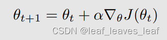

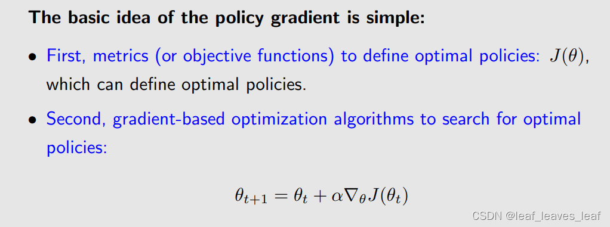

>   阿尔法是不是就是学习率啊？换个字母差点不认识了

尽管想法很简单，但当我们试图回答以下问题时，复杂性就显现出来了。

-    应该使用什么合适的度量标准（metrics）？也就是如何取目标函数
-    如何计算度量（metrics）的梯度？也就是如何计算目标函数对应的 gradient，到时候会出现 policy gradient 定理

本讲座将详细解答这些问题。

------

### 二.定义最优策略的 metrics，也就是 objective function 是什么

**有两个 metrics。metrics 是评价一个策略好坏的函数**
**第一个 metric 是平均状态值（average state value），简称平均值（average value）**，其实就是 state value 的加权平均。具体来说，该指标定义为

v_π(s) 对应 s 的 state value，d(s) 是给 s 的权重，这个权重是大于等于 0 的，并且所有权重之和等于 1，按照上式加起来就是 v_π(s) 的一个加权平均，得到的数就认为是 metric，用 v_π bar 表示，上面的横线代表平均的意思

 v_π bar 是策略的函数，不同的策略对应它的值也不同，所以就可以去优化，找到一个最优的策略让这个值达到最大

-   v¯π 是 state value 的加权平均。
-   d(s) ≥ 0 是状态 s 的权重。
-   所有的 d(s) 之和为 1，这时候 d(s) 不仅可以理解为权重，也可以理解是 probability distribution，也就是 d(s) 代表了状态 s 被选中的概率，在这种情况下，刚才的 objective function 可以被写成下面这个样子：

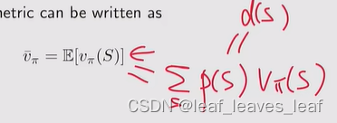

------

矢量乘积形式：

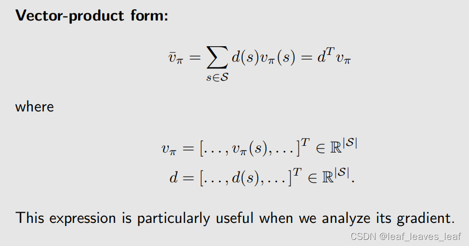

相乘再相加得式子可以写成两个向量的内积，d 和 v_π 对应两个向量，它们当中的每一个元素都对应一个状态，d(s) 对应状态 s 的权重或者说概率，v_π(s) 对应的是 s 的 state value

当我们分析如何求解 v_π bar 的梯度时，这个简介的表达式特别有用。

------

**如何选择分布 d(s)？ 有两种情况。**
**第一种情况是 d(s) 与策略 π 无关**。

-   这种情况比较简单，因为好求梯度。如果 d 和 π 无关，那我待会求它的梯度的时候，这个 d 不涉及到任何的梯度，我只需要求一个 v_π 的梯度 

-   如果 d 和 π 有关，那么求梯度的时候也要求这个 d 关于 π 的梯度，会更麻烦
-   在这种情况下，为了表明 d 和 π 无关，把 d 写成 d0，v_π bar 写成 v_π bar 0

>   这里取期望应该是类比tabular form里的任意state，因为这里是function form，没办法遍历所有的state，所以用了期望，表示一个policy总体意义上优于另一个

如何选择 d0?

-    一种微不足道的方法是将所有状态同等对待，每个状态我给它的权重或者是概率都是相同的，因此选择 d0(s) = 1/|S|，|S|=n 也就是状态的个数。
-    另一种重要的情况是，我们只对特定的状态 s0 感兴趣。例如，某些任务中的 episodes 总是从相同的状态 s0 开始。那么，从那出发我希望我得到的 reward 越大越好，我们只关心从 s0 开始的长期回报。在这种情况下，我们对一些状态有所偏好。在这种情况下，我之关心 s0，从 s0 出发我所得到的 reward 越大越好：

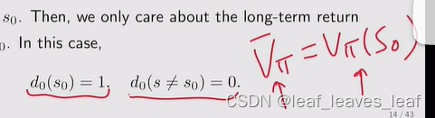

给 s0 的权重是 1，不是 s0 的权重是 0，我最大化 v_π bar 其实就是最大化我从 s0 出发能得到多大的 return

------

**第二种情况是 d(s) 与策略 π 有关**

**把 d 写成 d_π，d_π 是依赖于 π 的一个分布**

平稳分布，就是我有一个策略，然后我跟随那个策略去不断地和环境进行交互，当我执行那个策略很多很多次后，我就可以预测 agent 在某一个状态的概率是多少，那时候会逐渐达到一个平稳的状态，而且这个概率其实可以直接通过式子给计算出来：

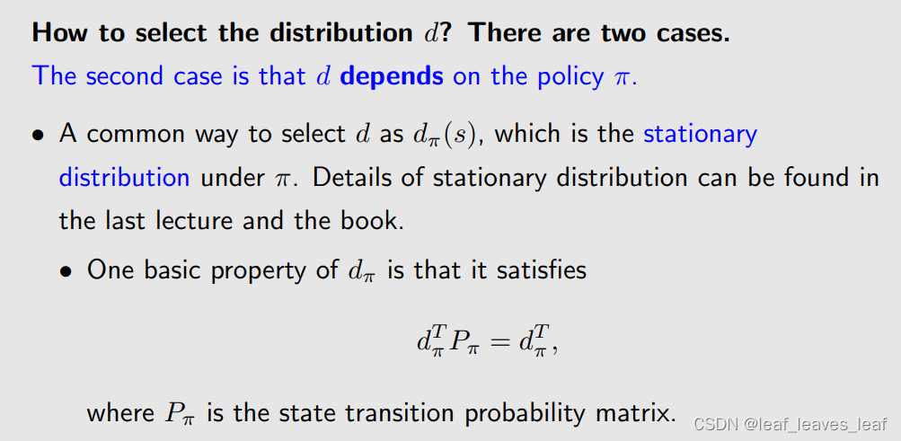

也就是知道 Pπ 之后我可以直接把 d_π 给求解出来。d_π 是依赖于 π 的一个 distribution

>   不是的，d是稳定下来之后每一个在每一个state的概率，用来算平均reward的

这时候我根据一个策略去执行，肯定有的状态我访问的多一些，有的状态访问的少一些，访问多的那个状态它对应的 d_π(s) 相对来说会更大，我给他的权重也会大一些，访问少的那些状态它的权重会少一些

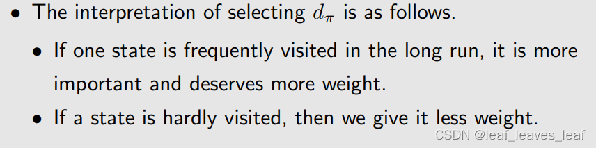

选择 dπ 的解释如下。

-   如果一个状态在长期内经常被访问，那么它就更重要，权重更高。
-   如果一个状态很少被访问，那么我们就会降低它的权重。

------

**第二个 metric 是平均一步奖励（average one-step reward）或简称平均奖励（average reward）**。具体来说，该 metric 是

r_π(s) 是我从 s 出发所得到的单步的，就是 immediate reward 的一个平均值，d_π(s) 是 s 对应的权重，从下标可以看出，它是一个 stationary distribution，它是依赖于策略 π 的

把 r_π(s) 做一个加权平均就得到了第二个 metric r_π bar，bar 代表平均。因为 d_π(s) 是一个概率分布，就可以把和式写成一个 expectation 的形式

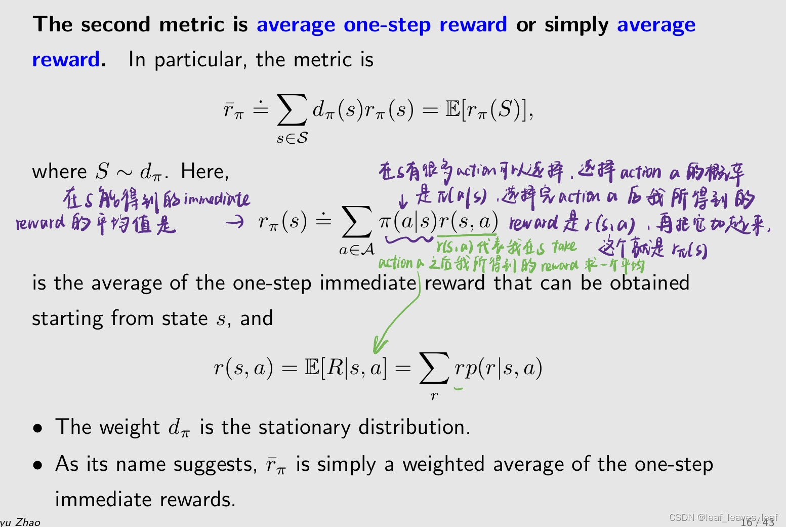

r(s,a) 是我在（s,a）得到的 immediate reward，我对这个 a 求加权平均或者求 expectation 就可以得到 r_π(s)，这个是在 s 我所得到的 immediate reward 的一个平均值，然后我在对 s 求加权平均就得到了 r_π bar，就是第二个 metric

>   （s,a）对应的奖励也是不确定的吗
>
>   -   是不确定的，就是reward probability，只不过前面的例子的reward都是确定的即为1
>   -   不是不确定，是因为我们只有数据，所以只能通过数据的分布拿到一个expection来代表reward
>   -   action是随机的，所以reward也是随机的。比如网格那个问题，即使往目标走一定是最优的，但policy还是会给其他方向一定的小概率
>   -   不确定的，因为从当前状态做出行动到下个状态是不确定的
>   -   reward是确定的
>
>   采取一个action不是只有一个reward吗 这就很尬
>
>   -   采取一个a，可能转移到不同的s'，自然奖励不一样。再说即使转移到相同的s'，也可以有多种奖励
>   -   前面的同学，r given s, a存在不固定的情况；因为s也许没包含这个世界所有的信息
>   -   也就是说你所求的那个状态的s本身也是不确定的，并且你在状态s采取的action也是不确定的。再而且你采取action后的奖励也是不确定的
>   -   这里的formula都是最generalized的形式，之前的example都是非常简单的、s和a确定后r也确定的形式

-    权重 dπ 是静态分布。
-    顾名思义，r¯π 只是一步即时奖励的加权平均值。

------

下面要给第二个 reward 的另外一种形式，在论文和书籍中经常遇到，等价定义如下：
 假设一个 agent 遵循给定的策略并生成一条轨迹，沿着这个 trajectory得到了很多的奖励 reward 为 (Rt+1，Rt+2，......)。
 沿着这条轨迹的平均单步奖励为

这个就代表我从某一个状态出发，跑无穷多步，但这时候不是求所有 reward 的和，而是跑无穷多步 reward 的平均

>   -   我大概明白意思了，因为dpi是和状态s根据策略被访问的频率有关，所以随机漫步的时候求和正好就隐含了频率这个因数，频率越高被累加的频次也越高
>   -   感觉像是因为对n个随机变量R之和求期望，所以要除以n
>   -   sorry，我错了，不是dpi，而是策略的p_pi
>   -   不加n就是和的期望，加n就是单步的

>   这里为什么要乘n分之1啊，期望E不是就平均了吗
>
>   -   那是n个随机变量的和的期望，不是一个随机变量的期望
>   -   把期望符号写到求和号内就好理解了
>   -   E是对每个状态的期望
>   -   R是随机变量，每一个新时刻获得的r都是服从概率分布的，E是求R在每一时刻的均值（它们有大有小），再求和。这里除以n是求每一步（时刻）r的平均
>   -   就像上学经常走过的一条路(不要太宽，平稳的），走的次数多了，时间上平均大致为中线，统计上对这条路而言，也是中线
>   -   平均的是n步的return，这个return在n趋向无穷的时候，是趋向无穷的，除以n就是一个可以衡量的标量了
>   -   平稳随机过程的各态历经性： 时间平均等于统计平均
>   -   里面是n个随机变量，所以要乘以n/1
>   -   因为平稳分布下的均值就是执行无穷多步后的平均呀
>   -   这不就是stationnary distribution吗 呜呜呜

------

**关于 metric 的备注 1：**

-    所有这些 metric 都是策略 π 的函数，无论是 v_π bar 还是 r_π bar。
-    策略 π 的参数是 θ，由于 π 由 θ 参数化，因此这些 metric 是 θ 的函数，无论是 v_π bar 还是 r_π bar 都是 θ 的函数。那么不同的 θ 就会得到不同的 metric 的值，里面就会有一个最优的，我希望能够去优化然后找到这个最优的 θ 去最大化这些 metric
-    换句话说，不同的 θ 值会产生不同的 metric 值。
-    因此，我们可以寻找最优的 θ 值，使这些 metrics 最大化。

这就是策略梯度法（policy gradient methods）的基本思想。

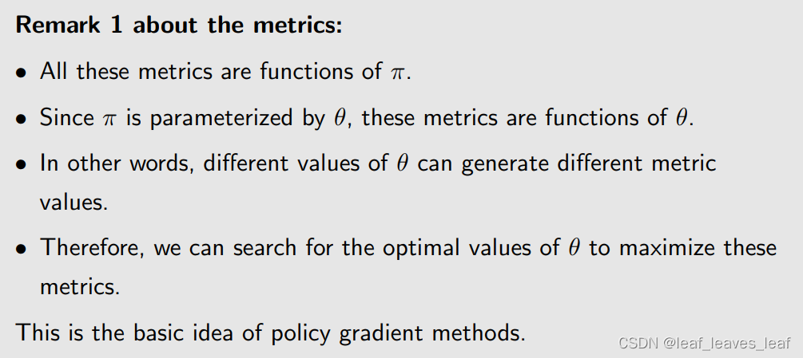

------

**关于 metric 的备注 2：**

-    一个复杂的问题是，metric 既可以在 discounted rate γ∈ (0, 1) 的 discounted case 情况下定义，也可以在 γ = 1 的 undiscounted case 情况下定义。
-    我们在本书中只考虑 discounted case 情况，之所以会出现 undiscounted case，是因为刚才我们介绍的 r_π bar 这个 metric，它是对 immediate reward 求一个平均，它不是对 return 求平均，不求 return 那所有我也不需要考虑这个 discounted rate，所以 r_π bar 对 discounted case 和 undiscounted case 都成立。有关 undiscounted case 情况的详细信息，请参阅本书。

------

**关于 metric 的备注 3：**

-    从直观上看，r¯π 更为短视，因为它只考虑了即时回报，而 v¯π 则考虑了整个步骤的总回报。
-    其实，这两个指标是等价的。等价不是说相等，而是满足下面这个等式，在 γ < 1 的 discounted case 情况下，可以认为

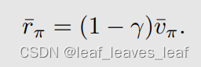

我对其中一个做优化的时候，另一个也达到了极值

------

练习：

你会在文献中经常看到下面的指标：

它与我们刚才介绍的指标有什么关系？

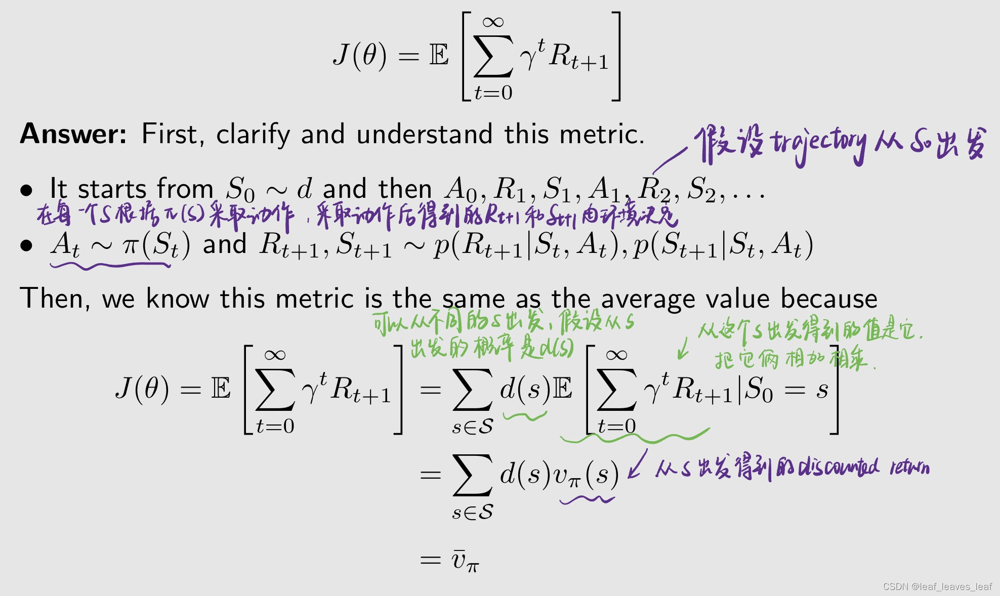

------

### 三.objective function 的 gradient

objective function（metrics）对应的 gradient 是什么

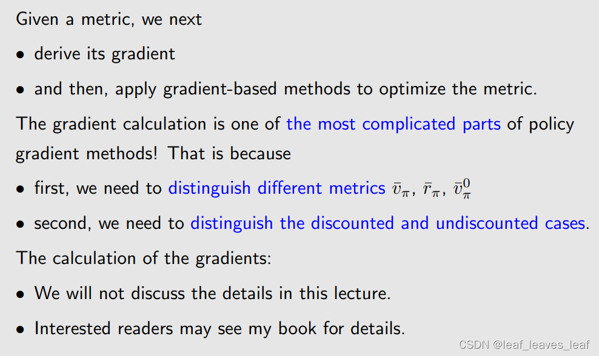

给定一个 metric，我们接下来

-    得出其梯度
-    然后，运用基于梯度的方法优化 metric

梯度计算是策略梯度法中最复杂的部分之一，梯度计算是最复杂的部分之一！这是因为：

-    首先，我们需要区分不同的 metric v¯π、r¯π、v¯π0，v_π bar 0 指的是 s 的分布与 π 无关，它是 v_π bar 的一个特殊情况
-    其次，我们需要区分 discounted and undiscounted cases 情况。

不同的目标函数和不同的情况排列组合一下，每种情况计算 gradient 都是不同的 

梯度的计算：

-    我们将不在本讲座中讨论细节，只作简要介绍，只给出一个公式。
-    有兴趣的读者可以参阅我的著作。

------

梯度的结果：

以上所有的情况求出来的 gradient 大同小异，所以就用上面这一个式子标识出来了

书里有详细推导，在此简单讲解：

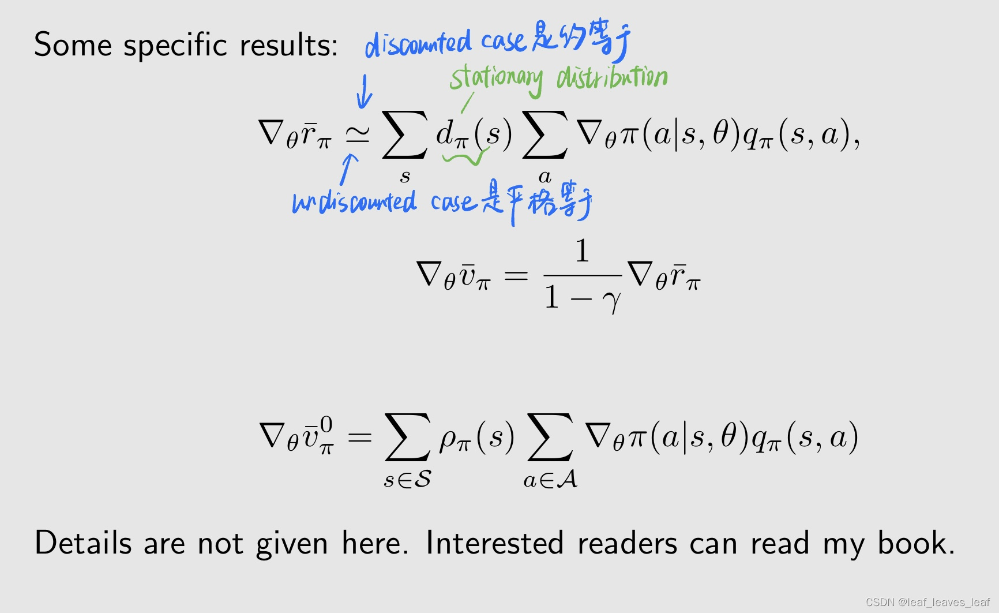

------

一种简洁实用的梯度形式：

**为什么需要这个式子？** 

-   因为这是一个真实的梯度，这个真实的梯度里含有 expectation，我不知道 expectation，就可以用采样来近似 expectation，这个就是 stochastic gradient descent 或者是 ascent 基本的思路，待会就会用 stochastic gradient 来做优化
-   因为我们可以用样本来逼近梯度

**如何得到这个式子？证明** 

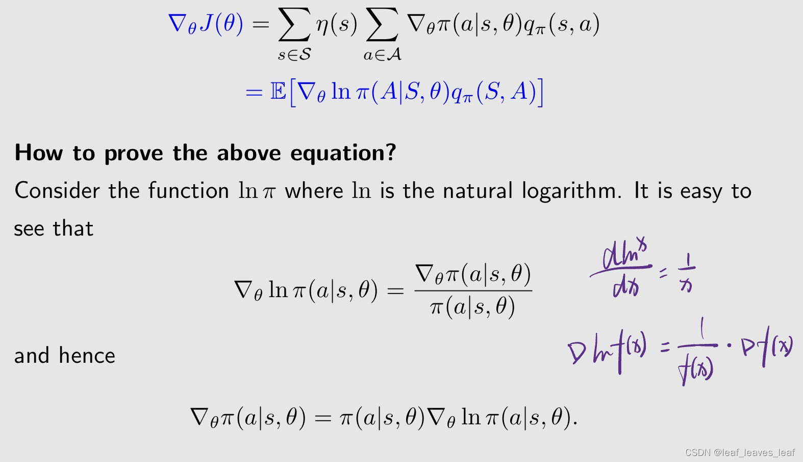

------

要想使用 ln，π 必须是大于 0 的，我们之前介绍了很多 greedy policy 或者 deterministic policy，它们对于某些 action 的 π 等于 0，在这里面不能这样，那么如何确保所有的 π 对所有的 a 都大于 0 呢？

这可以通过使用 softmax function 来归一化，该函数可以将（-∞，+∞）上的一些数归一化为（0，1）区间，该函数可以将向量中的条目从（-∞，+∞）归一化为（0，1）。

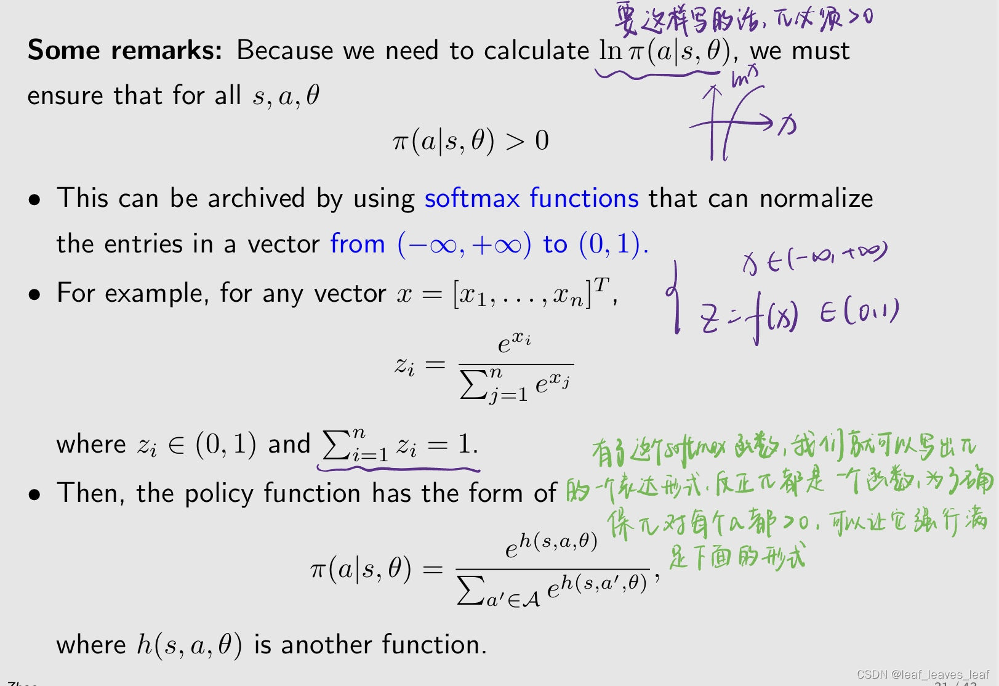

h 是另外一个函数，类似于之前介绍 value function approximation 中的 feature vector，也就是对应（s,a）它有一个 feature function，之前选取 feature function 很麻烦，现在全都是神经网络

>   -   softmax激活函数
>   -   最后一层网络用softmax()函数

------

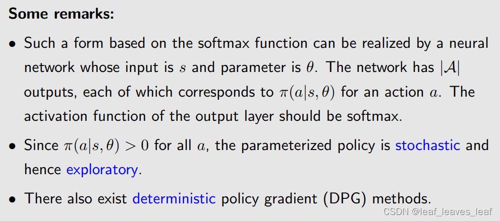

也就是假如有一个神经网络，输入为 s，参数为 θ，这个神经网络直接就可以把 π(a1|s,θ)，π(a2|s,θ)，...，π(a5|s,θ) 输出出来（如果有 5 个 action），它的输出层要用 softmax，那么自然得到的所有的这些数都是在 （0，1）区间，并且相加等于 1

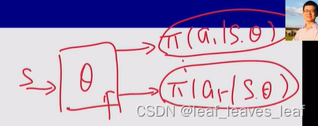

-   这种基于 softmax 函数的形式可以通过一个神经网络来实现，该网络的输入为 s，参数为 θ。该网络有 |A| 个输出，每个输出对应一个动作 a 的 π(a|s,θ)。 输出层的激活函数应为 softmax。
-   因为策略对每一个 a 都大于 0，所以这个策略是 stochastic 的，自然也是探索性的
-   下节课会介绍 deterministic policy 的方法，那时候就不需要这个条件了，它也有优势，刚才我们要输出每一个 action 对应的 action 的 π，那么如果 action 是无穷多个怎么办呢？这时候这种方法就不行了，但是 deterministic 方法可以

>    无穷多个action意思就是连续的action space了吧？

### 四.梯度上升算法（REINFORCE）

怎么用这个 gradient 做优化得到最优的策略

在这一节我们会把梯度带入梯度上升的算法中去优化，然后会给出第一个，最简单的 policy gradient 的算法，叫 REINFORCE

现在，我们准备介绍第一种策略梯度算法，以找到最优策略！

最大化 J(θ) 的梯度上升算法是：

这个在实际当中不能用，因为有一个 expectation，这就涉及到了状态的分布，如果知道了所有的信息，这个分布就可以确定下来，但是环境的模型等等我们都不知道，这时候无法计算 expectation，所以我们要用随机的梯度代替真实的梯度

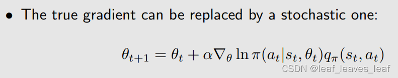

这个式子其实也不能用，因为里面有一个 q_π，是策略 π 对应的真实的 action value，那怎么办呢？我们用一个方法来近似或对 q_π 进行采样，把 q_π 换成 q_t

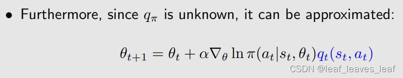

那怎么来来近似或对 q_π 进行采样呢？有几种方法：

-   第一种方法是基于蒙特卡洛的方法，也是最直观的，我要估计 q_π(s,a)，那我就从 (s,a) 出发得到一个 episode，我计算这个 episode 的 return 为 g，这个 g 其实就是 q_t(s,a)，我就用这个来近似 q_π。基于这个方法并且和 policy gradient 算法相结合就得到一个算法叫 REINFORCE

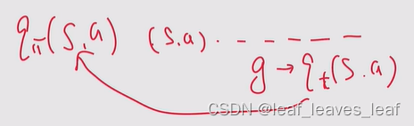

-   除了这个方法，还有一些其它算法，比如 TD，这就引出了 actor-critic 一系列算法，会在下一节课介绍

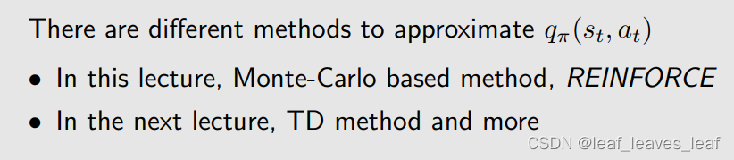

>   但是如果都要用MC或者TD为什么不直接value base？
>
>   -    因为这样交替迭代收敛会更快吧
>   -   本节一开始就讲了呀，该类方法优势在于可缓解"pi表格"高维的问题
>   -   value based的主要问题是策略的泛化性不好。虽然在这里也需要估计q，但是只是在更新策略梯度时计算而已
>   -   直接更新策略,更快

------

**备注 1：如何进行采样？**

如何采样 S？

-   S 服从 d 分布 或者说是 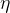 分布，这个分布代表了一种长期，就是我跑了很久之后我所得到的一种对 S 的分布，但是在实际中我们不会这么做，因为有数据就不错了，我们不会说要采很久之后等他达到那个平稳的状态如何再去用这个数据，所以这个我们在实际中不太考虑，不用在意

如何采样 A？

-   根据理论上的要求，A 应该服从 π，所以我在 st 应该根据当前的这个 π 采这个 a
-   所以，policy gradient 在这里应该是 on policy 的算法，因为它的 behavior policy 是 π(θt)，target policy 也是 π(θt)，因为它在不断改进，改进完了后立刻用它生成新的数据然后再改进我自己
-   也有 off policy 的情况，但是需要额外技巧，在下节课会介绍

------

**备注 2：如何理解算法？**

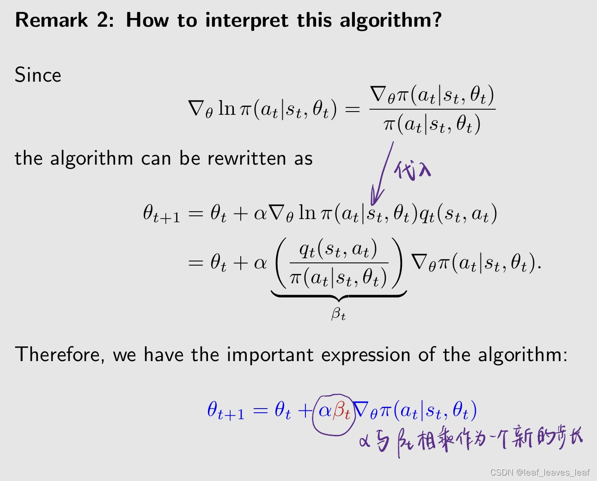

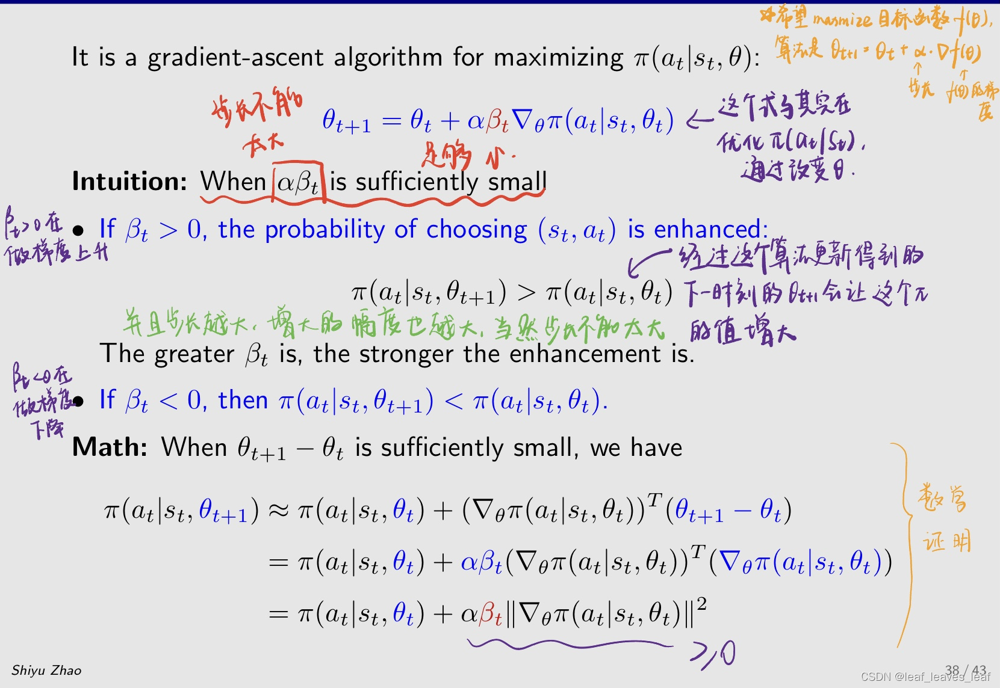

系数 βt 可以通过分子和分母这两项很好地平衡探索和开发（充分利用）。

首先，βt 分子为 qt（st，at），βt 与 qt（st，at）成正比。

-   qt 越大，βt 越大，π(at|st) 这个值会被增大，意思就是，如果这个 action 之前它的 action value 比较大，那么我会给他更大的概率选择这个 action，这是再做 exploitation，也就是充分利用，我都知道那个 action 能给我更大的 action value 了，我干嘛不去给他更大的概率选择它？

第二，βt 分母为 π，所以 βt 与 π 成反比

-   π(at|st) 越小，βt 越大，那么 π(at|st) 越大，大的 βt 在 θt+1 的情况下会得到更大的 π(at|st)。这个意思是如果之前我选择 at 的概率比较小，那么我会在下个时刻给他更大的概率去选择它，这是在做探索 exploration

>   可是你没有说beta负数的情况啊
>
>   q是负的就为负了

------

-   刚才介绍过有一些方法可以求出 qt，也就是我从（st,at）出发得到一个 episode，我把这个 episode 的 return gt 赋值给 qt，这就是蒙特卡洛的方法，如果是这样，那么这个 policy gradient 的算法就被称为 REINFORCE
-   REINFORCE 是最早和最简单的策略梯度算法之一。
-   许多其他策略梯度算法，如 actor-critic methods，都可以通过扩展 REINFORCE 得到（下一讲）

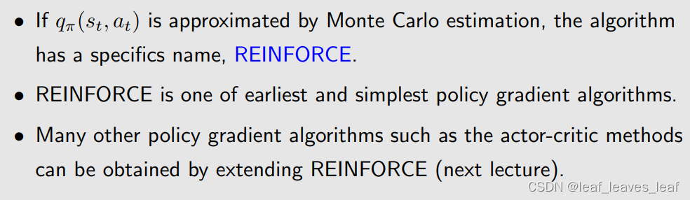

------

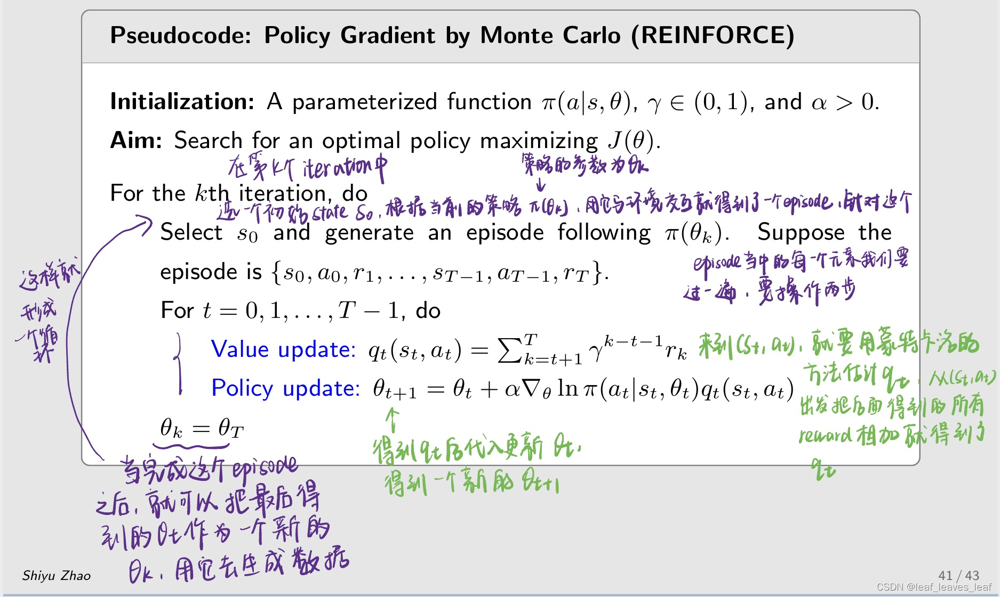

-   为什么这里 θt 更新成 θt+1 之后，θt+1 没有立刻去产生数据呢？因为这个方法是基于蒙特卡洛的方法，蒙特卡洛是 offline 的，是离线的，也就是你必须把所有的 episode 全部采集完之后，我才能开始跑，所以它不能我边更新我的 θt 边采集。
-   之后我们介绍基于 TD 的方法的时候，就可以变成 online 的，就是我得到新的 θt 就可以立刻去用来生成数据

>   -    蒙特卡洛需要完整的轨迹 
>   -   老师这里说的是on\off-line(是否采一步学一步)，你说的on-policy是指采样和部署策略是否是同一个
>   -   是offline不是off policy
>   -   因为要算q就要把时间跑完了，没办法t+1更新
>   -   MC可以on也可以off，这里老师强调的是不能在一个episode没完成的时候就更新策略
>   -   value update, 累加会产生大的方差
>
>   神经网络是哪一步出现的
>
>   -   神经网络就是策略函数

### 五.总结

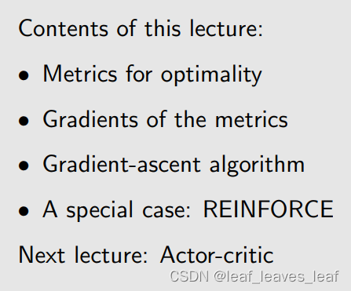