# 方法强化学习的数学原理 课程笔记 10 Actor-Critic

Actor-Critic 方法把基于 value 的方法，特别是 value function approximation 引入到 policy gradient 当中，我们就得到了 actor critic

Actor-Critic 方法仍然是策略梯度（policy gradient）方法，和我们上节课学的 policy gradient 的方法是一种方法。

-   它们强调的是将策略梯度和基于价值的方法结合在一起的结构。

什么是 "Actor "和 "Critic"？

-   这里的 "Actor "指的是策略更新，actor 对应的是策略，也就是它是来更新策略的一个东西或者是一个过程。之所以称为 "Actor"，是因为策略是用来 take action 采取行动的，那么 take action 的这个东西就可以对应这个 actor。
-   Critic 的字面意思是评论家，批评家。这里的 "Critic "是在做策略评估（policy evaluation）或价值估计（value estimation），也就是我有一个策略，我需要评估一下这个策略是好还是不好，那怎么评估呢，其实就是根据 value estimation，也就是我去估计它的 action value 或者 state value。之所以称其为 "Critic"，是因为它通过评估政策来对其进行批判。

**课程大纲：**

1.最简单的 actor-critic（QAC）：The simplest actor-critic (QAC)

2.Advantage actor-critic (A2C)：这个的思想是通过引入一个偏置量来减少估计的方差

3.Off-policy actor-critic：如何把 on-policy 的 AC 方法转化成一个 off-policy 的 AC 方法，这里会用到一个关键技术，就是重要性采样

>   前三节的 policy 都是 stochastic 的

4.Deterministic actor-critic (DPG)：第四节会介绍 deterministic actor-critic 的方法

------

### 一.最简单的 actor-critic（QAC）：The simplest actor-critic (QAC)

回顾上节课介绍的 policy gradient 方法，Actor-Critic 方法本身就是策略梯度（policy gradient）方法

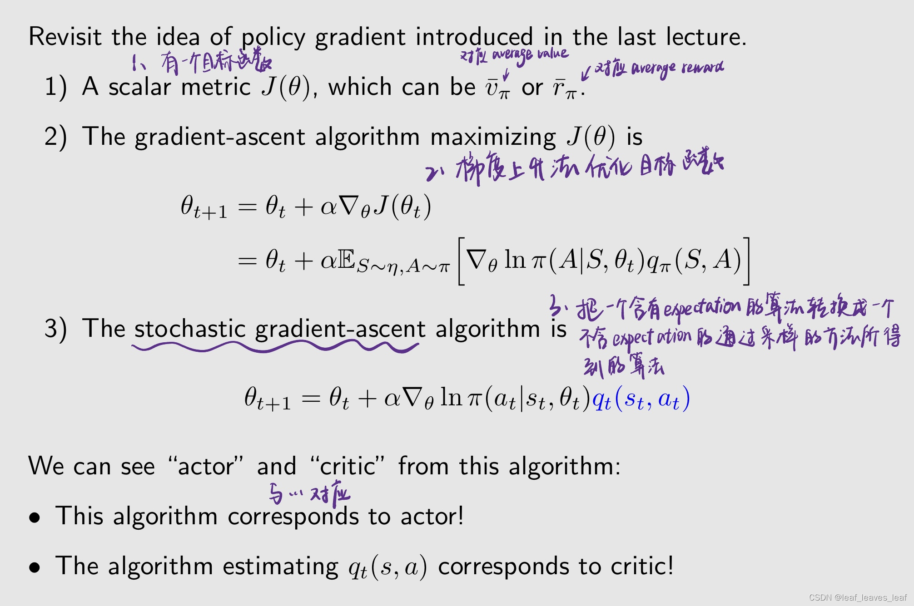

-   上面的最后一个表达式很重要，通过这个表达式我们就可以知道哪些是 actor 哪些是 critic，actor 和 critic 究竟是怎样结合起来的
-   上面的最后一个表达式的算法就是 actor，因为这个算法在更新策略，θ 是策略的参数，θ 变化了策略自然也就变化了，所以 actor 是更新策略的一个算法
-   critic 就是来估计 qt 的一个算法，因为你要更新这个策略需要 qt，qt 是 qπ 的近似，所以 critic 的作用就是对当前的这样一个策略进行评估，计算出来它所对应的 action value
-   通过这个式子，我们清晰的看到了 actor 和 critic，以及 policy based 和 value based 方法是怎么结合起来的

------

**如何获得 qt(st, at)？**

到目前为止，我们已经研究了两种估计 action value 的方法：

第一种上节课介绍了：

-    蒙特卡洛方法：如果要计算 qt(st, at) ，就从后面得到一个 episode，然后计算那个 episode 对应的 return，我就让那个 return 认为是 qt(st, at) 的一个近似值。 如果这个 qt(st, at) 是这样计算的，是使用 MC 计算的，相应的算法称为 REINFORCE 或蒙特卡罗策略梯度（Monte Carlo policy gradient）。
-    我们在上一讲中介绍过。

第二种这节课会介绍：

-    TD 学习： 如果使用TD学习来估计 qt，这类算法通常被称为行为批判算法（actor-critic）。
-    我们将在本讲座中介绍。

------

介绍第一个 actor-critic 的算法：
 

这里的 critic 对应 Sarsa 算法，并且结合了 value function approximation，这个 Sarsa 算法对应了一个 function，它的参数是 w，w 被更新之后我们就得到了一个新的 q，把这个 q 带入 Actor 里面，就得到了一个新的策略对应的 θt+1，这个新的策略会用到下一步当中去生成新的数据

>   -   出了MC，TD还有神经网络啊，为什么没有说呢？
>   -   TD就是用的神经网络拟合q的啊，不然怎么会有q(w)呢
>   -   神经网络体现在theta上...
>   -   现在在讲原理，神经网络是个函数估计器，你觉得是一码事么？
>   -   对神经网络求梯度并不难，这里知道可以求就行了
>   -   w就可以表示是神经网络的参数吧

补充：

-    critic 对应于 "SARSA+值函数逼近"（SARSA+value function approximation）。
-    actor 对应于 policy update 算法，在上上页给出了。
-    该算法是 on policy 的（为什么 policy gradient 包括刚才介绍的 actor-critic 方法是 on policy 的？）： 因为策略是随机的，1> π(a|s, θ) >0，所以无需使用 ε-greedy 等技术。

>   policy gradient 包括刚才介绍的 actor-critic 方法都是 on policy 的

-    这种特殊的 Actor-Critic 算法有时被称为 Q Actor-Critic 算法（QAC）。Q 对应那个 q value
-    这种算法虽然简单，却揭示了 Actor-Critic 的核心思想。如后面所示，它还可以扩展生成许多其他算法。

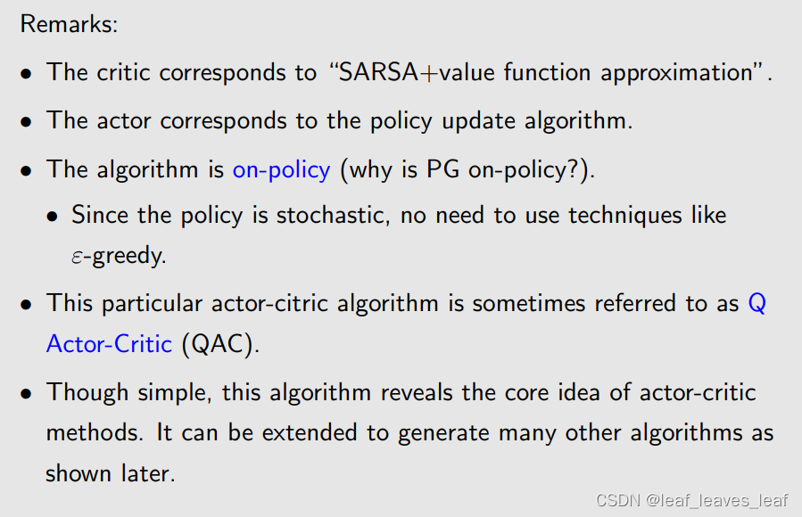

------

### 二.Advantage actor-critic (A2C)

接下来，我们将 QAC 扩展为 advantage actor-critic (A2C)

-    其核心思想是引入一个 baseline 以减少估计的方差。

性质：我们推导的策略梯度对于引入一个新的偏置不会发生变化

这里， baseline b(S) 是 S 的标量函数。

**为什么 baseline 有效？**

>   s为啥和theta无关呢，稳态的s分布应该和策略有关呀
>
>   -   确实和策略有关，这里按书上第9章的记号应该写成d_pi(s)。但不影响结论，原因：在单步更新中策略是被冻结的
>   -   s是环境自己的东西和策略无关
>   -   state和策略没有关系，策略是进行state的选择并作出对应action，state space是客观存在的
>   -   a和s是没关系的，就算state是一堵墙在你前面，你照样有往上撞的action。但是pi和a,s有关
>   -   他是S的函数；给定S，他有给定的值；这里不需要考虑S的概率分布问题
>
>   n（s）为啥可以不写成n（s｜theta）呢
>
>   岂不是说有没有这个b(s)，这个期望都是为0 ？
>
>   没有这个b(s)本来就是0啊

**为什么 baseline 有用？**

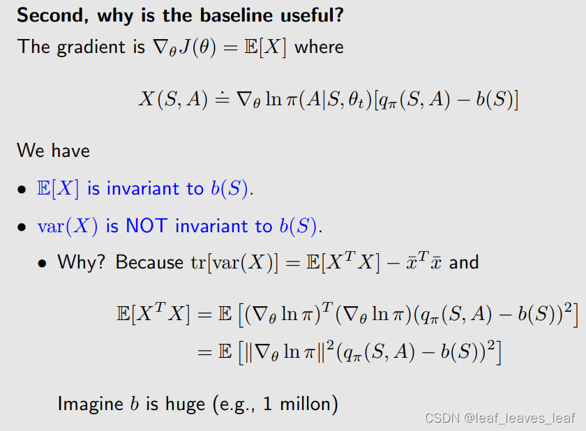

**为什么要考虑这个 baseline，它究竟有什么用？**

-   E[X] 与 b(S) 无关，无论取什么样的函数这个 E[X] 总保持不变
-   X 的方差 var(X) 与 b(S) 有关，取不同的 b 方差可能相差很大，baseline 对方差有影响

------

**目标:**是找一个最小的 baseline 使得方差最小，这样在采样的时候就有更小的误差

**优点：**当我们使用随机样本来近似 E[X] 时，估计方差也会很小。

在 REINFORCE 和 QAC 算法中、

-    没有基线 baseline。
-    或者，我们可以说 b = 0，但这并不能保证是一个好的基线 baseline。

------

**最好的 baseline 是：**

对于任意 s∈ S，能使 var(X) 最小化的最优 baseline 是

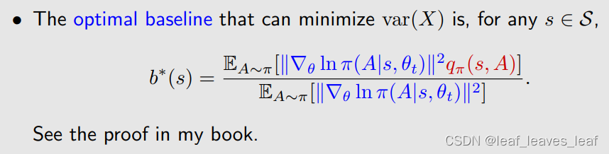

蓝色代表一个权重

-    虽然这一基线是最优的，但却很复杂。
-    在实际当中，我们我们可以去掉权重，选择次优基线，即直接求 q 的 expectation，这个公式就是在 s 对应的 state value：

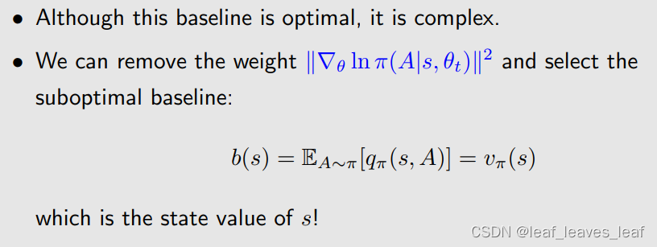

------

**下面看怎么把 baseline 引入到 actor-critic 的算法中**

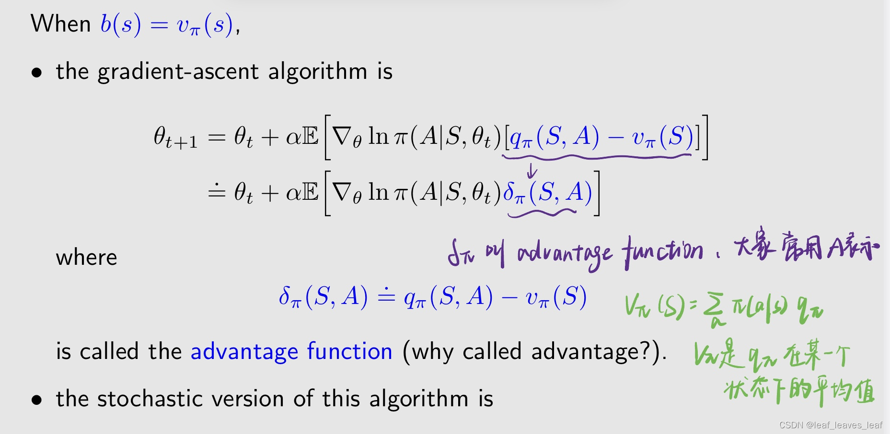

vπ 是 qπ 在某一个状态下的平均值，如果对应的某一个 action 比这个平均值大，那就说明这个 action 肯定是比较好的，它的 action value 比较大，有一定的优势

因为这里面有 expectation，那我们很自然的就要得到他的 stochastic version，也就是通过采样得到这样一个算法

------

算法可以被表示成：

上节课也说过，这种 stochastic gradient 的方法可以很好的平衡探索和利用

-    步长与相对值 δt 成比例，而不是与绝对值 qt 成比例，这样更合理。
-    它仍能通过分子分母很好地平衡探索和开发。

当 δt 比较大的时候，这个 step size 也会比较大，上面这个算法是在更新 π(at|st)，如果 step size 比较大，会超那个方向走的比较多，因此 π(at|st) 在下一时刻就会变得比较大。意思就是这一时刻我已经知道这个 action 有比较大的 action value，那么下个时刻就要给他更多的概率去选择他，这个就是充分利用

如果分母对应的策略比较小，他的 step size 也会比较大，所得到的下一时刻的 π 的概率也会比较大，也就是在上一时刻我选择这个 action 的概率是比较小的，那么下一时刻选择这个 action 的概率就会增大一些。就是给他更多的机会去选择他，这样增加探索

------

上节课的分子是 qt，现在变成了 δt。δt 比 qt 更好，因为我们在乎的不是 action value 的绝对值，而是他的相对值

------

此外，优势函数近似于 TD 误差：

这一近似值是合理的，因为

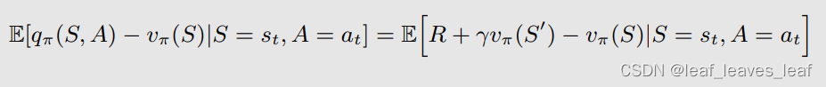

优点：只需一个网络即可逼近 vπ(s)，而不需要两个网络来逼近 qπ(s,a) 和 vπ(s)。

------

它是 on-policy 的。由于策略 π(θt) 是随机的 stochastic，因此无需使用 ε-greedy 等技术。

------

### 三.Off-policy actor-critic 方法

到目前为止 AC 的方法还有 policy gradient 的方法，它们都是 on-policy 的。如果之前有一些经验了，我们想用这些经验怎么办呢？我们可以用 off policy 的 actor-critic 的方法。接下来会介绍重要性采样 important sampling 来把 on-policy 的算法转化成一个 off policy 的算法

 我们可以将其转换为 off policy 的吗？

-    可以，通过重要性采样
-    重要性采样技术 important sampling 不仅适用于 AC，也适用于任何旨在估计期望值 expectation 的算法。包括前面的蒙特卡洛和 TD 都可以

转成 off policy 的算法的算法之后，我们就可以复用一些之前通过一些其他方法所得到的经验

>   On-Policy就是你用来探索生成数据的那个策略和你正在优化的策略是一样的，off-policy就是你探索的时候用一种策略但你实际上更新的是另外一个策略

------

如果我不知道 p0 的表达式，或者 p0 很复杂，我求不出来这个 E[X] 的时候，我能否通过采样的方式来求这个 E[X] 呢？

------

**方法1：**这个在我们介绍蒙特卡洛的时候介绍过

根据 X 的真实分布得到了一些 sample {xi}，那么每个 sample 的期望和方差都和 X 的是相等的

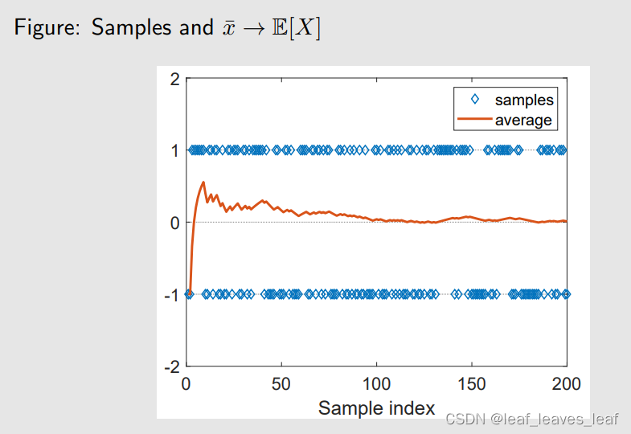

------

**方法2：**

我的 sample 是在另一个分布 p1 下采样得到的

------

 **问题：**我有一个概率分布 p1，在这个 p1 下产生了一些 sample，我想用这些 sample 来估计在 p0 下的 expectation

**为什么要这样做？**

我们可能希望根据行为策略（behavior policy） β 的样本来估计 E_A∼π[∗]，其中 π 是目标策略（target policy）。β 对应 p1，是来产生数据的，我要去估计在这个 π 分布下它的 expectation，所以 π 对应 p0

**如何做？**

如果直接对这些 sample 求平均，他最后。。。

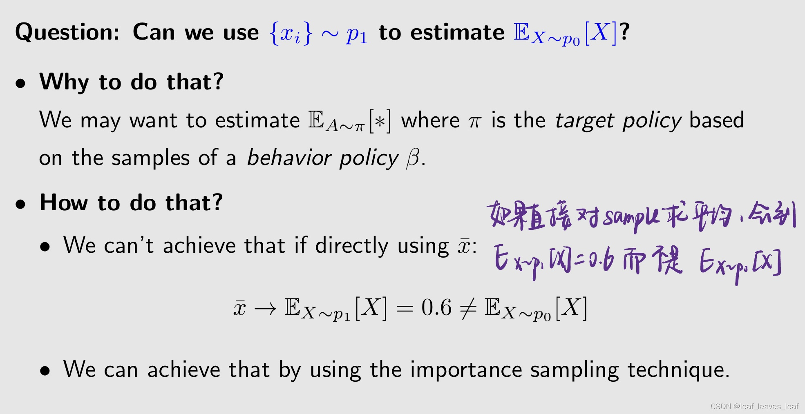

我们可以利用重要性采样技术来实现这一目标。

------

+1 的概率是 0.8，-1 的概率是 0.2，可以明显的看到，我取 +1 它得到的采样是非常多的而取 -1 得到的采样比较少，虚线代表 xbar，对采样求平均后会趋向 0.6，对应它的 expectation。红色的线代表我同样用这些数据，但是我用了 important sampling 这样的技术，我就可以让她趋向于 p0 所对应的 expectation 就是 0

------

**重要性采样：**

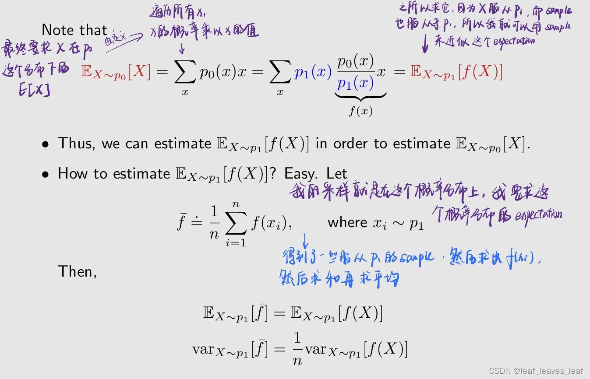

这个权重被称为 importance weight

-   当 p0 等于 p1 的时候，权重等于1
-   当 p0 大于 p1 的时候，权重大于1。直观解释是：我现在得到一个 xi，我发现 p0(xi) 比较大，这说明我在 p0 下采到 xi 的概率比较大；我发现 p1(xi) 比较小，这说明我在 p1 下很难采到 xi，我现在要计算 p0 下的 expectation，所以我需要很珍惜这个 xi 才对，因为他在 p1 下很难采到，而在我 p0 下很容易采到，所以我要给他比较大的重要性的权重，通过这样才能拉回来

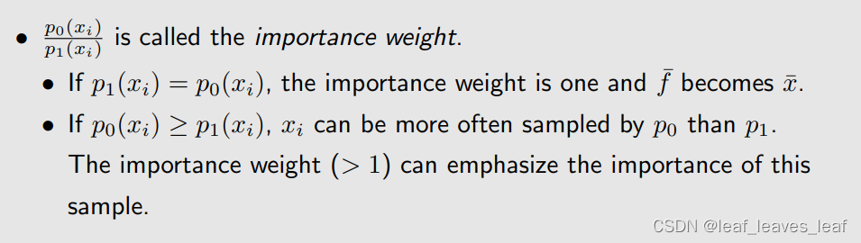

>   这个P0和P1是已知的吗？
>
>   这里我咋没太懂呢，p0和p1的关系我也不知道啊
>
>   p1已知p0未知
>
>   都是已知的，但是p0不用于采样，需要用p1的采样更新p0
>
>   但是直接更新又不准确，因此需要做这个重要采样
>
>   概率是已知的

------

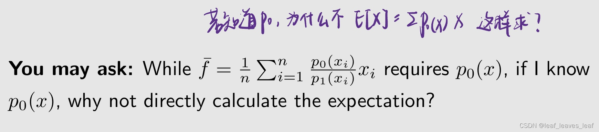

**回答：** 如果你能那么做，就不需要用 importance sampling，你用 importance sampling 是因为你不能那么做，也就是说我给一个 x，未能得到 p0(x)，但是我不能去求他的 expectation。它适用于给定 x 时，计算 p0(x) 很容易，但计算期望却很困难的情况。
 例如，我们这里考虑的是离散情况，但是连续情况的时候，这个时候就不能用求和了，要求积分，求积分的时候对 p0 的表达式有要求，很复杂的话可能计算不出来。更重要的情况是 p0 是用神经网络表达的，也就是你给我一个 x 我能够输出一个 p0(x)，但是 p0 的表达式根本就没有，没有表达式就无法求积分。在这种情况下，用 importance sampling

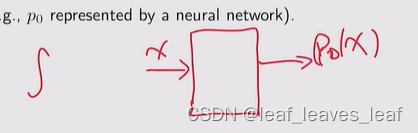

>   我这里有疑问，不用积分的方式，用采样的方式求期望不行吗？
>
>   -   可能是因为，虽然能得到p0(x)的值，但是因为p0表达式未知，所以生成服从p0(x)的采样依然很麻烦
>   -   所以p0并不是实际分布，只是一个用神经网络估出来的分布？那感觉好不到哪去啊
>
>   因为生成样本是有成本的，如果像你想的这样去生成了就变回前面on-policy的算法了
>
>   个人觉得最后这个生成数据有成本的解释有道理，因为off-policy的一个优势就是可以利用上手头有的数据-->p1产生的数据

为什么要用神经网络代表一个分布呢？

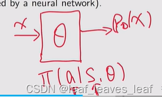

在强化学习里，有 Π(a|s,)，输入 s 和 a，我就通过这个神经网络能告诉你对应的概率

------

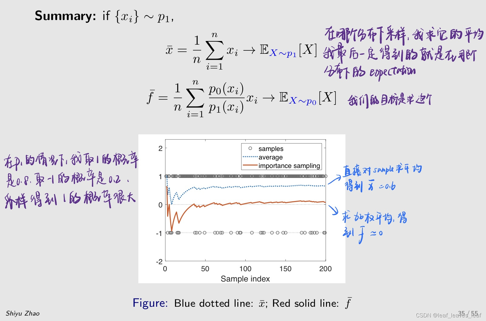

------

把重要性采样的技术用到 policy gradient 当中，去实现 off-policy 的学习。下面有两个步骤，第一个步骤要得到 gradient 的表达式是什么，在得到这个 gradient 的表达式之后，可以把它用到梯度上升的方法当中进行优化

与之前的 "on policy "情况一样，我们需要推导 "off policy "情况下的 policy gradient。
 假设 β 是产生经验样本的 behavior policy。
 我们的目的是利用这些样本更新 target policy π，使指标最大化

------

直接给出梯度的表达式 

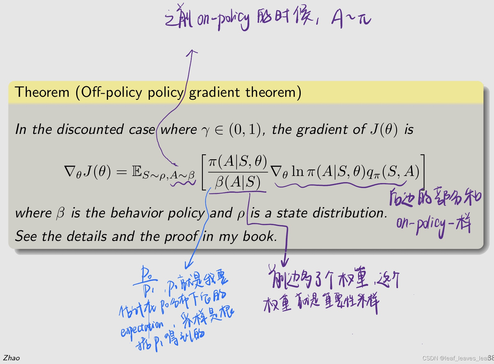

------

有了这个梯度的表达式，我们就可以立刻应用到梯度上升的方法中去优化，这里我仍然可以加上一个 baseline 然后不改变梯度，常见的方法就是把 baseline 设为 state value

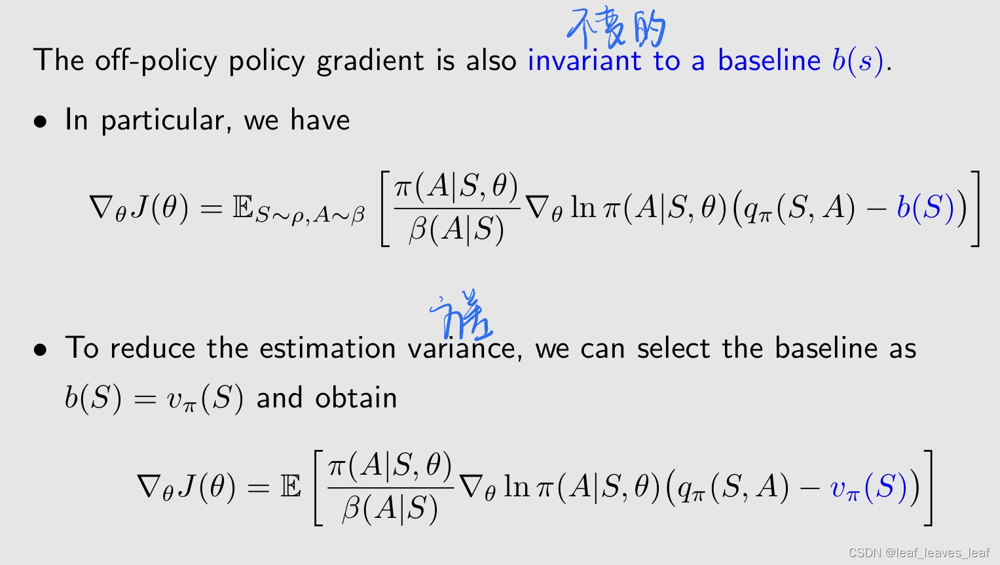

------

刚才是 true gradient，里面有 expectation，我不知道怎么求，就用 stochastic gradient 去代替，这个就是我们得到的 off policy 的 policy gradient 的算法

-   当 δt 比较大的时候，这个 step size 也会比较大，下一时刻会增大π(at|st) ，使得选择 action 的概率大一些，这个就是充分利用。
-   之前的分母上是 π，如果分母对应的策略 π(at|st) 比较小，他的 step size 也会比较大，所得到的下一时刻的 π(at|st) 的概率也会比较大，也就是在上一时刻我选择这个 action 的概率是比较小的，那么下一时刻选择这个 action 的概率就会增大一些。就是给他更多的机会去选择他，这样增加探索。但是在这里他不是 π，是 β，是一个固定的值，所以这时候里面就没有什么探索，就是充分利用，因为分母不可变

------

伪代码与 A2C 一样，区别就是这里有一个 behavior policy β，我产生经验采样的时候要根据 β 产生，后面的式子一模一样，除了在两处多了两个 importance weight

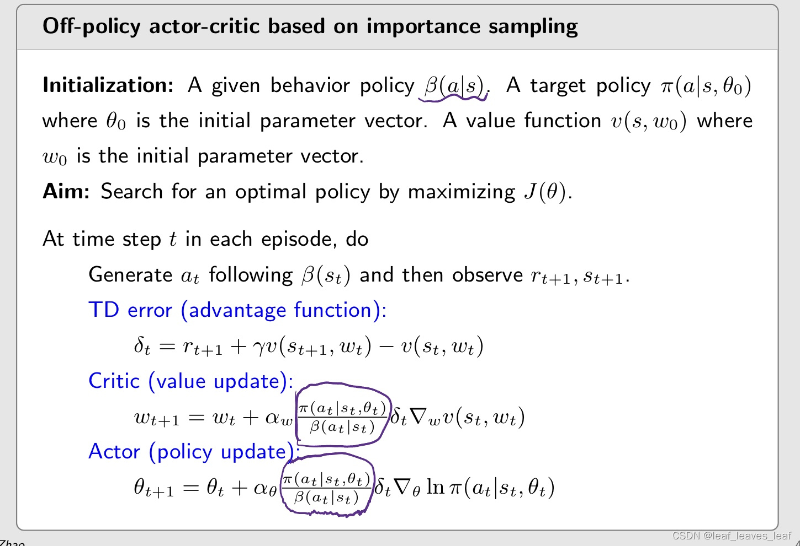

------

小结：介绍 QAC 的时候，主要突出的是 actor-critic 的思想是什么，介绍 A2C 的时候主要为了引入 baseline 来减少估计的方差，介绍 off policy actor critic 主要为了引入重要性采样这个方法

前三节的共同点是它的策略 π(a|s,) 一定是 >0 的，不会等于 0，也就是说它的除了一定是 stochastic 的策略，下面介绍一个很重要的的 deterministic actor critic

------

### 四. Deterministic actor critic(DPG)

到目前为止，策略梯度法中使用的策略都是随机策略，因为对于每个 (s, a)， π(a|s, θ) > 0。

我们能在策略梯度法中使用确定性策略吗？

-    优点：可以处理连续行动。

之前讲的我们的策略是 π，输入是 s，输出是 π(a1|s, θ)，...，π(a5|s, θ)，通过输出层，它可以约束每一个输出都是严格 >0 的并且它们的和等于 1，这种表达方式就是我们之前一直用的，它的缺点是它对 action 的个数有要求，只能是有限个，因为它的输出，不可能输出无限个

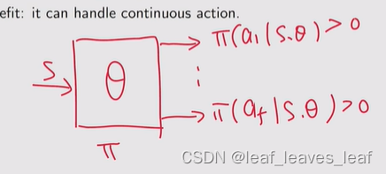

如果我在一个状态 s 有无限个 action，这时候就可以用 deterministic 的情况

>   不能把之前得到的策略取最大值吗？
>
>   -   把策略取最大值，策略不就又变成了表格的形式，如果状态是连续的做不到了

------

表示策略的方法

-    到目前为止，之前我们的策略都表示为 π(a|s, θ) ∈ [0, 1]，它是在状态 s 我 take action a 的概率是多少，是从 0-1 的一个数值，这个可以表示 stochastic 的策略也可以表示 deterministic 的策略，它可以是随机的，也可以是确定的。如果是 deterministic 就等于 1
-    现在，确定性策略 deterministic policy 具体表示为

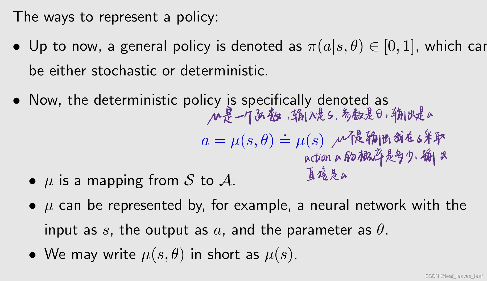

>   这个就变成了一个回归问题，输入状态输出动作
>
>   输出是a的分布？
>
>   -   不是分布，就是明确指令
>   -   stochastic才是a的分布吧，deterministic是a的值了

-    µ 是从状态空间 S 到动作空间 A 的映射，当在状态空间的点确定的时候，动作空间的点也就确定下来了。
-    在实际中，µ 可以用神经网络来表示，输入为 s，输出为 a，参数为 θ。
-    我们可以将 µ(s, θ) 简写为 µ(s)，隐藏掉参数 θ。

------

下面的介绍分两步，第一步就是介绍梯度怎么计算，第二步就是把梯度用到梯度上升的方法中去优化，与前面介绍的思想一样，所以梯度优化的方法在强化学习中广泛使用

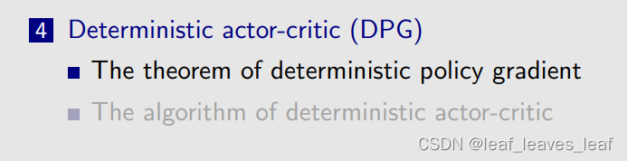

------

-    前面介绍的 policy gradient 定理仅适用于随机策略 stochastic policy。
-    如果策略必须是确定性的 deterministic，我们就必须推导出新的 policy gradient 定理。
-    其思想和过程是相似的。

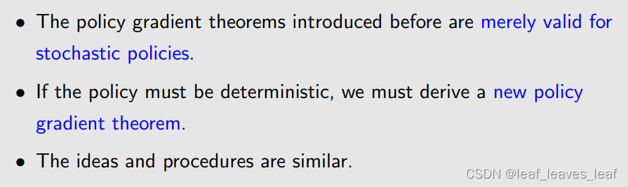

------

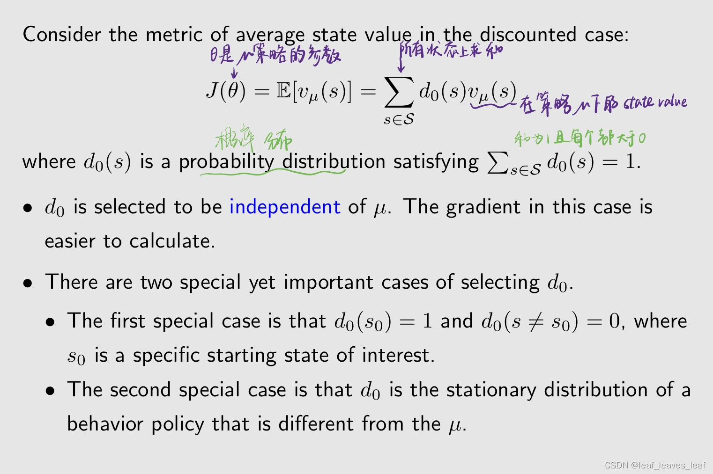

 d0 的选取与 µ 无关，这种情况下的梯度更容易计算。
 d0 的选择有两种特殊但重要的情况。

-    第一种特殊情况是我只关心某一个状态，比如说我有一个任务，我每次开始这个任务，我都会从这个状态出发，那其它状态都无所谓，我只需要最大化从这个状态出发的 return 就可以。 d0(s0) = 1 和 d0(s ！= s0) = 0，其中 s0 是一个特定的起始状态。这时候的目标函数是 v_µ(s0)，我只是最大化从 s0 出发的 return

-    第二种特殊情况是 d0 是一个 stationary distribution of a behavior policy，也就是我另外一个 behavior policy 比如说 β，在她下面的 stationary distribution，这个和 off policy 有关系。d0 是不同于 µ 的 behavior policy 的静态分布。

待会大家就会发现，这个 deterministic policy gradient 是 off policy 的天然的，我不需要用 importance sampling 把它转成 off policy 的，他自己就是 off policy

------

这个梯度和 stochastic 的梯度很不同，因为这里没有涉及到 A

与随机情况（stochastic case）有一个重要区别：

-    梯度不涉及行动 A 的分布（为什么？），这个 action A 最后会被替换成 µ(s)，所以没有 action A，那自然也就没有 A 所谓的梯度
-    因此，确定性策略梯度法是 off policy 的。因为之后我会对 true gradient 求 stochastic gradient，也就是采样，我在进行采样的时候如果给定了一个 s，然后我要求得到一个 a，再得到 r_t+1 等等，这时候我不需要关心 a 到底是哪个策略得到的，因为 expectation 没有要求我必须按照哪一个策略得到，可以是任意的，所以这时候我就可以用一个 behavior policy，其他的任何一个策略都可以

------

根据 policy gradient，最大化 J(θ) 的梯度上升算法为

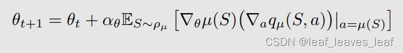

上面式子的 expectation 不能求出来，所以我用 stochastic gradient 来代替。相应的随机梯度上升算法是

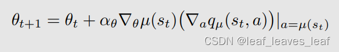

------

------

备注

-    这是一种 off-policy 的方式，其中的 behavior policy β 可能与 µ 不同，µ 是 target policy。
-    β 也可以与 µ 一致，那就是每次我得到一个 µ 之后，因为 µ 是确定性的，是不能探索的，所以我可以给他加上一些噪音，让动作左右摇摆一点，就可以有一定的探索性，然后去到下一个时刻去执行采样的任务，在那样的情况下就变成了 on-policy 的情况。β 也可以用 µ+noise 代替。
-   本质上来说它是一个 off policy 的算法，所以他既可以用 on-policy 也可以用 off policy 的实现方式。
-   µ+noise 的方式与我们之前的 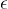-greedy 的方法类似，但是这里我们不能用，因为这里边他的 action 是连续的，我不能在其它有限的 action 上加一些比较小的概率

 如何选择表示 q(s,a,w)的函数？

-    线性函数：q(s, a, w) = φT(s, a)w，其中 φ(s, a) 是特征向量，w 是参数。详情请参见 DPG 论文。它的问题在于，一个是我要选取这个 feature vector，再一个就是它是线性的，他对于逼近真实的 action value 的能力有限
-    神经网络：深度确定性策略梯度法（DDPG）。