# 强化学习的数学原理 课程笔记 01 基本概念

## 一. 内容概述

第一部分主要有两个内容：

1.   通过案例介绍强化学习中的基本概念
2.   在马尔可夫决策过程（MDP）的框架下将概念正式描述出来

## 二. 通过案例介绍强化学习中的基本概念

### 1. 网格世界（A grid world example）

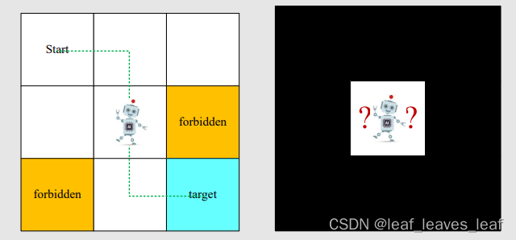

本课程中始终使用的一个示例：网格世界

1.   网格类型：可访问（Accessible）；禁止访问（forbidden）；目标单元格（target cells）；边界（boundary）
2.   机器人只能在相邻网格移动，不能斜着移动

强化学习的任务：==给任意一个起始点，找到一个比较好的路径到达目标。比较好的路径就是尽量避开禁止访问的地方，不要有无意义的拐弯，不要超越边界。==

### 2. 状态（State）

**状态（state）**：智能体**相对于环境**的状态

==以网格世界为例，智能体的位置就是状态。==有九个可能的位置，因此也就有九种状态：S1、S2、...... , S9。这些字母是一个索引，真正对应的状态可能是在二维平面上的位置（x,y），更复杂的问题可能还会对应速度，加速度，或其他类型的状态信息等等。

**状态空间（state space）**：把所有状态放在一起，所有状态的集合（set）
$$
S=\{s_i\}_{i=1}^{9}
$$

### 3. 动作（Action）

**动作（action）**：每个状态都有五种可能的行动：a1, ... . , a5

-   a1：向上移动；
-   a2： 向右移动；
-   a3： 向下移动;
-   a4： 向左移动；
-   a5： 保持不变；

**状态的动作空间（action space）**：状态的所有可能动作的集合。
$$
A(s_i)=\{a_i\}_{i=1}^5
$$

>   [!NOTE]
>
>   动作空间和状态有依赖关系，**不同状态的动作空间不同**，由上面的公式可知，$A$ 是 $s_i$ 的函数。

### 4. 状态转移（State transition）

在采取行动（action）时，智能体可能会从一个状态移动到另一个状态。这种过程称为状态转移。

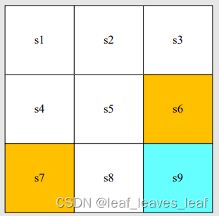

-   在状态 s1 下，如果我们选择行动 a2，那么下一个状态是什么？（向右移动一格）

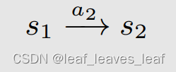

-   在状态 s1 下，如果我们选择行动 a1，那么下一个状态是什么？（向上移动一格，会撞到边界，所以状态还是 s1）

$$
A(s_i)=\{a_i\}_{i=1}^5
$$

>   [!NOTE]
>
>   **状态转换描述了智能体与环境的交互行为。**在游戏当中可以任意定义某个状态采取一个行动后状态的转换，但是在实际中不可以。

**注意禁止访问的区域（forbidden area）：**

例如：在状态 s5，如果我们选择操作 a2、 那么下一个状态是什么？

-   情况 1：禁区可以进入，但会受到惩罚。那么

-   情况 2：禁区无法进入（如被围墙包围)

本课程考虑的是第一种情况，这种情况更为普遍，也更具挑战性。

 **表格表示法（Tabular representation）：** 我们可以使用表格来描述状态转换，表格的每一行对应状态（state），每一列对应行动（action）。**表格表示法只能表示确定性（deterministic）的情况。**

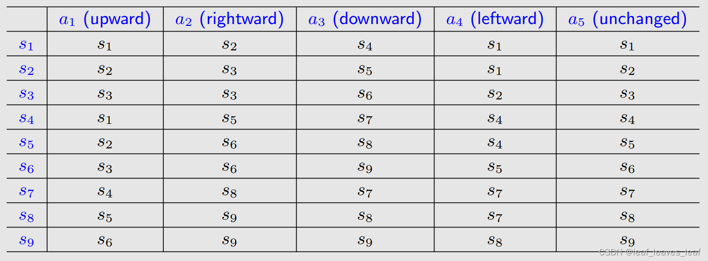

**State transition probability：**使用概率描述状态转换

-   直觉：在状态 s1 下，如果我们选择行动（take action） a2，下一个状态就是 s2。
-   数学：使用**条件概率**表示

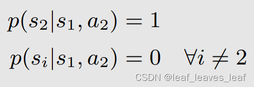

解释：假如当前时刻状态在 s1，采取动作 a2，那么下一时刻状态转移到 s2 的概率是1，但是下一时刻转移到其他任意 i ≠ 2 的状态的概率是 0 。 

虽然这里仍然是确定性情况，但是也可以用条件概率**描述随机性的（stochastic）**状态转换（例如阵风），假如当前时刻状态在 s1，采取动作 a2，由于有风，有百分之 50 的概率到 s2，有百分之 50 的概率到 s5。

### 5. 策略（Policy） 

==**策略告诉智能体在某一状态下应采取什么行动。**==

**（1） 策略的直观表示法：** 我们用箭头来描述策略。（图中的圆圈表示待在原地不动）

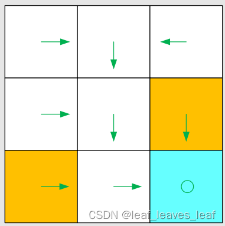

基于这一策略，我们可以得到以下**不同起点的轨迹**（path，trajectory）。

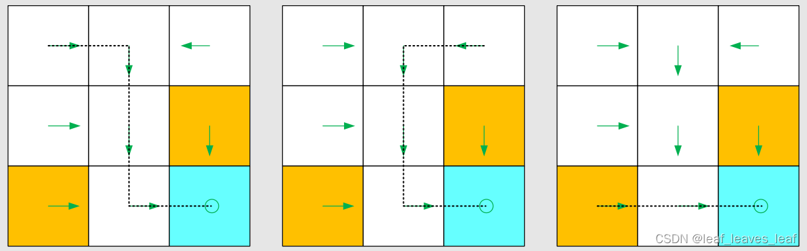

**（2）策略的数学表示法：**使用条件概率描述策略

**确定性策略（deterministic policy****）：**

例如，对于状态 s1，它的策略 Π 就是一个条件概率，它指定了任何一个状态下，采取任何一个动作（action）的概率是多少。

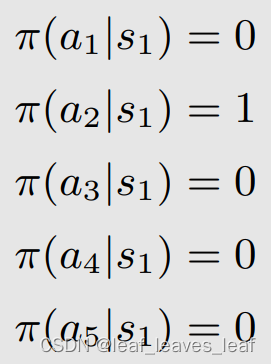

**公式解释：**在状态 s1 下，采取动作（take action） a1 往上走的概率是 0；在状态 s1 下，采取动作（take action） a2 往右走的概率是 1，以此类推。

**针对一个状态所有可能采取的动作的概率之和应该等于 1。**

上面例子只说了 s1，还有 s2， ...，s9，针对每个状态都要它的有策略。

**不确定性策略（stochastic policy）：**

在这一策略中，对于状态 s1，使用条件概率表示策略：

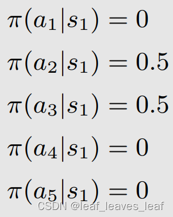

**公式解释：**在状态 s1 下，采取动作（take action） a1 往上走的概率是 0；在状态 s1 下，采取动作（take action） a2 往右走的概率是 0.5，以此类推。

**针对一个状态所有可能采取的动作的概率之和应该等于 1。**

**（3） 策略的表格表示法：**每一行对应一个状态（state），每一列对应一个动作（action）

>   [!NOTE]
>
>   **这样的表格可以描述确定性（deterministic）或随机性（stochastic）的情况**，在编程的时候就是这么做的，会用一个数组或者矩阵表示这样的一个策略。

### 6. 奖励（Reward）

奖励（reward）是强化学习中最独特的概念之一。

奖励：智能体采取行动（take action）后获得的真实数字，是标量。

-   如果这个数字是正数，则是正向奖励，代表对采取此类行动的鼓励。
-   如果这个数字是负数，则是负向奖励，代表对采取此类行动的惩罚，不希望这样的行为发生。
-   那么零奖励呢？代表没有惩罚。
-   正数也可以意味着惩罚，负数也可以意味着奖励，这是数学上的技巧而已。

在网格世界示例中，奖励设计如下：

-   如果智能体试图离开边界，则让 r_bound = -1
-   如果智能体试图进入禁区，让 r_forbid = -1
-   如果行为体到达目标单元，让 r_target = +1
-   其他情况下，智能体获得的奖励为 r = 0

奖励可以被理解为一种人机界面（我们与机器交互的一种手段），我们可以用它来引导智能体按照我们的期望行事。例如，有了上述设计的奖励，智能体就会尽量避免走出边界或踏入禁区，而会尽量进入目标区域。所以可以通过设计 reward，实现目标。

**（1）奖励转换（reward transition）的表格表示法：**表格的每一行对应一个状态（state），每一列对应一个动作（action），表格中间表示在某个状态采取某个动作得到的奖励（reward）。

表格只能表示**确定性的情况（deterministic）**，比如在一个状态采取了一个行动，一定会得到某种奖励，但是实际上奖励（reward）的大小可能是不确定的，这时候可以使用下面的数学表示法表示。

**（2）奖励的数学表示法：**条件概率

**直觉：**在状态 s1 下，如果我们选择行动 a1，奖励为 -1

**数学：**

这里是一个确定性(deterministic)案例，在这个状态采取这个行动，一定会得到那个 reward。奖励转换（reward transition）也可能是随机（stoachstic）的。例如，如果你努力学习，这个行为会被鼓励，就会得到正的奖励。但正的奖励的数值多少不确定。

>   [!NOTE]
>
>   ==奖励依赖于当前的状态和动作，而不是依赖于下一个状态。比如在 s1 选择动作 a1，会回到 s1；在 s1 选择动作 a5，也会在 s1，这两个行为的下一个状态应用，但动作不一样，reward 就不一样。==（这个问题更详细的讨论见赵老师写的书的第一章的 Q&A 的最后一个问题 P25）

### 7. 轨迹和收益（Trajectory and return）

**（1）策略1**

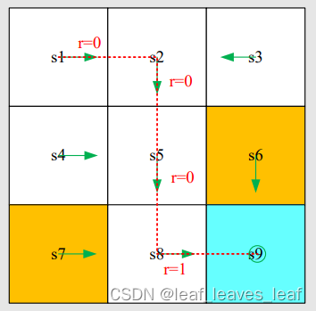

**轨迹（trajectory）是一条状态-行动-回报链：** 

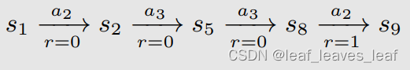

**这条轨迹的收益（return）是**沿轨迹（trajectory）收集的所有奖励（reward）的总和（The return of this trajectory is the sum of all the rewards collected along the trajectory:）：return = 0 + 0 + 0 + 1 = 1

**（2）策略2**

不同的策略（policy）带来不同的轨迹（trajectory）

这条路径的收益是（The return of this path is）： return = 0 − 1 + 0 + 1 = 0

 **哪种策略更好？**

-   从直觉上将：第一个更好，因为它避开了禁区。
-   在数学角度：第一种更好，因为它的收益（return）更大！
-   **收益（return）可以用来评价一项策略（policy）的好坏**（详见下一课）！

### 8. 折扣回报（discounted return）

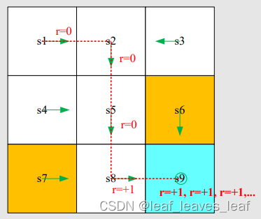

**轨迹可能是无限的（A trajectory may be infinite:）：**

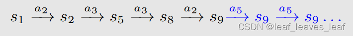

收益是（ The return is ）：return = 0 + 0 + 0 + 1+1 + 1 + . . . = ∞

这个定义是无效的，因为回报（return）发生了偏离，会发散！需要引入**折扣率（折扣因子） （discounted rate）：γ∈ [0, 1）**

折扣率（discounted rate）和回报（return）结合就得到了**折扣回报（Discounted return）**

折扣回报（Discounted return）的作用：**1）总和变得有限；2）平衡远期和近期的回报（reward）：

-   如果 γ 接近于 0， γ 的三次，五次方会很快的衰减掉，则**折扣回报（Discounted return）**的价值以近期（最开始）获得的奖励（reward）为主。
-   如果 γ 接近于 1，未来的奖励（reward）衰减比较慢，则**折扣回报（Discounted return）**的价值以远期奖励（reward）为主。

通过控制 γ ，能够控制智能体学到的策略，若减小 γ ，会让智能体变得更加短视（更加注重最近一些的奖励 reward）；若 γ 较大，会让智能体变得更加远视（更加注重长远的奖励 reward）

### 9. Episode

​    

当智能体按照策略（policy）与环境交互时，**可能会在某些终端状态（terminal states）停止。由此产生的轨迹（trajectory）称为一集（an episode）**（或一次试验 trail）。

例如：episode

**通常假定一集（An episode）是一个有限的轨迹（finite trajectory）**，有 episodes 的任务称为偶发任务（episodic tasks）（An episode is usually assumed to be a finite trajectory. Tasks with episodes are called episodic tasks.）

有些任务可能没有结束状态（have no terminal states），这意味着与环境的交互永远不会结束。这类任务被称为持续性任务（continuing tasks）。

在 "网格世界 "的例子中，我们是否应该在到达目标后停止？还是像刚才计算折扣回报（ discounted return ）的时候还可以继续让智能体执行策略，然后一直停到 s9 状态？

事实上，我们可以通过**将偶发任务（episodic tasks）转换为持续任务（continuing tasks）**，用统一的数学方法来处理偶发任务和持续任务。

转换的两种方法：

-   方案 1：将目标状态（target state）视为特殊的吸收状态（absorbing state）（absorbing state 就是在设置它的 state transition probability 的时候，如果当前状态就是 target 状态，不论采取什么样的 action 都会再回到这个状态；或者在这个状态的时候没有其他的 action ,可以修改 action space ，让它的 action 只有留在原地这样的一个 action）。一旦智能体达到吸收状态（absorbing state），就永远不会离开。因此它之后得到的所有奖励（reward ）r = 0。
-   方案 2：将目标状态（target state）视为有策略的正常状态（a normal state with a policy）。如果策略好的话，智能体能够一直留在那里，收集正的收益（reward） ，策略不好的话智能体仍然可能离开目标状态，并在进入目标状态时获得 r = +1 的收益。

我们在本课程中将考虑方案 2，这样我们就不需要将目标状态（target state）与其他状态区分开来，而可以将其视为正常状态（a normal state）。

## 三. 在马尔可夫决策过程（MDP）的框架下将概念正式描述出来

### 1. 马尔可夫决策过程（Markov decision process） 的关键要素：

#### （1）集合（Sets）

-   **状态（即 state space）：**状态 S 的集合。（State: the set of states S）
-   **行动（即 action space）：**与状态 s∈S 相关联的行动集 A(s)。（Action: the set of actions A(s) is associated for state s ∈ S.）
-   **奖励：**奖励 R（s，a）的集合 （Reward: the set of rewards R(s, a).）（从状态 s 出发，选择动作 a，即 take action a ，得到的 reward 一定来源于一个集合）

#### （2）概率分布（Probability distribution (or called system model)）

-   **状态转换概率：**在状态 s 下，采取行动 a，转换到状态 s' 的概率为 p(s'|s, a)         （State transition probability: at state s, taking action a, the probability to transit to state s' is p(s’|s, a)
-   **奖励概率：**在状态 s 下，采取行动 a，获得奖励 r 的概率为 p(r|s, a)                （Reward probability: at state s, taking action a, the probability to get reward r is p(r|s, a)）

#### （3）策略（policy）—— ==对应 Markov decision process 中的 decision==

​    策略：在状态 s 下，选择行动 a 的概率为 π(a|s)

​    Policy: at state s, the probability to choose action a is π(a|s)

#### （4）马尔可夫性质：无记忆性质（Markov property: memoryless property）—— ==对应 Markov decision process 中的 Markov==

这是与历史无关的一个性质。

比如最开始的状态是 s0，然后我采取了一个 action a0，慢慢的我走到 st 的时候，我采取了一个 action 是 a_t，这时候我跳到下一个状态 s_t+1 的概率**等于**完全不考虑这些历史，也不管之前在什么地方，反正现在在 st，现在 take action a_t+1，会跑到 s_t+1 的概率。

本讲座介绍的所有概念都可以放在 MDP 的框架中（All the concepts introduced in this lecture can be put in the framework in MDP）

### 2. 马尔可夫过程（Markov process）

网格世界（The grid world）可以抽象为一个更通用的模型，即马尔可夫过程（Markov process）。

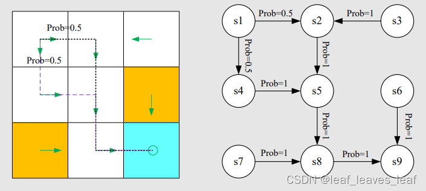

圆圈代表状态（states），带箭头的链接代表采取 action 后的状态转换（state transition）。

### 3. 马尔可夫过程（Markov process）与马尔可夫决策过程（Markov decision process） 的关系

一旦给出策略，即策略确定下来，那么 policy 就和整个系统融为一体了，马尔可夫决策过程（Markov decision process）就变成了马尔可夫过程（Markov process）！

Markov decision process becomes Markov process once the policy is given!

## 四. 总结

通过使用网格世界的示例，我们展示了以下关键概念：

By using grid-world examples, we demonstrated the following key concepts:

-   State
-   Action
-   State transition, state transition probability p(s 0 |s, a)
-   Reward, reward probability p(r|s, a)
-   Trajectory, episode, return, discounted return
-   Markov decision process

