# 强化学习的数学原理 课程笔记 02 bellman equation

## 一. 内容概述

### 1. 第二章主要有两个内容

（1）一个核心概念：状态值（state value）：从一个状态出发，沿着一个策略我所得到的奖励回报的平均值。**状态值越高，说明对应的策略越好**。之所以已关注状态值，是因为它能**评价一个策略的好坏**。

（2）基本工具：贝尔曼公式（the Bellman equation）：

-   用于分析状态值，描述所有状态和状态值之间的关系，这个关系就是一个方程，一个等式。通过求解这个方程就可以求解出来一个给定策略的状态值，因此就可以评价这个策略的好坏。
-   求解贝尔曼公式进而得到一个策略所对应的状态值这样的一个过程被称为策略评价（policy evaluation），policy evaluation 在强化学习中是非常基础的一个概念，我评价了一个策略得到它的值，然后基于它的值再改进策略然后循环下去，最后就能得到一个最优的策略。 

### 2. 第二章大纲

（1）激励性实例（Motivating examples）

（2）状态值（state value）

（3）贝尔曼公式（ Bellman equation）：推导

（4）贝尔曼公式（  Bellman equation）：矩阵向量形式

（5）贝尔曼公式（ Bellman equation）：求解状态值（state value）

（6）动作值：从 state value 过渡到 action value

## 二. 激励性实例（Motivating examples）

### 1. 例子1：为什么回报/收益（return）很重要？

#### （1）**什么是回报**（return）**？**

沿着轨迹获得的奖励（reward）的（折扣discounted）总和。

What is return? The (discounted) sum of the rewards obtained along a trajectory.

#### （2）为什么回报（return）很重要？

下图的第三个表示，这个策略在 s1 状态有百分之 50 的概率向右，有百分之 50 的概率向下。

**问题：**从起点 s1 出发，哪项策略（policy）是 "最好的"？哪项 "最差"？

**直觉：**第一个最好，第二个最差，因为第二个进入了禁区。

**数学：**我们能用数学来描述这种直觉吗？回报（return）可以用来评估策略（policy），return 可以告诉我们哪个策略好，哪个策略坏，这样才能不断地改进策略。请参阅下文。

-   根据策略 1（左图），从 s1 开始，折扣回报（discounted return）为

-   根据策略 2（中图），从 s1 开始，折扣回报（discounted return）为

-   根据策略 3（右图），从 s1 开始，折扣回报（discounted return）为（策略3是随机性的Policy 3 is stochastic!）

>   策略 3 这里其实是在计算期望。这里已经不是 return 的概念了，return 的概念是针对一个轨迹定义的，现在有两个轨迹，我们在做的是求平均值，即求期望。其实这里求的是状态值（state value）。

总之，从 s1 开始

上述不等式表明，第一种策略是最好的，第二种策略是最差的，这与我们的直觉完全相同。

***计算回报（return）对于评估一项策略非常重要。***

### 2. 例子2：如何计算回报（return）？

>   上图中四个状态（state）是 s1,s2,s3,s4，策略（policy）是绿色的箭头，奖励（reward）是 r1,r2,r3,r4。

#### （1）方法1：通过定义

***让 vi 表示从 si（i = 1、2、3、4）出发得到的回报（return）。***

注意，轨迹是无穷的，例如，从 s1 出发：s1->s2->s3->s4->s1->s2->s3->s4->s1......会一直走下去

#### （2）方法2：

上面这一组式子告诉我们从不同状态出发得到的 return 依赖于从其他状态出发得到的 return，回报（return）相互依赖。 

>   这一思想在强化学习中被称为 Bootstrapping !

------

如何使用这些方程？把上面的一组式子写成矩阵向量的形式（matrix-vector form）：

可被重写成一种更简化的形式：

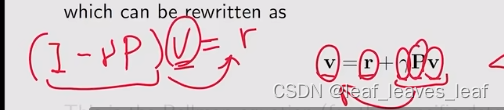

从上面的方程可以解出从不同状态出发的价值（value） v ，这就是贝尔曼公式（针对这个特定的确定性 deterministic 问题）！ 

-   虽然简单，但它展示了核心概念：一个状态（state）的价值（value）依赖于其他状态（state）的价值（value）
-   矩阵向量形式更容易理解如何求解状态值（state value）。

------

**练习：**

考虑图中所示的策略（policy）。请写出回报（return）之间的关系（即写出贝尔曼方程）

答案：（从 s1 出发，以奖励 0 到状态 s3 ，从状态 s3 出发得到的 return 是 v3；从 s2 出发，以奖励 1 到状态 s4 ，从状态 s4 出发得到的 return 是 v4；...）

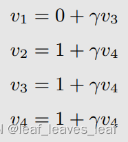

如何求解？这是一个线性方程组，很好求解。 我们可以先计算 v4，然后计算 v3、v2、v1。

------

## 三. 状态值（state value）

**单步：**

请考虑以下单步（single-step）流程：

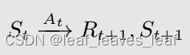

-   t, t + 1：离散时间实例，t 指当前的时刻，t+1 指下一个时刻 
-   St：t 时刻的状态
-   At：在状态 St 采取的动作
-   Rt+1：在状态 St 采取动作 At 之后获得的奖励（reward）（有时也写成Rt，写成什么都没有区别，只是一个习惯，但是一般都写成 Rt+1）
-   St+1：采取动作 At 后转换到的状态

注意，St、At、Rt+1 都是大写的，代表随机变量（random variables），就是我们可以对他进行一系列的操作，比如求期望（expectation）。

------

每一步的所有跳跃（step）都由以下概率分布（probability distributions）所决定：

-   在 St 要采取什么样的动作（action）由**策略 Π** 来决定
-   在 St 采取动作（take action）At，要得到什么样的奖励（Reward）由**奖励概率（reward probability）**决定
-   在 St 采取动作（take action）At，要跳到下一个什么状态（State）由**状态转移概率（ state transition probability）**决定

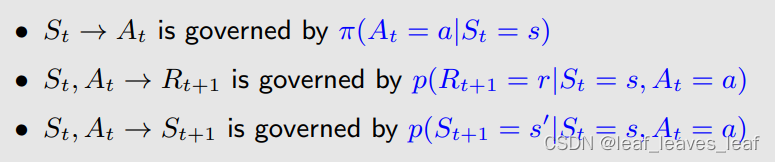

governed：受约束的，所规管的

**多步：**

考虑以下多步骤轨迹（multi-step trajectory）：

折扣回报（discounted return）Gt 是所有瞬时回报（immediate reward）与折扣因子（discount rate）乘积相加：

-   γ∈ (0, 1) 是折扣率（discount rate）。
-   Gt 也是一个随机变量（random variables），因为 Rt+1、Rt+2、......都是随机变量（random variables）。

**正式定义状态值（state value）：**

折扣回报（discounted return）Gt 的期望值（或称为期望值 expectation 或平均值 mean）被定义为状态值函数（state-value function），或简称为状态值（state value）： 

The expectation (or called expected value or mean) of Gt is defined as the state-value function or simply state value:

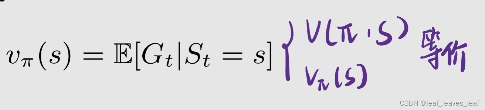

注意：

-   ***\*状态值（state value）它是 s 的函数，\****是一种条件期望（conditional expectation），条件是状态从 s 开始。从不同的状态 s 出发，得到的轨迹不同，得到的折扣回报（discounted return）Gt 也不同
-   ***\*状态值（state value）它是策略 Π 的函数，\****对于不同的策略（policy） ，会得到不同的轨迹，不同的轨迹会得到不同的折扣回报（discounted return）Gt，就会得到不同的状态值（state value）
-   它代表一个状态的 "价值"。如果状态值（state value）越大，那么从这个状态出发的策略（policy）就更好，因为可以获得更大的累积回报（return）。

------

**问：**回报（return）与状态值（state value）之间的关系是什么？

**答：**回报（return）是针对单个轨迹（trajectory）求的 return；状态值（state value）针对多个轨迹（trajectory）得到的 return 再求平均值。如果从一个状态出发，**有可能得到**多个轨迹（trajectory），这时候回报（return）与状态值（state value）显然有区别；但假如从一个状态出发，一切都是确定性的，只能得到一条轨迹（trajectory），这时候那个状态的回报（return）与那个状态的状态值（state value）是一样的。

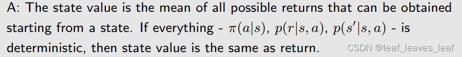

------

**例子：**

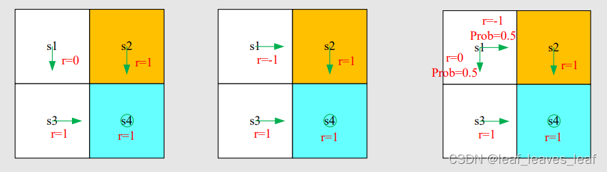

这三个例子分别对应三个策略 Π1，Π2，Π3，三个策略导致了三个轨迹（trajectory 理解为根据策略可能走出的轨迹），要计算在这三个不同策略下同一个状态 s1 的状态值（state value）

策略 1 和 2 从 s1 出发，能得到唯一的一个 trajectory，这个 trajectory 的 return 就是它们分别的 state value

策略 3 有两条轨迹，状态值（state value）是这两条轨迹分别得到的回报（return）的平均值。就是把 probability 乘到前面去，这实际上就是期望（expectation）的求法。

比较三个策略导致的状态值（state value）的大小可知，第一种策略是最好的，第二种策略是最差的，这与我们的直觉完全相同。

##  四. 贝尔曼公式：推导

### 1. 推导

-   状态值（state value）固然重要，但如何计算呢？答案就在贝尔曼公式（Bellman equation）中。
-   总之，贝尔曼公式（Bellman equation）描述了不同状态的状态值（state value）之间的关系。

考虑一个随机轨迹：

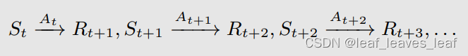

折扣回报（discounted return）Gt 可写成

所以这个时刻我所得到的 return 等于我能立即得到的奖励（immediate reward）Rt+1 加上到下一时刻从那出发能得到的 return （futrue reward）乘以 discount rate

那么，根据状态值（state value）的定义可以得出

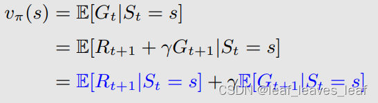

接下来，分别计算这两个项，求出他们的形式，就得到了贝尔曼公式

------

首先，***\*计算第一项\**** E[Rt+1|St = s]：当前时刻我在状态 s ，我得到的立即奖励（immediate reward）是 Rt+1

**理解：**

在状态 s ，我有多个 action 可以去选择，take action a 的概率是 Π（a|s)，当我 take action a 我所得到的 value 是 E[Rt+1|St = s, At = a]。E[Rt+1|St = s, At = a] 可以写成

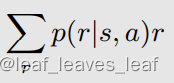

意思是，从 s 出发，take action a，得到的奖励（reward）是 r 的概率是 p(r|s, a)，根据期望的定义，取值为 r 的概率乘以 r 本身就是期望。

>   ***\*注意：\****第一项其实就是我能得到的立即奖励（immediate reward）的期望/平均

------

-   大写的 S 不确定，小写的 s 是确定的。在前面的 state value 定义时已说明，S、R 表示随机变量。
-   这里的大写 St，At，Rt+1都是集合，所以对于任意时刻 t，S 是确定的，A 可能有几种不同选择。 而之前的例子是确定性奖励，所以对于 R 是一个集合（变量）印象不深。最简单的就是抽奖，你每次执行同样的行为得到的奖励却不同
-   这里 Π（a|s) 是采取动作 a 的概率，后面一项是采取这个动作之后，到下一个不同状态的概率
-   比如我有 0.5 概率（pai）撞到墙，但是撞到墙之后有 0.1 概率原地不动，也有 0.9 概率后退一步，这部分内容就是后面的 p
-   这里就是枚举了所有动作下的概率和收益的成绩加起来算了期望
-    就是两次离散型随机变量计算期望

------

其次，***\*计算第二项\**** E[Gt+1|St = s]：第二项是我从当前状态 s 出发得到的下一个时刻的回报（return）的期望（mean）

-   第一行：从当前 s 出发，有多个选择，可以跳到不同 s' ，跳到不同 s' 的概率是 p(s' | s)，跳到不同 s' 所得到的值是 E[Gt+1|St = s, St+1 = s’ ]，一相加就是 E[Gt+1|St = s]
-   从第一行到第二行：E[Gt+1 | St = s, St+1 = s’ ] 意思是当前状态是 s，下一个状态是 s'，计算从下一个状态出发所得到回报（return）的期望（mean），第二行 E[Gt+1|St+1 = s' ] 把第一行中那一项的 St = s 去掉了，因为我已经知道了下一个状态是 s'，就不用关系我之前究竟是在什么状态了，这其实就是马尔可夫的性质，是无记忆的（memoryless Markov property）
-   从第二行到第三行：E[Gt+1 | St+1 = s' ] 意思是从下一个状态 s' 出发计算我所能得到的回报（return）的平均值（mean），这个就是第三行写的一个状态值（state value）v_π(s’)，只不过是针对 s' 的状态值（state value）v_π(s’)。——最开始的状态值（state value）的定义
-   从第三行到第四行：从 s 到 s' 的概率 p(s' | s)：从 s 出发我有多种选择，可以选择不同的动作（action），选择 action a 的概率是 π(a|s) ，选择这个 action 我跳到 s' 的概率是 p(s' |s, a)，通过两者相乘相加可以得到 p(s' | s)。

>   ***\*注意：\****第二项是 future reward 的平均（mean）

------

**贝尔曼公式（Bellman equation）：此处西格玛 a 后面应该加一个左大括号 {，右大括号在式子的最后面 }**

**强调，由方程中的符号可以得出以下重点：**

-   上述方程称为贝尔曼方程（Bellman equation），它描述了不同状态（states）的状态值函数（state-value functions）之间的关系：因为看上面式子标红的地方，上面式子等式左边是 s 的状态值（state value），等式右边是 s' 的状态值（state value），他们的关系可以通过这样的一个式子表达出来。
-   它由两个项组成：即时奖励项（immediate reward term）和未来奖励项（future reward term）。
-   这是一组等式：每个状态（state）都有这样的等式！！！这不是一个式子，这个式子对状态空间中的所有状态都成立（等式后面的取值范围是 ∀s ∈ S），所以如果有 n 个状态，就有 n 个这样的式子，通过这 n 个式子可以求解出状态值（state value）。

-   v_π(s) 和 v_π(s') 是我们要计算的状态值，计算的思想就是 Bootstrapping ! 直观上来讲，等式左边的状态值（state value）v_π(s) 依赖于等式右边的状态值（state value）v_π(s') ，看起来好像没法计算，其实我们有一组这样的式子，把这些式子连立就可以算出来。
-   公式中的 π(a|s) 是给定的策略 policy（是一种概率 probability）。解方程称为策略评估（policy evaluation）：贝尔曼公式依赖于策略（policy），***\*如果我们能计算出状态值（state value），其实我们在做的一件事就是评估这个策略（policy evaluation）究竟是好是坏\****。 
-   奖励概率 （Reward probability） p(r|s,a) 和状态转换概率（State transition probability） p(s'|s,a) 代表的是**动态模型（dynamic model）或称为环境模型（environment model）**：分两种情况，一种是我们知道这个模型（model），在本节和下节当中我们都会假设知道这个 model，给出来相应的算法；一种是不知道模型（model），这种情况下我们仍然可以求出 state value，这就是 model free reinforcement learning 的算法。

------

### 2. 例子

#### （1）例子1：

图中的策略 Π 由绿色的箭头表示

根据一般表达式（general expression）写出贝尔曼方程：

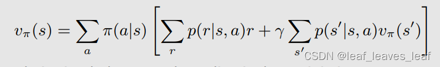

这个例子很简单，因为策略（policy）是确定的（deterministic）。

首先，考虑 s1 的状态值（state value）：

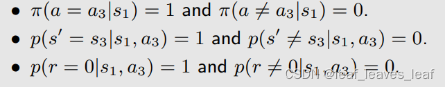

将上面这些概率和值代入贝尔曼方程，得出：（下面这个式子和上面在 二.2 那部分用激励性例子 2 介绍的方法计算出的结果一样，即与上面直观计算出的结果是一样的，虽然此时是用复杂贝尔曼公式得到的，但从直观上来讲很容易理解）

类似地，可以得出

从最后一个方程到第一个方程，逐一求解上述方程，得到：

如果 γ = 0.9，那么

计算出 s1 的状态值是 9，s2,s3,s4 的状态值是 10。状态值（state values）代表这个状态的价值，如果一个状态的价值高，说明这个状态是值得我们往那个方向走的，之所以 s2,s3,s4 的价值高，是因为它们距离 target area 比较近。

计算出状态值（state values）后干什么？耐心等待（计算行动值（action value）并改进策略（improve policy）），慢慢的就会得到最优策略。

------

s2 不是陷阱吗？为什么状态值那么高？

-   前面提到过，reward 是给动作打分，现在的 v 是状态的得分，所以虽然 S2 是陷阱，但是进入陷阱的惩罚是不体现在陷阱这个状态里面的
-   陷阱的负价值体现在 s1 的 value 是最小的上面，因为只有 s1 有可能往陷阱走
-   s2 的策略是走向s4，这个是高价值的；如果 s1 还有一个策略是走向s2，那么 s1 的 value 还会进一步降低

------

#### （2）例子2

-   \- 写出每个状态的贝尔曼方程。 write out the Bellman equations for each state
-   \- 求解贝尔曼方程中的状态值。 solve the state values from the Bellman equations
-   \- 与上一个示例中的策略进行比较。 compare with the policy in the last example

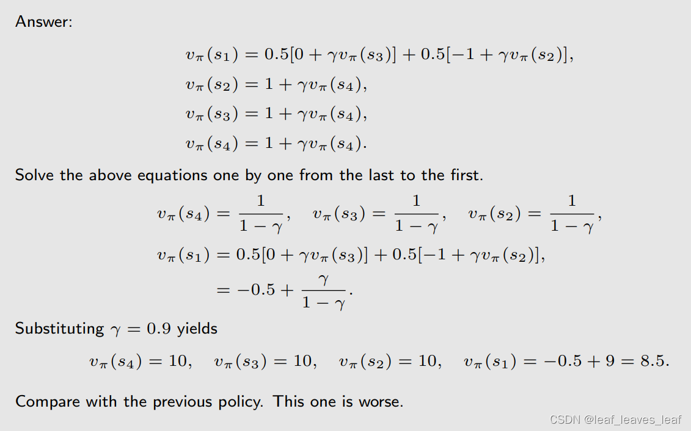

 在这个策略（policy）下，计算出 s1 的状态值（state value）是 8.5，s2,s3,s4 的状态值（state value）是 10。而在上一个策略（policy）下 s1 的状态值（state value）是 9。**所以这个策略没有刚才的策略好。**

------

## 五.贝尔曼公式（ Bellman equation）：矩阵向量形式（Matrix-vector form）

为什么要考虑矩阵向量形式？因为我们需要从中求解状态值（state value）！

一个未知数依赖于另一个未知数。如何解决这些未知数？

-   **元素形式（Elementwise form）：** 上述元素形式的方程对每个状态 s∈S 都成立，如果有 n 个状态就有 n 个这样的方程。这意味着有这样的 |S| 方程！
-   **矩阵向量形式（Matrix-vector form）：**如果我们把所有方程放在一起，就会得到一组线性方程，可以简洁地写成矩阵向量形式。矩阵向量形式非常优雅，也非常重要。

------

### **1. 推导出矩阵向量形式：**

回顾一下：

将贝尔曼方程改写为（括号外的项往括号里面分配）

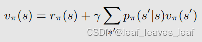

其中

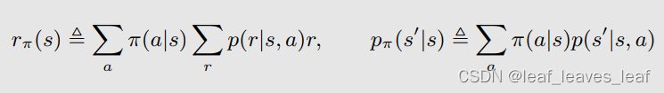

-   r_π(s) 代表从当前状态出发，我所能得到的即时奖励（immediate reward）的平均值
-   这个式子其实与推导贝尔曼公式的时候计算第一项和第二项的时候写的中间过程的公式是一样的，是即时奖励加未来奖励
-   从当前 s 出发，有多个选择，可以跳到不同 s' ，跳到不同 s' 的概率是 p(s' | s)

假设状态（states）可以索引为 si (i = 1, ... , n)。

对于状态 si，贝尔曼方程为：（从 si 跳到 sj 的概率是 p_π(sj | si)，从 si 跳到 sj 所取的 state value 是 v_π(sj) ）

将所有这些状态方程放在一起，改写成**矩阵向量形式，v_π 是一个向量**

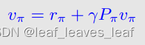

其中（Pπ 是状态转换矩阵（state transition matrix），pπ(sj | si) 意思是状态从 si 跳到 sj 的概率）

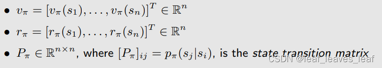

------

### **2. 例子**

#### **（1）例子1**

有四个状态，即 n = 4 的时候的矩阵向量形式

考虑下图，策略（policy）用绿色的箭头表示

#### （2）例子2

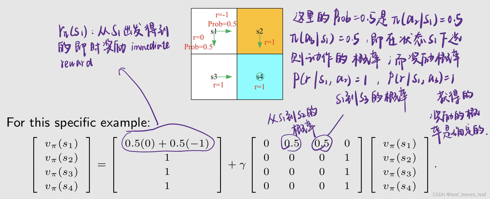

## 六.贝尔曼公式（ Bellman equation）：求解状态值（state value）

### 1.求解

**用刚才推导的贝尔曼公式的矩阵和向量的形式求解状态值（state value）**

为什么要求解状态值（state value）？

-   给定一个策略（policy），我们会列出来它的贝尔曼公式（ Bellman equation），再进一步求解这个贝尔曼公式得到状态值（state value），求出相应的状态值这样的一个过程（state value）称为策略评估（policy evaluation）！这是 RL 中的一个基本问题。它是找到更好策略的基础。
-   策略评估（policy evaluation）是强化学习中的关键，因为只有能够去评价一个策略好或者不好，我们才能进一步改进它最后再找到最优的策略。

------

矩阵向量形式的贝尔曼方程为：***\*v_π 是一个向量\****

下面给出两种求解贝尔曼公式的方法：

（1）闭式解为（The closed-form solution is），即状态值（state value）的解析表达式为：

实际上，我们仍然需要使用数值工具来计算矩阵逆，实际中并不会使用。我们能避免矩阵逆运算吗？可以，通过迭代算法（iterative algorithms）。

（2）**迭代解决（iterative solution）方案是：**（vk 和 vk+1 都是向量，包含了不同时刻的所有状态值）

首先可以随便猜一个 v0 等于什么（比如全为0），然后带入到等式右边，得到等式左边的 v1；然后把 v1 再带到等式右边，得到等式左边的 v2；然后把 v2 再带到等式右边，得到等式左边的 v3，如此循环计算下去，就会得到一个序列 {v0, v1, v2, . }。我们可以证明当 k 趋向于 ∞ 的时候，vk 就收敛到了 vπ，这个 vπ 就是真实的状态值（state value）

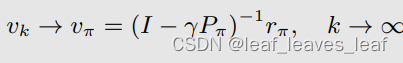

------

### 2.例子

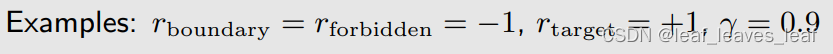

以下是两项 "好 "的策略（绿色箭头是策略）和状态值（state value）。在第四列中，前两个状态的两项策略是不同的。

用刚才讲的解析表达式或者迭代算法都可以求出状态值（state value）。可以看出，状态值（state value）全为正数，靠近目标 target area 的状态值（state value）都比较大，距离目标 target area 越远，它的状态值（state value）越小。 

------

以下是两项 "不好"的策略（绿色箭头是策略）和状态值（state value）。状态值（state value）比好策略的状态值小。

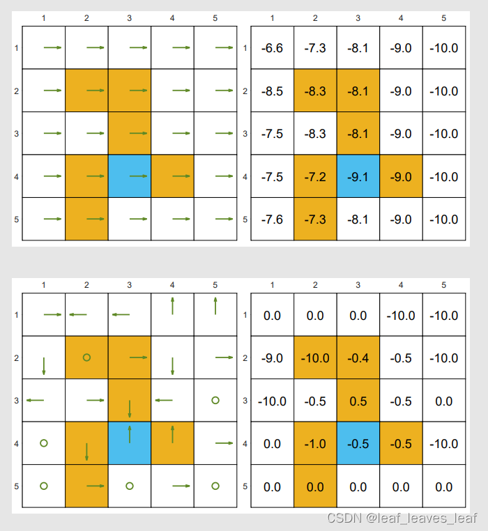

上面两个策略很明显会撞墙或进入禁区，从直觉上讲，这是不好的策略；而计算出的状态值（state value）有负数，通过状态值（state value）也可以判断出这是不好的策略，这与我们的直觉一致。 

>   可以看出，我们可以通过计算状态值（state value）来评价一个策略（policy）的好坏

## 七.动作值（action value）

从状态值（state value）到动作值（action value） ：

-   状态值（state value）：智能体从某一状态（state）开始所能获得的平均回报（average return）。
-   动作值（action value）：智能体从某一状态（state）出发并采取某项动作（taking an action）之后所能获得的平均回报（average return）。

我们为什么关心动作值（action value）？

-   策略指的是在一个状态我要选择什么样的 action，有一些 action 我们如何做选择呢？就要根据 action value 来做判断，action value 大的意味着我选择那个 action 会得到更多的 reward，那我就会去选择那个。
-   因为我们想知道哪个动作更好。这一点在下面的讲解中会更加清楚。我们将经常使用动作值。

------

### 1.动作值定义

动作值定义：我们从当前状态 s 出发，选择动作 a 之后，我所得到的回报（return）的一个平均（average）就是动作值（action value）：

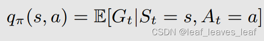

-   q_π（s，a）是状态-动作对（s，a）的函数，依赖于从哪个状态出发，从哪个状态的 action 出发。
-   q_π(s, a) 依赖于 π，不同的策略会得到不同的 action value

（不确定对）确定了action的话reward不也是确定的吗，为啥还要求期望？

-   确定了action，action的reward确定，但结果状态不确定，所以期望是给结果状态v（s‘）的
-   就比如之前老师讲的被风吹歪的例子，现态采取同个策略可能会掉到不同的次态

------

### 2.动作值与状态值的联系

根据条件期望的性质可以得出：等式右边意思是我有很多个 a，我选择一个 a 的概率是 π(a | s)，选择 a 后所得到的 average return 是 q_π(s,a)

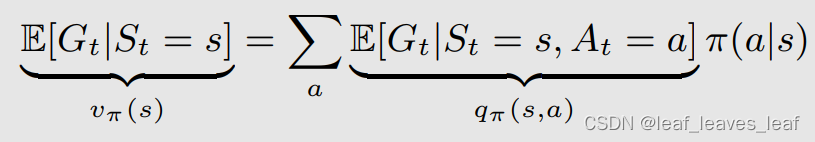

因此

等式左边是从一个状态出发的 state value 等于右边我选择不同 action 得到的 action value 的平均值，权重就是策略 π。

>   action value其实可以理解为state value的一个action下的值

------

回想一下，状态值（state value）由以下公式给出

比较 (2) 和 (3)，我们可以得出**动作值函数（action-value function）的表达式**为

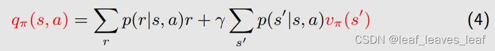

(2) 和 (4) 是一枚硬币的两面：

-   (2) 说明了如何从动作值（action value）中获取状态值（state value）。
-   (4) 则说明了如何从状态值（state value）中获取动作值（action value）。

>   在概率论范畴下，研究对象都是随机变量，是没有常规意义的平均的。所说的平均都是概率意义平均，即期望。

### 3.例子

写出状态 s1 的动作值

问题？下面这些不等于0！！

至于其他动作：所有的 action 都可以计算

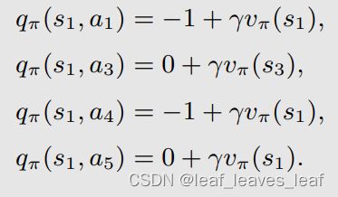

**强调：**

-   动作值（action value）很重要，因为我们未来会已关注在某个状态它不同的 action ，它们之间会相互比较，我们会选一个动作值（action value）最大的那个。因为我们关心的是采取哪种动作。
-   我们可以先求解贝尔曼公式，计算所有状态值（state value），然后再计算动作值（action value）。
-   我们也可以不计算状态值（state value），使用或不使用模型直接计算动作值（action value）。

------

## 八.总结

