# 强化学习的数学原理 课程笔记 04 vaule iteration & policy iteration

## 一.内容概述

**本节课讲的是 model base 的算法，下节课将会介绍 model-free 算法。值迭代和策略迭代和截断策略迭代都是求解最优状态值和最优策略的办法**

-   值迭代算法（value iteration algorithm）：第三章的贝尔曼最优公式中，提到了有一个算法能求解贝尔曼最优公式，这个算法实际上就是值迭代算法。
-   策略迭代算法（policy iteration algorithm）：在第五章，不需要模型的蒙特卡洛方法中有重要应用。是下节课，蒙特卡洛学习（Mente Carlo learning）的一个基础
-   截断策略迭代算法（Truncated policy iteration algorithm）

**值迭代算法和策略算法是截断策略迭代算法的极端情况**

-   上面三个算法都有两个子步骤：policy update 和 value update
-   在当前时刻我有一个不太好的策略，我估计一下这个策略它的值，也就是做一下策略评价，我得到值之后就根据这个值改进一下策略，改进完了策略得到新的策略再估计它的值然后再改进策略，所以 policy update 和 value update 这两个步骤会不断迭代，最后就能找到最优的策略。
-   这样一个思想不只用在第四章当中，后面所有强化学习算法都是这样做的，都是值和策略，值和策略不断地迭代，只不过具体算法形式可能不同。

## 二.值迭代算法（value iteration algorithm）

>   **这是上一节课由收缩映射定理（Contraction mapping theorem）给出的一个算法，这节课给它一个名字，给它两个步骤，正式的介绍出来：** 

贝尔曼最优公式（矩阵向量形式）：

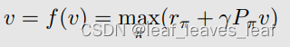

如何求解贝尔曼最优公式？在上一讲中，我们知道收缩映射定理提出了一种迭代算法：只要用下面这个算法就可以求出它的最优策略（optimal policy）和最优的状态值（optimal state value）

其中 v0 可以是任意值。

-   这种算法最终能找到最优状态值和最优策略。
-   这种算法称为值迭代（value iteration）！
-   我们将看到，我们所学的关于 BOE 的数学知识终于得到了回报！
-   **接下来我们将详细剖析值迭代算法，包括编程的时候如何实现。至于这个值迭代算法为什么会设计成这样，为什么能够找到最优策略，它的数学原理上节课已经介绍过了，这节课就不回答了。**

------

算法的矩阵向量形式如下：

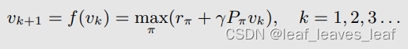

可以分解为（be decomposed）两个步骤：

第 1 步：在 vk 给定的情况下进行**策略更新（policy update）**，求解 π，可以得到 πk+1 。这一步是处理方程右边的优化问题：

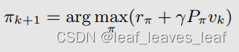

其中 vk 是给定的。

第 2 步：**价值更新（value update）**。把上一步求解出的 πk+1 带入第一个式子，第一个式子中下标的 π 全部变成 πk+1，然后根据 vk 可以求解出来 vk+1

**问题：vk 是状态值（state value）吗？不是**，因为不能确保 vk 满足贝尔曼方程。如果上式中，左边是 vk，那它确实是一个贝尔曼公式，那么 vk 就是一个状态值（state value），但是左边并不是 vk，而是 vk+1。所以这里的 vk 就是一个向量，就是一个值，可以是任意的值，并不是状态值（state value）

**理解：**

-   vk只是某次迭代过程中没有收敛的一个值
-   是估计的state value,后面可以求解出最优的state value
-   因为不在在同一个policy下的vk迭代，所以没有收敛到当前policy下的state value
-   这就是我们胡乱假设的一个state value吧，老师说不算的意思大概是它还没迭代到位
-   其实是state value只是还没收敛
-   只能说vk k无穷时，vk的物理意义为state的估计。否则只是估计过程中的一个参数，没有意义
-   意思是最后无穷/有限多步收敛到的值才是state value吗？

------

接下来，我们需要研究元素形式（elementwise form），以便实现算法。

-   矩阵向量形式（Matrix-vector form）有助于理论分析（theoretical analysis）。
-   元素形式（elementwise form）有助于实现（implementation）。

------

### 1.第 1 步：策略更新（policy update）

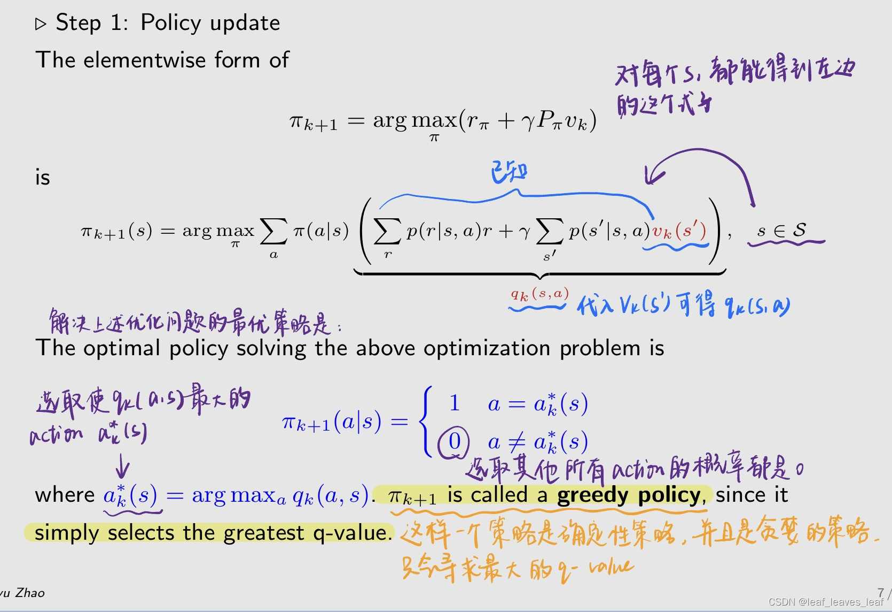

-   如果有多个action有相同的qk(s,a)，那么可以任意选取一个，数学上都能达到最优
-   压缩映射定理v*存在且唯一
-   v*唯一，但策略不一定唯一，有两个最优策略，一般随机选一个

### 2.第 2 步：**价值更新（value update）**

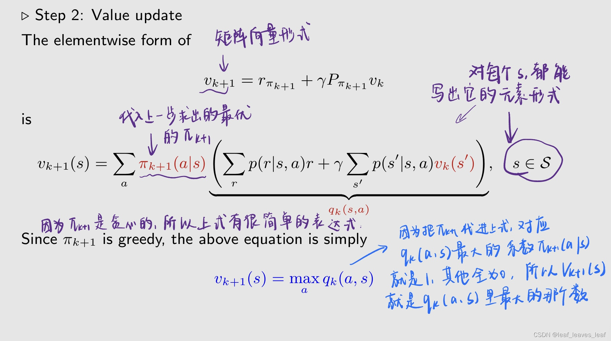

### 3.流程总结，程序概要，并写成伪代码

  对每一个 s，一开始有个 vk(s)，vk 最开始可以从 v0 或者 v1 开始——>从 vk 可以计算得到 qk——>得到 qk 后我知道哪个 qk 是最大的，然后知道它对应的 action 是什么，就可以得到贪婪策略（greedy policy）πk+1——>然后得到 vk+1，vk+1就对应最大的 qk

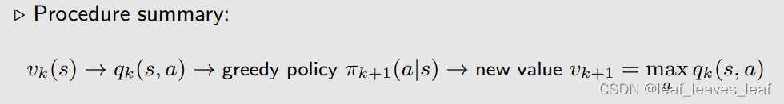

这个过程可以写成下面的伪代码：

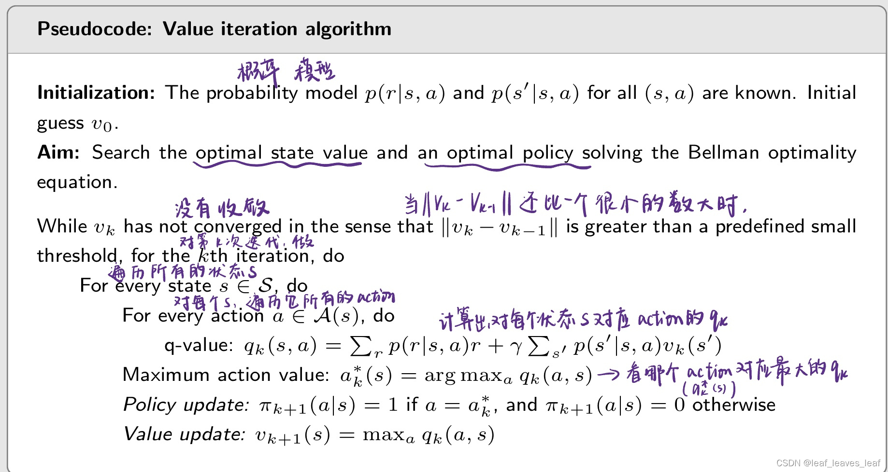

### 4.举例

用值迭代算法（value iteration algorithm）为下面的 a 图求解出一个最优的策略，图 b,c 是我们在使用算法进行迭代的过程中，每次我们都会得到一个策略 πk+1，图 b,c 就是得到的策略 πk+1，把它画在图中。

q 表（q-table）： q(s, a) 的表达式（当给出 v 的时候，能求出 q）

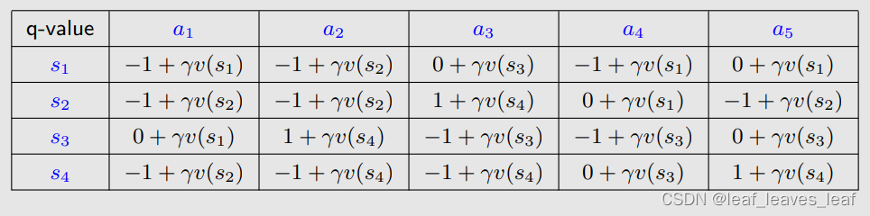

k=0，先选取 v0，可以任意选取，简单起见全选0，然后把 v0 带入刚才的 q-table 当中去：

**先进行策略更新**，针对每一个状态，我们去看哪个 qk 是最大的，那么它对应的新的策略就可以求出。对 s1 而言，选取动作 a3 和 a5 对应的 q 最大，所以 policy 可以在最大的 q 里面随便选一个（第k步是对所有s进行更新）

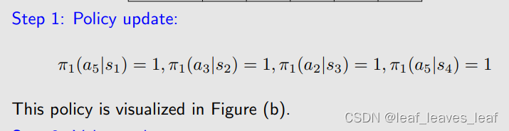

**再进行价值更新**，上面选出的最大的 qk，作为新的 v1 进行下一步的使用

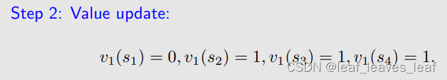

这个策略绘制出图片就是上面的 b 图，可以看出在 s2 ，s3 和 s4 上都已经达到了最优，可以到达目标。但是在 s1 上还没有达到最优，因为当前策略是原地不动，但是最优策略需要到达目标。再进行下一步迭代：

k=1，把上次迭代得到的 v1 带入刚才的 q-table 当中去：

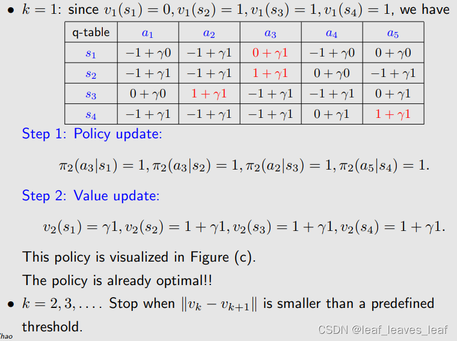

这个策略绘制出图片就是上面的 c 图，可以看出在 s1，s2 ，s3 和 s4 上都已经达到了最优，可以到达目标，已经求出来了最优策略。还可以进行下一步迭代，直到达到迭代终止条件：

------

## 三.策略迭代算法（policy iteration algorithm）

### 1.算法介绍

>   **这是这节课新介绍的一个算法，下节课会在这个算法的基础上，得到一个 model free 的 reinforcement learning 的算法**

**算法描述：**

给定随机初始策略 π0（任意给定，可能是不好的策略，之后会迭代找到好的策略）

每次迭代分为两个步骤：

**步骤 1：策略评估（PE）（Step 1: policy evaluation (PE)）**

之前提过，policy evaluation 就是我给定一个策略 πk（最开始是 π0），可以求解它对应的贝尔曼公式，得到 πk 对应的 state value v_πk，这样的过程就叫策略评估（policy evaluation）

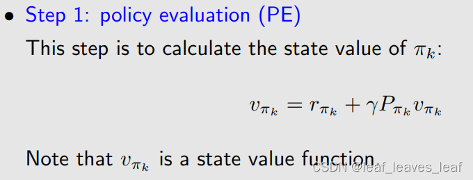

**步骤 2：策略改进 (PI)（Step 2: policy improvement (PI)）**

上一步求出来了 v_πk，我求解优化问题得到一个新的策略 πk+1，πk+1 比 πk 更好

最大化是分量式的！

理解：

-   policy iter 相当于比value iter提前了一步，从pi到v然后再经历完整的value iter到pi
-   Policy iteration algorithm和Value iteration algorithm的区别就是你以policy为主体还是以state value为主体。
-   PE里面包含了一层value iteration
-   其实在这两个iteration都会更新policy和valuie，只是先后的问题而已

------

该算法可以得到一个序列，用下面的过程来表示：最开始猜的 π0 肯定是不好的，然后我做 policy evaluation 得到 v_π0，然后做 policy improvement 得到 π1......

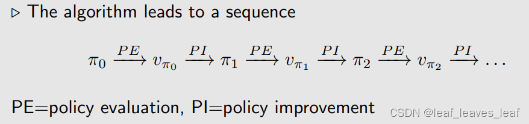

**问题**

-   问题 1：在策略评估（policy evaluation）步骤中，如何通过求解贝尔曼方程得到状态值（state value） vπk？
-   问题 2: 在策略改进（policy improvement）步骤中，为什么新策略 πk+1 比 πk 更好？
-   问题 3：为什么这种迭代算法能最终找到最优的策略？
-   问题 4: 这种策略迭代算法（policy iteration algorithm）与前一种值迭代算法（value iteration algorithm）之间的关系是什么？

------

**问题 1： 在策略评估（policy evaluation）步骤中，如何通过求解贝尔曼方程得到状态值（state value） vπk？**

**这个问题之前在介绍贝尔曼公式的时候已经详细介绍了（第二节课第六点）**，假设给定一个策略（policy）πk，我们可以列出来它的贝尔曼公式（ Bellman equation）如下：

有两种方法可以求解这个贝尔曼公式得到状态值（state value）：

**（1）闭式解为（The closed-form solution is）**，即状态值（state value）的解析表达式为：

这个方法我们不太用，因为要求逆矩阵，经常用的是下面的方法

**（2）迭代解决（iterative solution）方案是：**（v_πk 和 v_πk+1 都是向量，包含了不同时刻的所有状态值）最开始对 v_πk 有一个猜测，不断迭代就可以得到 v_πk

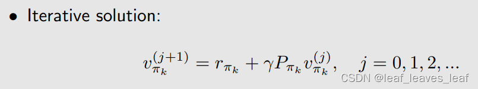

-   已在贝尔曼方程讲座中学习过。
-   policy evaluation 是 policy iteration 这个算法的一步，这一步又依赖于一个迭代的算法（即上面的迭代解决（iterative solution）方案）。
-   策略迭代算法（policy iteration algorithm）是一种迭代算法，在策略迭代算法的策略评估（policy evaluation）步骤中嵌入了另一种迭代算法（iterative solution）（相当于有一个大的迭代算法，里面有一步又嵌入了一个小的迭代算法）

------

**问题 2: 在策略改进（policy improvement）步骤中，为什么新策略 πk+1 比 πk 更好？**

πk+1 是求解下面这个（v_πk给定的）式子所得到的，可以证明 v_πk+1 一定大于等于 v_πk，所以 πk+1 比 πk 更好

------

**问题 3： 为什么这种迭代算法能最终找到最优的策略？**

由于每次迭代都会改进策略，我们知道：最优的状态值（state value）是 v*

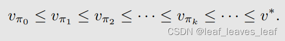

因此，v_πk 会不断增加并收敛（keeps increasing and will converge）。仍需证明它收敛于 v*：

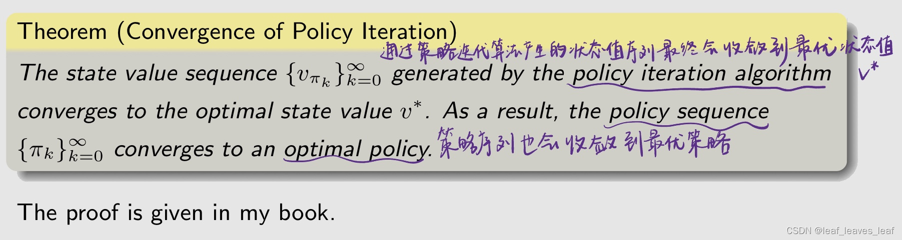

-   个人的理解是，PI是多轮的VI，VI只为了达成目的，但策略不一定最好，Pi相当于BFS算法一样，把最好的策略都完完全全走了一遍流程（因为只有求出贝尔曼才能说明他最好） 

------

**问题 4: 这种策略迭代算法（policy iteration algorithm）与前一种值迭代算法（value iteration algorithm）之间的关系是什么？**

问题 3 给出的那个定理的证明（就是上面那个定理），即若要证明 policy iteration 的算法是收敛的，实际上用到了 value iteration 算法是收敛的这样的一个结果，所以它是基于 value iteration 算法的一个结果。另外 policy iteration 和 value iteration 实际上是两个极端，是一个更 general 的截断策略迭代算法（Truncated policy iteration algorithm）的两个极端，稍后会介绍。

------

### 2.**policy iteration algorithm 的具体实现**

为了实现，我们要研究它的元素形式（Elementwise form）

**步骤 1：策略评估（PE）（Step 1: policy evaluation (PE)）**

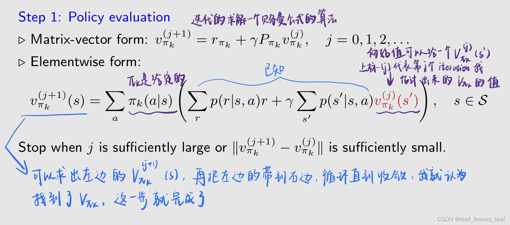

**步骤 2：策略改进 (PI)（Step 2: policy improvement (PI)）**

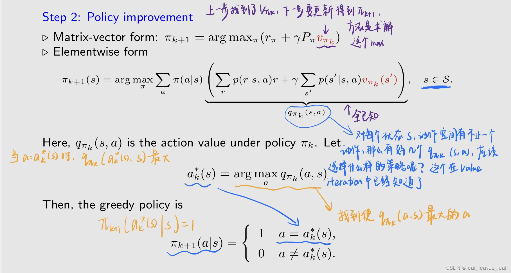

**流程伪代码：**

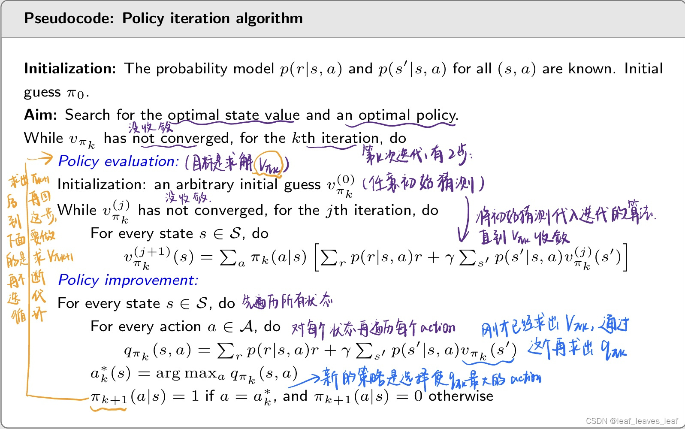

值迭代和策略迭代的区别： 

-   有差别，值迭代每一步得到的value是虚假的，但策略迭代每一步得到的value是真实的 
-   区别是先求策略还是先求state value的问题
-   策略迭代里面包含值迭代，策略迭代时间复杂度更大
-   其实不同在于值迭代不同迭代次数间的state value是严格根据不动点迭代运算得到的
-   policy iteration的终点应该是policy收敛不变，这比value收敛快很多
-   确实，值迭代是严格遵守不动点迭代的
-   这里对比值迭代算法，策略迭代算法实际就是多了一块策略评估。如果策略评估直接给定v0那么这个算法就是值迭代
-   可以把值迭代的value update看成一次策略评估，只不过评估的效果不是很好。补充一下，不好的原因是因为没有加入最好策略的计算
-   Policy iteration先通过策略评估选取V_k，而不是随机初始化一个直接用了
-   value感觉虽然在更新pi，但是实际上没有用pi，policy实际上是用了pi来计算v的

------

### 3.例子

#### （1）例子1

图 b 是最优策略，在 s1 的时候往右走，在 s2 的时候静止不动。图 a 是初始策略，都往左走是不合适的，我们用 policy iteration 的算法得到图 b 这样一个最优策略

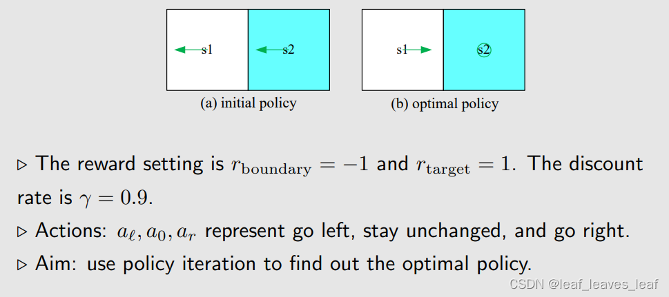

k=0

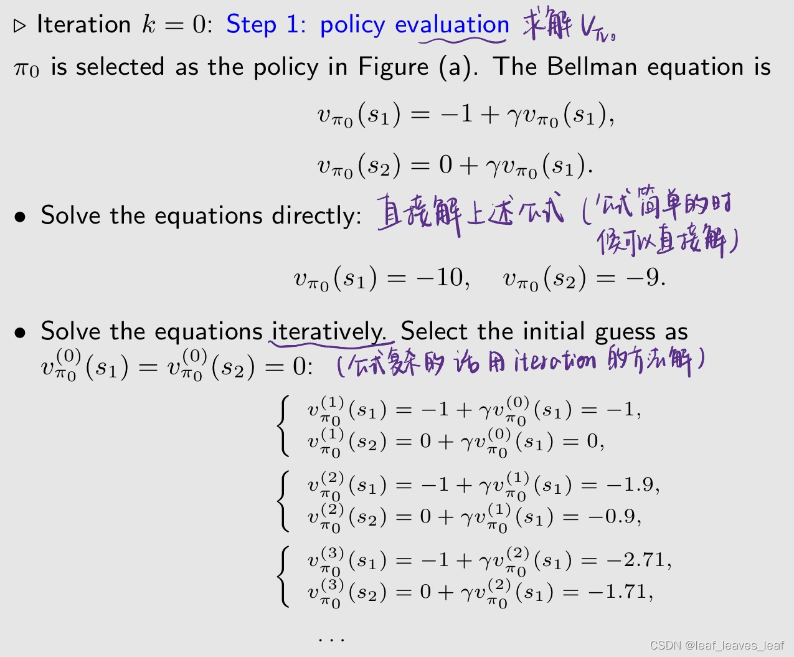

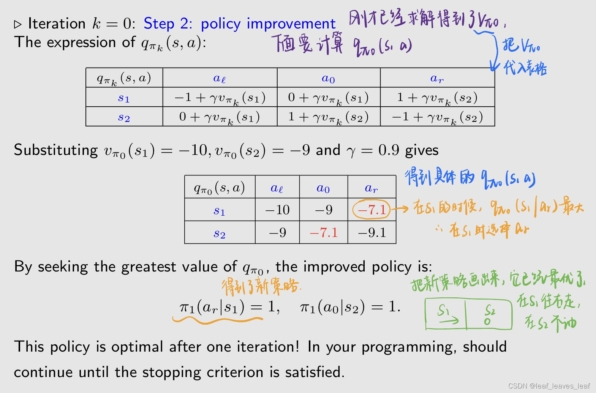

该例子比较简单，该策略在一次迭代后达到最优！在您的程序设计中，应该继续运行，直到满足停止标准为止。
现在你知道了另一种搜索最优策略（optimal policies）的强大算法！现在，让我们应用它，看看能发现什么。

------

#### （2）例子2

例子的基本设置：

现在要做的是对这样一个 5×5 的网格，求一个最优策略。下面这些图画的是，我从最开始随便给定的一个策略 π0，求出 v_π0，policy improvement 得到 π0，然后policy evaluation 得到 v_π1，一直下去直到得到 π10 和 vπ10

让我们来看看中间策略和状态值。

策略和状态值的有趣模式

-   可以看到，中间的策略不好，但是策略 π10 已经是一个最优的策略了，从任何一点（图中任何一个状态）出发都能到达目标区域。我们设置的 r_forbidden 比较大，所以会避开障碍。
-   从图中还能看出一个现象，比较接近目标的状态的策略会先变好（从图中绿色的箭头可以看出），远离目标的状态的策略会后变好。从直观上这是因为，在某一个状态，我选择它的 greedy action，也就是 action 对应的最大的动作值（action value）q_π(s, a)的时候，严重依赖于其他状态的策略，如果其他状态的策略是不好的乱七八糟的，这时候虽然选一个最大的动作值（action value）q_π(s, a) ，但是可能也是没有意义的。 
-   当这个状态周围没有状态能到达目标区域时，它也不会到达目标区域，当有状态有能够到达目标区域的策略时，这个状态新的策略也能到达目标区域。

------

## 四.截断策略迭代算法（Truncated policy iteration algorithm）

这是前两个值迭代算法（value iteration algorithm）和策略迭代算法（policy iteration algorithm）的一般化推广；值迭代算法（value iteration algorithm）和策略迭代算法（policy iteration algorithm）是截断策略迭代算法（Truncated policy iteration algorithm）的特殊情况

这两种算法非常相似：

理解： 

-   u 不是真实的状态价值
-   u0 可以看成未收敛的state value，就是一个中间值
-   这个前面提到过了，状态价值（state value）是需要贝尔曼方程求解得到的，而这里 u0 只是由策略求出来的一个值，并不是状态价值 

让我们仔细比较一下这些步骤：

理解： 

-   值迭代的状态值V经过一步计算获得 策略迭代的状态值V需要迭代计算获得 
-   开始一个需要policy一个不要。value更新时Policy iteration每一个value的求解都得Bellman公式求解，Value iteration直接一步带入
-   policy iteration直接一步到位，value iteration 还在迭代
-   太妙了，这里v的下标是pi的时候，表示一个值函数；是数字的时候，不表示值函数了，只是一个迭代中的变量
-   雀氏，值迭代中外框架是用一个序列逼近真实的v，所以值迭代里的v你可以理解为v的估计\中间计算步骤，而策略迭代里的v是通过PE评估一个确定的策略得到的
-   value iteration: v-p-v-p-v-p-v-p-.....；policy iteration: p-vvvvv...-p-vvvvv...-p-vvvvv.
-   值迭代算法只迭代一次，策略迭代算法迭代无穷多次

-   由上图可知，在第四步中 value iteration 只计算了一步，就得到 v1，而 policy iteration 要计算无穷多步才能得到 v_π1。那么自然能想象到有没有一个中间步，只计算 j 次，把 v_π1(j) 作为一个新的量，把它作为新的值放到下一步计算策略，这样的算法叫截断策略迭代算法（Truncated policy iteration algorithm），之所以是 Truncated，因为从 j 到 ∞ 的这些步骤全都被截断了。 
-   所以截断策略迭代算法（Truncated policy iteration algorithm）是前两个值迭代算法（value iteration algorithm）和策略迭代算法（policy iteration algorithm）的一般化推广。当 j=1，截断策略迭代算法（Truncated policy iteration algo rithm）变成了值迭代算法（value iteration algorithm）；当 j=∞，截断策略迭代算法（Truncated policy iteration algorithm）变成了策略迭代算法（policy iteration algorithm）
-   在实际当中策略迭代算法（policy iteration algorithm）不存在，因为不可能计算无穷多步，我们经常做的是判断 v_π1(j) 和 v_π1(j-1) 这两个它们之间的 error 是否足够小，足够小就停止迭代，这样的话它仍然是计算了有限步。所以在实际当中即使我们要计算策略迭代算法（policy iteration algorithm）它也仍然是一个截断策略迭代算法（Truncated policy iteration algorithm）

------

**伪代码：**

收敛的意思就是，收敛到一个怎么迭代都不太会改变的值 

因为没有计算无穷多步，所以此时的 vk ≠ v_πk，那么此时的截断是否会带来一些问题呢？比如是否会使整个算法不再收敛？

------

**截断是否会削弱收敛性？下面给出一个定理：** 

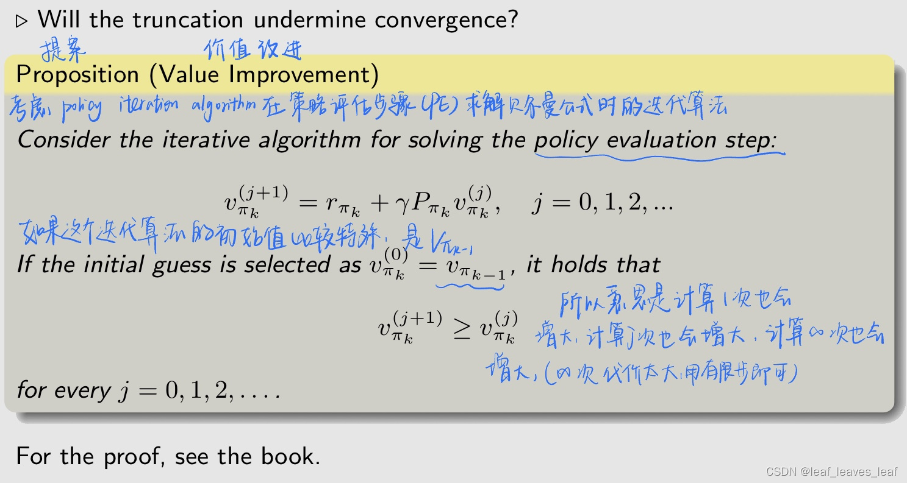

刚才这个结果可以通过下图比较好的展示出来，这个图的横轴是 k，即 policy iteration 算法中的迭代次数 iteration 的索引（index） ，纵轴是值，简单起见，state value 只有一维。红线 v* 代表最优状态值（optimal state value），其他曲线是上面三种算法，通过迭代都最终收敛到 v*

PI 的收敛证明基于 VI 的收敛证明。既然 VI 收敛，我们就知道 PI 收敛。

------

**例子：**

设置： 与上一示例相同。以下是初始策略，目标是找一个最优策略

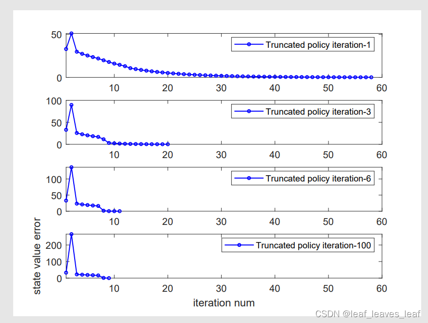

-   "截断策略迭代（Truncated policy iteration）-x"，其中 x = 1、3、6、100 指的是截断策略迭代算法，其中策略评估步骤（the policy evaluation step）运行 x 次迭代。
-   每个小图右上角标签上的数字意思是，每次在大的 Truncated policy iteration 中有一个嵌套的迭代的次数（在策略评估那一步 policy evaluation），如果是 value iteration 只迭代一次，如果是 policy iteration 则迭代无穷多次，把那个次数设为 x。当 x=1 时，就是 value iteration，最上面一幅图，要到50多步的时候 vk 与 v* 的误差才小于 0.01；如果 x=3，那么它20多步就小于 0.01 了，可以加快收敛速度；x=6，x=100的时候也可以加快收敛，但是效果越来越不明显。
-   上图横坐标是最外面的迭代次数，这里迭代的步数应该是外面PE，PI的步数

结论：

-   x 值越大，估计值收敛得越快。
-   但是，当 x 值越大时，增加 x 值的好处就会迅速减少。
-   在实际操作中，在策略评估步骤中运行少量的迭代，尽量不要每次计算一步，也不要计算很多步，尽量稍微多计算几步就能有很大收获。
-   外层循环相比内层循环要多计算很多东西，每一次迭代花费的时间不一样，所以找一个折中方案。让外层尽量少，内层又不至于过多

------

## 五.总结

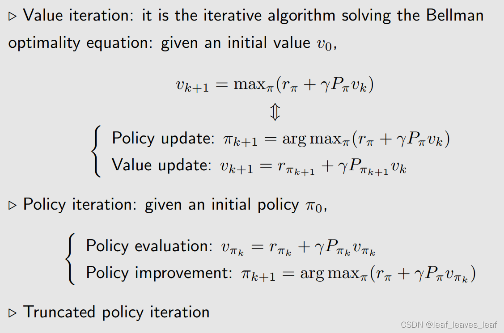