# 强化学习的数学原理 课程笔记 05 Monte Carlo

### 一. 内容概述

-   上节课介绍了 model-base 的方法，这节课将介绍 model-free 的方法，上节课的 policy iteration 的方法是这节课的基础，我们把 policy iteration 当中基于模型的部分替换成不需要模型的部分就得到了今天的算法
-   在这门课中，把 value iteration 和 policy iteration 统称为 model-base reinforcement learning，但是更准确来说，它们应该称为动态规划（dynamic programming）的方法。model-base reinforcement learning 简称 MBRL，这个研究的是我用数据估计出一个模型，再基于这个模型进行强化学习。
-   这节课介绍没有模型的强化学习方法，首先我们要学习随机变量的期望值，因为之前提到的 state value 和 action value 全都是随机变量的期望值，对随机变量采样的平均值可以作为 E[X] 的一个很好的近似。所以没有模型要有数据，没有数据要有模型才能学习。

**课程大纲：**

1.激励性实例（Motivating examples）：介绍蒙特卡洛估计（Mento Carlo Estimation）的基本思想

2.介绍三个基于蒙特卡洛（MC）强化学习的算法（这三个算法环环相扣，前一个是后一个的基础）

（1）最简单的基于 MC 的 RL 算法：MC basic（我们把上节课介绍的 policy iteration 方法当中基于模型的部分替换成不需要模型的部分（依赖于数据的）就得到了这个算法。是最简单的基于蒙特卡洛强化学习的算法，简单到这个算法在实际中不能用，因为效率很低，但他有利于揭示怎么样把模型给去掉，不基于模型来实现强化学习的这样一个核心idea，即它可以帮助理解之后的，因为强化学习是一环扣一环的）

（2）更高效地使用数据：MC Exploring Starts（把 MC basic 复杂化）

（3）MC 没有探索就启动：Algorithm: MC ε-Greedy（去除掉 exploring starts 这样的 assumption）

------

### 二. Motivating examples

-   从 model-based 强化学习过渡到 model-free 的强化学习，最难以理解的就是我们如何在没有模型的情况下去估计一些量？（How can we estimate something without models）
-   最简单的方法：蒙特卡洛估算（Monte Carlo estimation）。

下面通过一个例子说明蒙特卡洛估算：投掷硬币

投掷硬币后的结果（正面或背面朝上）用随机变量（random variable） X 表示

-   如果结果为正面朝上，则 X = +1
-   如果结果是背面朝上，则 X = -1

**目的是计算 E[X]（X 的平均数，X 的期望）。**

------

这里有两种方法计算期望

**方法 1 ：基于模型的（model-based）**

假设概率模型为（我们知道随机变量（random variable） X 的概率分布（probability distribution））：正面朝上和背面朝上的概率都是 0.5

那么随机变量（random variable） X 它的期望（expectation）就可以简单的通过定义计算：

**问题：**可能无法知道精确的概率分布情况（precise distribution）！！

**方法 2 ：无模型的（model-free）**

基本思想：多次掷硬币，做很多次实验，得到很多的采样，然后计算所有采样的平均结果。

假设我们做了 N 次实验，这 N 次的实验结果分别是 x1,x2,...,xN，得到一个样本序列： {x1, x2, . , xN }。那么，均值可以近似为：

期望（expectation）用  来近似，认为  是 E(X)

这就是蒙特卡洛估计的基本思想！

------

**问题：**用蒙特卡洛估计（Mento Carlo Estimation）是否精确？

-   当 N 较小时，近似值不准确。
-   随着 N 的增大，近似值会越来越精确。

如上图所示，我们已知真实的期望（expectation）是 0，随着做平均的样本数越多，样本的平均值（expectation）越接近真实的期望（expectation）0

------

上面这样直观的解释有数学理论做支撑（大数定律）

iid：独立同分布样本（independent and identically distributed sample）

------

**总结：**

-   蒙特卡罗估计是指依靠重复随机抽样来解决近似问题的一大类技术。凡是需要做大量的采样实验，最后用实验的结果近似的的方法，都可以称为蒙特卡洛估计的方法。
-   **我们为什么要已关注蒙特卡罗估计？因为它不需要模型**！
-   为什么要已关注均值估计（mean estimation）？为什么用蒙特卡洛来估计期望（expectation）？因为状态值（state value）和行动值（action value）被定义为随机变量的期望值（expectation）！

------

### 三. 最简单的基于 MC 的 RL 算法：MC basic

#### 1.将策略迭代转换为无模型迭代（Convert policy iteration to be model-free）

理解算法的关键是理解如何将策略迭代算法（policy iteration algorithm）转换为无模型算法（model-free）。我们知道策略迭代算法（policy iteration algorithm）是依赖于模型的，但是实际上我们可以把它依赖于模型的那部分给替换掉，替换成 model-free 的模块

-   应充分理解策略迭代（policy iteration algorithm）。
-   应理解蒙特卡罗均值估计（Monte Carlo mean estimation）的思想。

------

**接下来看策略迭代算法（policy iteration algorithm）如何转换为无模型（model-free）的：**

策略迭代（policy iteration algorithm）的每一次迭代都有两个步骤：

-   1.策略评估：我有一个策略 πk，通过求解贝尔曼公式，我要求出来它的状态值（state value）v_πk
-   2.策略改进：知道 v_πk 之后就可以做改进，求解一个最优化问题得到一个新的策略 πk+1。（通过选择最大的 q_πk 得到新的策略 πk+1）

**这里面非常核心的量是 q_πk (s, a)**

------

**要计算动作值（action value） q_πk (s, a) 有两种算法：**

**方法 1 需要模型：**这就是 value iteration 这个算法所使用的，第一步得到了 v_πk，第二步这些概率模型都是知道的，所以就可以求出来 q_πk (s, a)**（这些概率代表系统的模型）**

**方法 2 不需要模型：**这种方法依赖于动作值（action value） q_πk (s, a) 最最原始的定义。就是从当前状态 s 出发，选择动作 a 之后，我所得到的回报（return）Gt，这个 return 是一个随机变量，我求它的平均（average）或者求期望（expectation）就是动作值（action value）

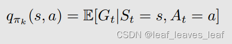

理解：

-   老师在前面提到多，p这些概率是基于model的，model-free就是不用model，也就是不用到概率矩阵 
-   是的，也就是不需要知道概率分布，

>   上面这个式子是基于蒙特卡洛方法的核心思想，这是一个均值估计（mean estimation）的问题，在第一部分（motivating example）中介绍了蒙特卡洛估计（Monte Carlo estimation）可以用来解决均值估计（mean estimation）的问题

**实现无模型 RL 的思路：**我们可以使用方法 2 的表达式，根据数据（样本或经验）计算 q_πk(s,a)！

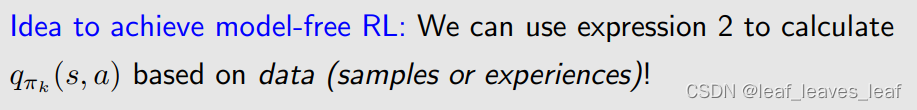

------

**下面来看一下具体是怎么求解的：**

动作值（action value）的蒙特卡洛估计（Monte Carlo estimation）程序：（episode就是根据一个给定策略进行的一次试验的轨迹(trajectory),在第一课里介绍过这个词）

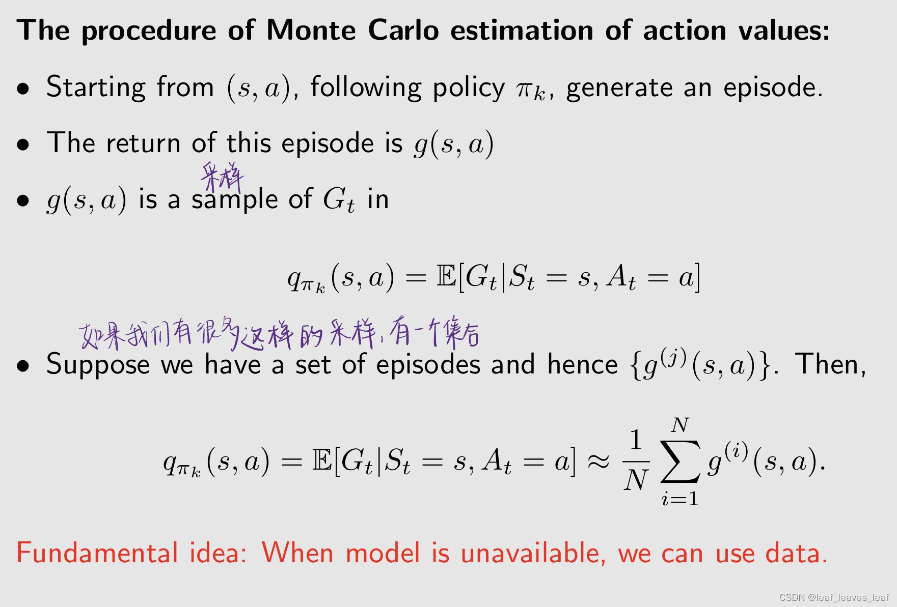

-   从任意一个 (s，a) 的组合开始，根据当前的策略 πk ，得到一个 episode（ 在第一章中介绍了：当智能体按照策略（policy）与环境交互时，可能会在某些终端状态（terminal states）停止。由此产生的轨迹（trajectory）称为一集（an episode）（或一次试验 trail））
-   计算出来这个 episode 对应的折扣回报（discounted return）g(s,a)
-   Gt 是一个随机变量（random variable），g(s,a) 是这个随机变量 Gt 的一个采样

-   如果我们有很多这样的采样，有一个集合，我们就可以用这些采样 g 求一个平均值，来估计 Gt 的这个平均值，就是估计 Gt 的期望（expectation）。这个就是蒙特卡洛估计（Monte Carlo estimation），刚才在第一部分 motivating example 中介绍的

>   基本理念： 当模型不可用时，我们可以使用数据。（没有模型就要有数据，没有数据就要有模型）（Fundamental idea: When model is unavailable, we can use data. ）这里的数据在统计或者是概率里面叫样本（sample），**在强化学习中它有一个特殊的名字叫经验（experience）**

------

#### 2.The MC Basic algorithm

到此为止，算法已经逐渐清晰了，这个算法的名字叫：MC Basic algorithm，MC是蒙特卡洛首字母的缩写

**算法描述：**

理解：我怎么记得policy evaluation是求状态值的？ 

-   因为求完状态值后，还是要求动作价值的，这里相当于合并了
-   因为之前 policy evaluation 中求解状态值的目的就是在 policy improvement 这一步中使用状态值来求动作值，进一步求出下一步的新的策略 πk+1（通过选择最大的 q_πk 得到新的策略 πk+1）。这里 policy evaluation 中直接求出了动作值
-   q值的均值就是状态值
-   求解出station value后进行的操作还是计算action value，所以本质是一样的
-   action value 就是要用到state value
-   老师把从action value到state value放在下一步了

**伪代码：**

理解：每一个 episode 的 return 不是 model-based 的吗，否则要怎么算呢？

-   每个a得到很多轨迹和 return 然后估算 action value
-   model-based直接算的就是期望，这个是采样
-   这些轨迹是实验得来的不是算概率分布得来的 所以是model-free
-   直接丢给环境，环境会返回结果，但是环境变化的分布我们是不知道的，根据返回结果experence来估计
-   不知道模型是指你不知道模型的概率分布，但你做实验会知道结果
-   就是和环境一直交互到一幕结束，把每一步的奖励累计就是return。不用模型
-   这些return是与环境交互的结果吧，不需要知道model
-   是用样本拟合的均值return
-   你可以理解就是环境的动力学用一个外挂代理模块来实现，你算法只需要调用它就行

------

-   MC Basic 是策略迭代算法（policy iteration algorithm）的一种变体，就是把基于 model 的模块拿掉，换成一个不需要 model 的模块。
-   无模型算法是在基于模型算法的基础上建立起来的。因此，在研究无模型算法之前，有必要先了解基于模型的算法。
-   要学习基于蒙特卡洛的强化学习的算法，首先应该明白基于模型的 policy iteration 的算法
-   MC Basic 有助于揭示基于 MC 的无模型 RL（MC-based model-free RL）的核心思想，MC Basic 有助于揭示如何把 model-base 变成 model-free 的过程，但由于效率低（low efficiency）而不实用，之后还会介绍两个算法提高效率（efficiency）。之后会介绍怎么更高效的去更新数据，怎么去掉一些实际当中难以实现的假设等等，这会让算法看起来更复杂也更实用。
-   既然策略迭代（policy iteration algorithm）是收敛的，那么 MC Basic 的收敛性也是有保证的，因为他俩类似，只是估计 action value 的方法有些差别。

**为什么 MC Basic 估算的是动作值而不是状态值？MC Basic 是直接来估计动作值（action value），而在 policy iteration 中是先估计了 state value，再转成 action value**

-   这是因为如果要估计 state value，之后还要转成 action value，那从 state value 到 action value 又依赖于模型，这是不行的，所以要直接把 action value 估计出来。状态值不能直接用于改进策略，当没有模型时，我们应该直接估计行动值。

------

#### 3.例子

##### （1）例子 1

在下面的例子中，有一个初始策略 π0（图中绿色箭头），在其他状态策略不错，只是在状态 s1,s3 策略不太好。接下来就从 π0 出发，用 MC Basic 算法找到一个最优的策略。

**大纲：**给定当前策略 πk

**步骤1：**策略评估（policy evaluation）：对任意的 s 和任意的 a，计算 q_πk (s, a)

-   在这个例子中有 9 个 state，每个 state 对应 5 个 action，有 45 个 state-action pairs，所以要找到 45 个 q_πk (s, a)，假设从每一个（s,a）出发都有 N 条轨迹，最后要求 N 条轨迹的平均的 return，那么一共有 45 × N 条轨迹。
-   就是上节课那些例子里的Q值表，现在要把表填上。

理解：当目前有策略时，action不是也确定了？为什么有45个state-action？

-   不是，model才是概率，在free里没有给，但state，action，reward都还是已知的
-   是45个(s, a)后再沿着策略PI_k走
-   因为策略是条件概率
-   因为你还得改进策略啊，要是你一直都算同一个动作就没法提升了。瞎挑的策略 还得更新呢
-   都是确定策略的话那就确定了，随机性策略就得求平均了。。
-   你不是要去explora一下其他策略的action value，来选最大的吗？跟你目前策略无关了
-   有策略时V确定了，但是q(pi,k)还是没有确定啊，因为那些概率为0的策略也要计算的
-   因为当下的策略并不一定是最优的，所以得从当前的策略出发进行优化，因此要全部遍历一遍
-   那只是开始随便给的策略，你要继续优化啊
-   action value和策略没有关系，受策略影响的是state value
-   只有直接奖励和策略无关，而延迟奖励是要跟着策略走的，肯定和策略有关

**步骤2：**策略改进（policy improvement）

-   在每个状态求出哪个 action 对应最大的 action value，就选择那个 action

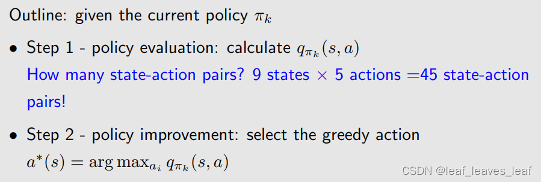

------

由于篇幅有限，我们不可能把 45 个 q_πk 全部找到，我们只找 5 个，针对 s1 它的 5 个 action，只展示 qπk (s1, a)：

**步骤1：策略评估（policy evaluation）：**

-   刚才提到，如果我从一个（s1,a1）出发的话，要找 N 个轨迹，对这 N 条轨迹的 return 求平均，这样才能求出 q_πk(s1,a1)。但是由于当前的问题很简单，当前的策略（policy）是确定性的（deterministic），当前的环境也是确定性的（deterministic），也就意味着，如果我从一个（s1,a1）出发，不管采样多少次，最后得到的轨迹都是相同的，因此只采样一次就可以，因此只需 one episode 就能得到行动值！
-   如果在更复杂的情况下，policy 是随机的（stochastic）；或者策略（policy）是确定性的（deterministic），但是环境是随机的（stochastic）。那么如果我从一个（s1,a1）出发，采样不同次就会得到不同的轨迹，那么就需要无限多的事件（episodes）（或至少很多事件（episodes））！需要采样多次，然后求一个平均

理解：环境是随机的是什么意思？

-   环境的随机性体现在两个方面: 一方面采取某个action后到达的下一个state不是确定的; 另一方面采取某个action后获得的reward不是确定的
-   你可以理解为：从s1出发，执行了a1，结果不一定是s2,也可能是s5 

理解：a5这里为啥后面都是-1了，不应该待在原地都是0吗

-   回答：在s1选择a5之后按照策略还是会“撞墙”，所以q(s1,a5)是如此 
-   S1产生a5原地不动所以第一个reward是 =0，但是之后都按照S1的policy（向上的action1），所以之后都是-1.
-   呆在原地不懂一次后，按照当前的策略（在s1向上走），就会不断向上走又弹回s1，每一次奖励都是-1

理解： 不是还有一个求平均值的过程吗，谁踢我一下

-   因为这里的当前策略对于每一个状态来说都是确定的，比如在状态s2，只可能往下走，而不可能往右走，所以无论采样多少次，得到的return都是一样的，所以只用采样一次，就不需要求平均了
-   这个是determinstic的，取样就一次，取平均就是除以1，还是自己
-   是有的，老师刚刚说了，由于我们环境是确定的，所以直接采样一次就行了
-   这个是确定的，因为s1，a1对应的结果只有一种，所以采样只有一次，平均的分母N=1可以省略。如果s1，a1对应的结果是变化的，那就需要进行多次采样然后求平均，这时候N>1就会显式表示平均的过程
-   因为都是确定性策略，所以相当于每个episode都是一样，相应的q也一样，均值就是它本身
-   这里只采样了一次，平均值就是这一条轨迹的值。
-   因为策略本身是确定好的，只是第一次因为qvalue的原因强行确定了一次visit 

**步骤2：策略改进（policy improvement）**

比较一下 q_πk 对应的 action value 哪个最大，这里 a2,a3 最大

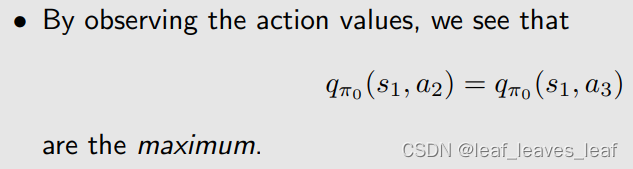

因为他俩对应的 action value 是一样的，所以可以任意选择 a2,a3 作为一个新的策略，直观上来看，往右走和往下走也是一个比较好的策略

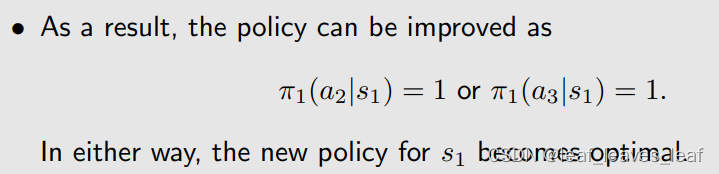

s1 的这个新策略已经实现最优了，对于这个简单的例子，一个 iteration 就可以找到实现它的最优策略。这是因为除了 s1 之外，s1 周围的其他 state 已经达到最优了，所以 s1 也可以轻松找到最优策略。

------

##### （2）例子2

这个例子不是展示如何用 MC basic 解决一个问题而是假如已经用 MC Basic 得到了一个最优策略，分析一下这个最优策略有什么性质

研究 episode 长度的影响（Examine the impact of episode length）：

-   在用 MC Basic 的时候需要数据，这个数据就是从任何一个状态和动作出发，有很多 episode，计算 episode 的 return。这个 episode 的长度理论上是越长越好，计算的 return 越精确，但现实中不能无限长，
-   那么 episode 的长度应该设置为多长才合适？

例子设置：

**episode length 直观上可以理解为探索半径的长度** 

问题：一个episode的终止条件是什么，假如在当前的policy下无法达到目标点的话，由于Discounted不是会一直持续下去吗

-   episode的长度是无穷的，需要我们手动终止
-   实际仿真的时候需要设置终止条件或者step最大值

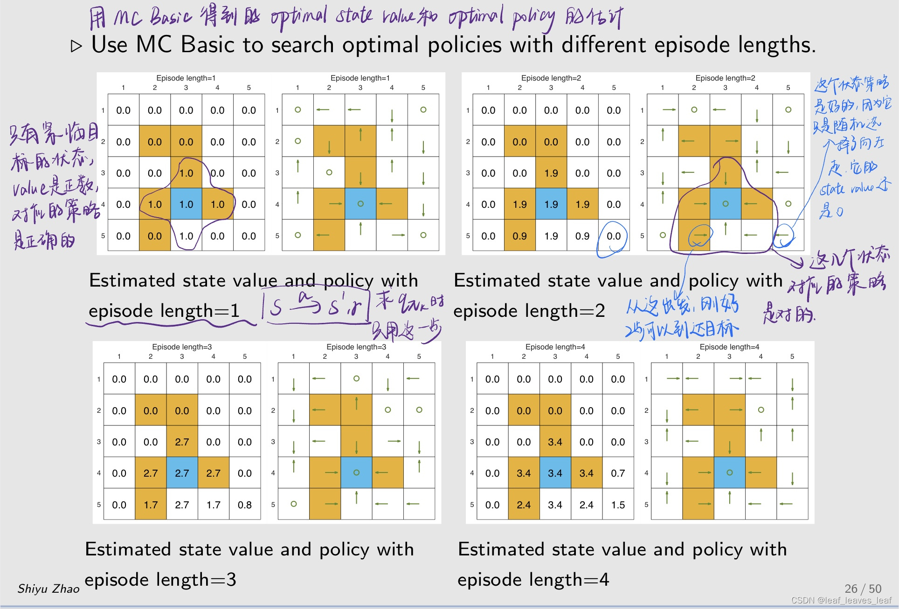

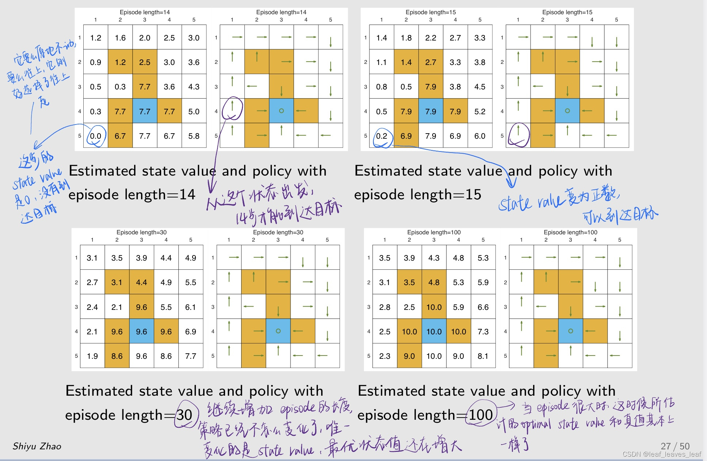

**研究结果**

-   当 episode 的长度较短时，只有靠近目标的状态具有非零状态值，只有离目标比较近的状态才能在这么短的步骤内找到目标，因此这些状态能找到最优策略。
-   随着 episode 的长度逐渐增加，离目标越来越远的状态也能慢慢到达目标，从而找到最优策略。距离目标较近的状态比距离目标较远的状态更早出现非零状态值。
-   episode 的长度应足够长，让所有状态都能有机会到达目标。
-   episode 的长度不一定要无限长，充分长就够了。

------

### 四. Use data more efficiently: MC Exploring Starts

这个算法是 MC Basic 的推广，可以让算法变得更加高效

MC Basic 算法：

-   优点：清晰揭示核心思想！帮助我们理解怎么样用蒙特卡洛方法实现不需要模型的强化学习
-   缺点：过于简单，不实用，效率低。
-   不过，MC Basic 可以扩展得更有效。

考虑一个网格世界的例子，按照策略 π，我们可以得到 an episode，例如

**访问（Visit）：**每当 episode 中出现一个状态-动作对（state-action pair）时，就称为对该状态-动作对的一次访问。

在 MC Basic 中使用数据的方法：初始访问法（Initial-visit method）

-   对于上图的这个 episode，我只考虑（s1,a2），用剩下的得到的 return 来估计（s1,a2）的 action value。只需计算回报值并近似计算 qπ（s1, a2）。
-   MC Basic 算法就是这么做的。
-   缺点：不能充分利用数据，有很多数据被浪费了。

**如何高效使用数据呢？**

-   我理解，MC-basic中每个episode只能拿到估计q值的一个数据，现在对每条episode拆分后，一个episode就能拿到估计不同state-action pair的多条数据。这样就算是充分利用数据了 
-   一个trajectory可出现多次相同的s a pair
-   这只是一个理论上提高数据利用率的改进的方法，还是要根据系统特点来看效果。如果研究对象系统状态转移非常稀疏，可能效果不好（利用不到几个片段），对于状态很容易循环的效果就可能很好

**数据效率高的方法有两种：**

**first-visit method：**上图中，状态-动作对 (s1,a2) 访问了两次，而 first-visit method 只使用第一次访问 (s1,a2) 的后面来估计 (s1,a1)，第二次出现的时候就不用它后面的来进行估计了。

**every-visit method：**上图中，状态-动作对 (s1,a2) 访问了两次（第一次和第三次），every-visit method 只要访问了，不管是第几次，都可以用它后面的 return 估计 (s1,a2) 的 action value

理解：还是没懂first-visit和every-visit区别？

-   就是你估计时，对于episode里出现多次的（s，a），是把第一个（s，a）当作样本，还是把后面的（s，a）对都算作（s，a）样本

------

**除了让数据的使用更加高效之外，我们还可以更加高效的去更新策略。基于 MC 的 RL 的另一个方面是何时更新策略。也有两种方法：**

**第一种方法是，**在策略评估（policy evaluation）步骤中，收集从一个状态-行动对（state-action pair）出发的所有 episode，然后使用平均回报（average return）来近似估计动作值（action value）。

-   这是 MC Basic 算法所采用的方法。
-   这种方法的问题在于，智能体必须等到（wait until）所有 episode 都收集完毕。这个等待的过程浪费时间，效率低。

**第二种方法是，**使用单个 episode 的回报（return）来立刻估计动作值（action value），然后不要等待，下一步就直接开始改进策略。这样的话，我得到一个 episode 就改进策略，得到一个 episode 就改进策略，效率会提升。

-   In this way, we can improve the policy episode-by-episode.

------

第二种方法会产生问题吗？

-   有人可能会说，单个 episode 的回报（return）无法准确地估计出相应的动作值（action value）。
-   事实上，在上一章介绍的截断策略迭代算法（truncated policy iteration algorithm）中，我们已经做到了这一点，在 truncated policy iteration algorithm 中的第一步做的是 policy evaluation，在那一步中要求出当前策略的 state value，求 state value 要求解贝尔曼公式，又需要无穷多步迭代，当时在那个算法中我们只做有限步迭代，虽然得不到非常精确的 state value，但这个算法仍然可行。与现在这个思想类似，用一个 episode 来估计动作值（action value），这显然是不精确的，但是没关系。

这一些方法有名字，叫做 Generalized policy iteration（简称 GPI）

-   GPI 不是一种特定的算法，是一大类算法，是一种思想，架构。
-   它指的是在策略评估（policy-evaluation）和策略改进（policy-improvement）过程之间切换的总体思路或框架。而且策略评估（policy-evaluation）不需要非常精确的把 action value 或者 state value 估计出来。
-   许多基于模型和无模型的 RL 算法都属于 GPI 这一框架。上节课和这节课的算法都可以属于 GPI 框架。

------

有了上面的这些思考，如果我们能更高效地利用数据和更新估计值，就能得到一种新算法，即 MC Exploring Starts，这是我们之前学的 MC Basic 的推广

If we use data and update estimate more efficiently, we get a new algorithm called MC Exploring Starts:

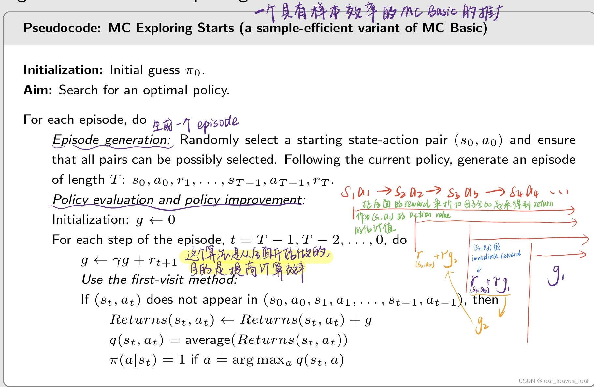

------

什么是探索起始（exploring starts）？

-   **探索（exploring）**指的是我从每一个(s,a)出发，都要有 episode，只有这样我才能用后面生成的这些 reward 来估计 return，进一步估计 action value。如果恰恰有一个 state-action 没有被访问到，那我就可能把这个 action 给漏掉了，但是那个可能就是最优的，所以我们需要确保每个都被访问。
-   **起始（starts）**意味着我们要访问每个（s,a），从它后面能够生成 reward 的这些数据有两种方法：第一种方法是从每一个 (s,a) 开始都有一个 episode，就是 **start**；第二种方法是从其他的 (s,a) 开始，但是也能经过当前的这个 (s,a)，那后面的这些数据也可以估计当前 (s,a) 的 return，这个叫 **visit**。目前来讲，visit 方法没法确保，它依赖于策略和环境，没法确保从其他的 (s,a) 开始一定能够经过剩下的所有 (s,a)，下面我们介绍的新方法就是使得 visit 可以做到，这样就可以避免必须从每个 (s,a) 都开始的条件。
-   MC Basic 和 MC exploring starts 都需要这一假设。

------

为什么我们需要考虑探索起始（exploring starts）？

-   从理论上讲，只有对**每个状态（state）的每个动作值（action value）**都进行了充分的探索，我们才能正确地选择最优动作（optimal actions）。相反，如果没有探索某个动作，这个动作可能恰好是最优动作，从而被错过。
-   在实践中，探索起始（exploring starts）是很难实现的。对于许多应用，尤其是涉及与环境物理交互的应用，很难收集到从每一对状态-行动开始的 episode。

因此，理论与实践之间存在差距。
**我们能否取消探索起始（exploring starts）的要求呢？接下来，我们将通过软策略（soft policies）来证明这一点。**

------

### 五. MC without exploring starts: MC ε-Greedy

#### 1.算法介绍

由上面的思考，引出了第五部分，如何把 exploring starts 这个条件给去掉，这里给出了一个算法叫 MC ε-Greedy

**什么是 soft policy？**

-   如果采取任何动作的概率都是正数，对每一个 action 都有可能去做选择，那么该政策就是软性的。
-   policy 分为两种，一种是确定性的（deterministic）policy，**之前讲的 greedy policy 就是deterministic**；另一种是随机性的（stochastic），这里的 soft policy 包括后面要介绍的 ε-Greedy 都是 stochastic policy

**为什么要引入 soft policy？**

-   如果采用软策略，如果我从一个 state-action pair 比如说 (s,a) 出发，如果后面的 episode 特别长，因为它是探索性的，我能够确保任何一个 s 和 a 都能被这个 episode 访问到。一些足够长的 episodes 就可以访问每一个状态-行动对。
-   这样，我们就不需要从每个状态-行动对开始的大量 episodes 了。因此，可以取消探索起始（exploring starts）的要求。不需要从每一个 (s,a) 都出发了，只需要从一个或者几个出发，就能够覆盖到其他的。

**我们使用的是什么 soft policy？**

-   ε-greedy policies（除了这个还有其他软策略，当前使用的是这个而已）

**什么是 ε-greedy policy？**

------

**为什么使用 ε-greedy policy？**

-   平衡开发（或者叫充分利用）（exploitation）与探索（exploration）
-   **充分利用 exploitation：**比如我在一个状态，有很多 action，我知道里面有的 action 的 action value 比较大，那么我知道这些信息，下一时刻我就应该去采取那个 action，那么未来我相信我就能得到更多的 reward
-   **探索（exploration）：**我现在虽然知道那个 action 能够带来更多的 reward，但是也许现在的信息不完备，我应该去探索一下其他的 action，执行完之后可能发现其他的 action 的 action value 可能也是非常好的

------

**如何将 ε-greedy 嵌入基于 MC 的 RL 算法（基于蒙特卡洛的强化学习算法）？如何将两者结合？**

**最初，**MC Basic 和 MC Exploring Starts 中的策略改进（policy improvement）步骤是求解下面的式子：（在第一步求解出了 q_πk (s, a)，这一步要求解下面这个优化问题得到一个新的策略）

之前我们没有强调过，但其实我们在求解这个优化问题的时候，π 应该在所有可能的策略当中去做选择，其中，Π 表示所有可能策略组成的集合。这里求解出的最优策略是：

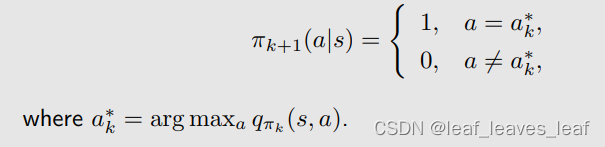

上面的是我们之前的方法，现在要把 ε-greedy 嵌入基于 MC 的 RL 算法：

**现在，**策略改进（policy improvement）步骤改为求解

在求解上面这个问题的时候，我不是在所有的策略里面去找，只是在 Πε 里面去找。其中，Πε 表示具有固定 ε 值的所有 ε-greedy 策略的集合（这里 ε 是事先给定的）。

这时候所得到的最优策略是：（把最大的概率仍然给 greedy action，但是会给其他所有 action 都给一个相同的比较小的概率）

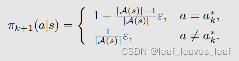

-   这样我们就得到了 MC ε-greedy 的算法，MC ε-Greedy 与 MC Exploring Starts 相同，只是前者使用 ε-greedy 策略，后者使用 greedy 策略。
-   它不需要探索起点（exploring starts）这样的一个条件，但仍需要以不同的形式访问所有的状态-动作对。It does not require exploring starts, but still requires to visit all state-action pairs in a different form.

------

**伪代码：**

------

#### 2.例子

（1）讨论 ε-greedy 的探索性：

**一个 episode 能访问所有状态-行动对吗？Can a single episode visit all state-action pairs?**

当 ε = 1 时，策略是均匀分布（uniform distribution）的，在我们的例子里面每一个状态有 5 个 action，每一个 action 都给了 0.2 的概率（由上面那个图片的最后一个公式可以计算出来）。当 ε = 1 时，探索能力（exploration ability）最强。

看图 (a)，从一点出发，根据策略要生成一个 episode，如果只有 **100 步（episode有100步）**的话，图 (a) 是它探索的情况，探索到了不少的 state；如果有1000步，图 (b) 可知，所有的 state 和 action 都被探索到了；如果有10000步，探索的次数会更大；图 (d) 是探索100万步的时候，每一个 state-action pair 被访问的次数，横轴代表 state-action pair 的索引，共有25个状态，每个状态有 5 个 action，所以一共有 125 个 state-action pair，这时候虽然只有一个 episode，但是每个 state-action pair 都被访问了很多次。

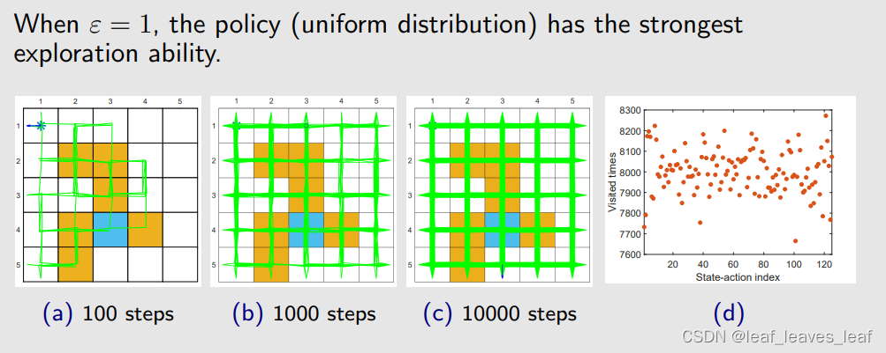

这个例子说明了，当 ε 比较大的时候，探索性比较强，自然就不再需要用 exploring starts 这样的一个条件了，不需要从每一个 (s,a) 出发都有一个 episode，只需要从某一些 (s,a) 出发，我就能覆盖到其它所有的 (s,a)。

------

当 ε 较小时，策略的探索能力（exploration ability）也较小。

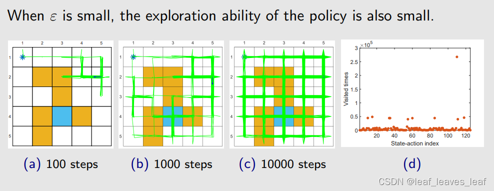

图 (a)，步数比较小的时候，访问的 state 比较少，因为它的偏好比较强；即使我把 episode 的长度变成了 100 万步，他会呈现出非常不均匀的访问次数，有的 state value 被访问的次数多，有的少。不管怎么样，相比 greedy 来说，还是有一定的探索能力。

------

下面用 MC ε-Greedy 算法实验一个例子：

运行 MC ε-Greedy 算法如下。在每次迭代中（In every iteration），执行下面的：

-   在 episode 生成步骤中，使用先前的 ε-Greedy 策略生成一个 episode，这个 episode 非常长，有一百万步！
-   在其余步骤中，使用这一个 episode 更新所有的 state-action pair 它们相对应的 action value 和更新策略。
-   之所以这样做，是想通过这个例子展示一下这个算法避开了 exploring starts 这样的一个条件，因为只要这个 episode 足够长，即使它从一个 state-action pair 出发，但仍然能够访问其他所有的 state-action pair。
-   两次迭代可以得到最优的 ε-Greedy 策略

-   图 (a) 是最初的策略，这个策略是不好的，在每一个状态都有相同的概率去选择所有的 action。然后我用这样一个策略生成一个 100 万步长的 episode，然后更新策略，得到了图 (b) 这样的策略；这个策略仍然不够好，一些状态上会保持不动；然后再用这个策略得到一个 100 万步长的 episode，再去更新策略，就得到了图 (c) 这样的策略。
-   我们看图 (c) 这样的策略，如果只看图上绿色箭头概率最大的 action（箭头最长的方向），比图 (b) 策略来说相对而言比较合理，从任何一点出发都能到达目标，但是它们会穿过障碍物，所以从这个意义上讲它还不是最优的，因为最优的应该绕过障碍物到达目标。所以 ε-Greedy 通过探索性得到了一些好处，但是牺牲掉了最优性。

------

**与贪婪策略（greedy policy）相比**

-   ε-greedy 策略的优势在于它们具有更强的探索能力，因此不需要探索开始（exploring starts）的条件。
-   缺点是 ε-greedy 策略一般来说不是最优的（not optimal）（我们只能证明总是存在最优的 greedy 策略）。
-   实际中可以设置应该比较小的 ε 值，当这个 ε 趋于 0 的时候，ε-greedy 就接近于 greedy，所以用这个算法找到的最优的 ε-greedy 策略就接近于最优的 greedy 策略；在实际中也可以让 ε 逐渐减小，比如在开始的时候 ε 比较大，就有比较强的探索能力，然后让 ε 逐渐趋于 0，最后得到的策略又又比较好的最优性。
-   MC ε-greedy 算法给出的最终策略只有在所有 ε-greedy 策略的集合 Πε 中才是最优的。
-   ε不能太大。

------

下面我们用几个例子说明一下 ε-greedy 的最优性

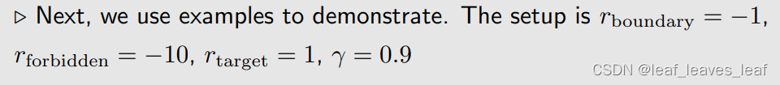

在下面的例子中，首先给出左图绿色箭头的一个策略，然后求解它的贝尔曼公式，可以得到它的 state value（右图）。

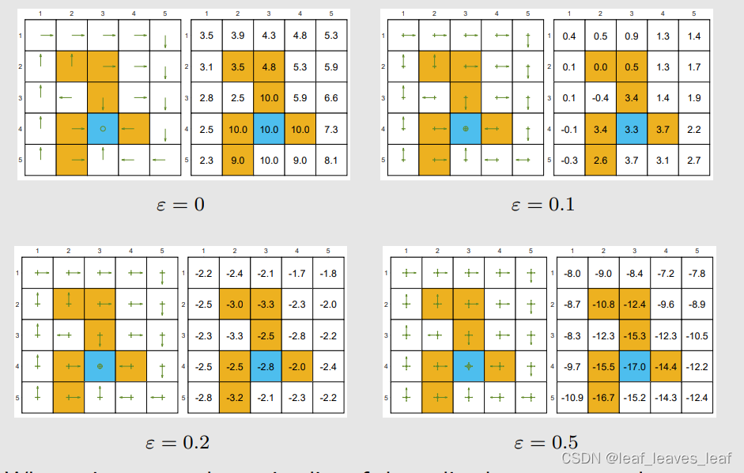

-   左上角第一幅图的 ε = 0，它是一个 greedy 的策略，并且它是在这个情况下最优的一个策略。
-   右上角的第二幅图 ε = 0.1，是第二个策略，第二个策略与第一个策略的关系是，他们是一致的（consistent），因为左下角那个小格子上，第一幅图中是往上走，第二幅图中最大的概率（最长的绿色箭头）是往上走，但与从同时也给其他的 action 有一些比较小的概率（小箭头），这个就被称为 consistent，这时候使用左图策略算出的 state value 比第一幅图的小，就是因为在很多地方它采取了不该采取的措施。
-   **consistent：**右上角的第二幅图 ε = 0.1，是第二个策略，第二个策略与第一个策略的关系是，他们是一致的（consistent），因为在第二幅图的左图中的任意一个状态中，箭头最长的策略（具有最大概率的策略）和第一幅图左图的策略一样。
-   进一步增大 ε，state value 变得更小，我们知道 state value 可以用来衡量一个策略是否好，最优策略的定义就是基于 state value，最优策略是有最大的 state value
-   因此虽然所有策略都和最优的 greedy 策略保持一致（绿色箭头一样），但最优性变得越来越差
-   实际上 target area 上的 state value 在最优的策略里，应该是最大的值，但当 ε 比较大的时候，它反而变成最小的值，变成负数，因为它在这个地方有比较大的概率进入 forbidden area，得到很多对负数 reward。 

------

下面例子说明 MC ε-Greedy 算法中 ε 的选择不能太大。或者最开始的时候 ε 比较大，探索性比较强，最后 ε 逐渐减小到 0，就可以得到一个最优的策略

-   左上角第一幅图的 ε = 0，它是一个 greedy 的策略，并且它是在这个情况下最优的一个策略。
-   用 MC ε-Greedy 得到的 optimal ε-Greedy 策略，得到这个策略之后要用到实际中，实际中不会带有 ε（即右上角的左图不会有小箭头了，只保留概率最大的策略，即只保留大箭头），会把它转成对应的 greedy 策略，这个转换成的 greedy 策略，我希望它与最优策略（左上角的左图策略）相同，即我们希望是具有**一致性的（consistent）**。在 ε=0.1 的时候，把它转成 greedy 的时候与左上角左图相同，就是 greedy 的策略。但当 ε=0.2 或更大的时候，ε-Greedy 策略与左上角的 greedy 策略无关了，转换过去（即只取最长的箭头，不要小箭头）他俩就不同了
-   因此如果你想用 MC ε-Greedy的话，那么你的 ε 选择不能太大。或者用一个技巧，在最开始的时候 ε 比较大，探索性比较强，最后 ε 逐渐减小到 0，就可以得到一个最优的策略

###  六.总结

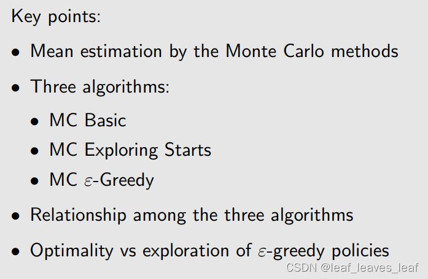