# 强化学习的数学原理 课程笔记 06 随机近似与随机梯度下降

### 一.内容概述
背景：

-   本次课学习随机近似理论（Stochastic Approximation）和随机梯度下降（Stochastic Gradient Descent）。因为下节课我们要介绍 Temporal-Difference learning，这是一个无模型的强化学习算法，下节课与上节课介绍的有一个知识的鸿沟，比较难理解。实际上，Temporal-Difference learning 是 Stochastic Approximation 的一个特殊情况。因此，这节课先介绍背景知识
-   在上一讲中，我们介绍了蒙特卡洛学习法（Monte-Carlo learning）。
-   在下一讲中，我们将介绍时差（TD）学习（temporal-difference (TD) learning）。
-   在本讲座中，我们将按下暂停键，以便做好更充分的准备。

为什么？

-   TD算法（temporal-difference (TD) learning）的思想和表达方式与我们目前学习的算法截然不同。
-   很多学生在第一次看到 TD 算法时，都会疑惑为什么当初要设计这些算法，为什么它们能有效地工作。
-   There is a knowledge gap!

在本次课中：

-   我们将通过介绍基本的随机逼近（SA）算法，填补上一讲和下一讲之间的知识空白。通过介绍 basic stochastic approximation (SA) algorithms，我们将填补上一讲和下一讲之间的知识空白。
-   我们将在下一讲中看到，时差算法是一种特殊的 SA 算法（temporal-difference algorithms are special SA algorithms）。因此，理解这些算法会容易得多。

### 二.激励性实例（Motivating examples）

这部分介绍一个 mean estimation 的算法，如何通过迭代的方式去求一个期望（expectation）

**重温上节课学过的平均值估计问题（Revisit the mean estimation problem）**

-   考虑一个随机变量 $X$
-   我们的目标是估计它的期望 $E[X]$
-   假设我们收集了一些独立同分布的采样
-   对采样求平均值，认为是 $E[X]$的近似
-   上面这种近似方法就是蒙特卡罗估计的基本思想。
-   当有足够多的数据的时候，采样的平均值会逐渐收敛到它真实的期望 $E[X]$

**为什么我们如此在意平均值估计问题（mean estimation problem）？**

强化学习（RL）中的许多量，如动作值和梯度（action values and gradients），都被定义为期望值，都需要用数据去估计

------

**新问题：**如何计算平均值 $\bar{x}$ ？

有两种方法：

**第一种方法：**很简单，就是收集所有样本，然后计算平均值。

-   这种方法的缺点是，如果要在一段时间内逐个（one by one）收集样本，我们就必须等到所有样本都收集完毕。我们必须等到所有样本都收集完毕再求平均。

**第二种方法：**可以避免这一缺点，因为它是以递增（增量式的）（incremental）和迭代（iterative）的方式计算平均值的。基本思路就是来几个就先计算几个，这样效率更高。

**下面详细介绍第二种方法**

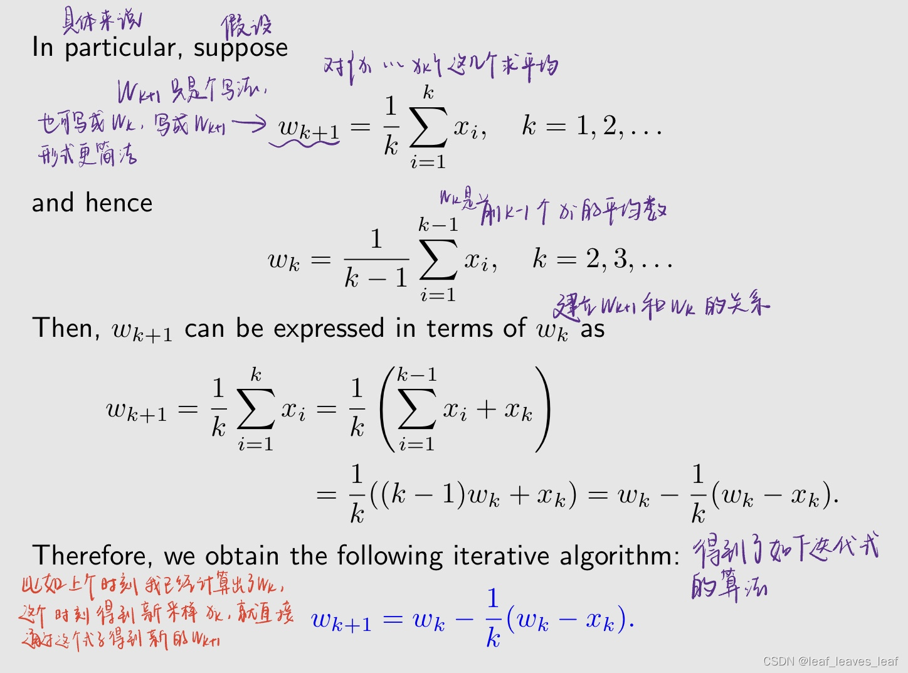

**关于该算法的说明：**

-   这种算法的优势在于它是渐进式的。一旦收到样本，就可以立即获得平均值估计值。然后，平均估算值就可以立即用于其他目的。在第 $k$ 步的时候，我不需要把前面所有的 $x_i$ 全部加起来再求平均，只需要通过上式一步的计算就可以得到一个新的平均数
-   这个算法代表一种增量式的计算思想：在最开始的时候因为数据量比较小，$w_k$ 难以非常精确的逼近 $E[X]$，即由于样本不足，平均值估计在开始时并不准确（即 $w_k ≠ E[X]$。不过，有总比没有好，总比一直等到最后才能有一个数来得到一个平均数要强。在这个过程中 wk 就算不精确，也可以用到其它任务中。随着样本的增多，数据越来越大，$w_k$ 也会越来越精确的逼近 $E[X]$，估计值会逐渐提高（即当 $k → ∞$ 时，$w_k → E[X]$）。

**此外，这个算法也可以进一步推广：**

还可以考虑一种表达式更一般的算法：

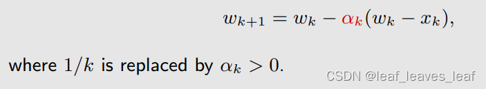

-   **这种算法还能收敛到平均值 E[X] 吗？**我们之后将证明，如果 ${α_k}$ 满足一些温和的条件（satisfy some mild conditions），答案是可以的。
-   我们还将证明，这种算法是一种特殊的 SA 算法（Stochastic Approximation algorithm），也是一种特殊的随机梯度下降算法（stochastic gradient descent algorithm）。
-   在下一讲中，我们将看到时差算法(the temporal-difference algorithms)有类似（但更复杂）的表达式。

### 三.Robbins-Monro 算法（RM 算法）：

是随机近似理论（Stochastic Approximation）中非常经典的一个算法

#### 1.算法描述

**随机近似（Stochastic approximation，SA）究竟是什么：**

-   SA 指的是**解决寻根（方程求解）或优化问题**的一大类随机迭代算法。SA refers to a broad class of stochastic iterative algorithms solving root finding or optimization problems.
-   SA 中的 `Stochastic` 代表涉及到对随机变量的采样
-   与许多其他寻根（方程求解）算法（如基于梯度的方法 gradient-based methods，梯度下降或梯度上升）相比，SA 的强大之处在于它**不需要知道目标函数的表达式或其导数或者梯度的表达式**。

**Robbins-Monro (RM) 算法:**

-   这是随机近似领域（in the field of stochastic approximation）的一项开创性工作。
-   著名的随机梯度下降算法（stochastic gradient descent algorithm）是 RM 算法的一种特殊形式。
-   它可以用来分析开头介绍的均值估计（mean estimation）算法。我们前面介绍的 mean estimation 算法也是一种特殊的 RM 算法。

------

**问题陈述：** 假设我们想找出方程的根

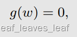

其中 w∈R 是待解变量，g ： R → R 是一个函数。w 和 g 全都是标量

-   这个问题看似很简单，但是很有用，因为它**广泛的存在**。许多问题最终都可以转化为这个寻根问题，
-   case 1：**优化问题**：例如，假设 J(w) 是一个需要最小化的目标函数，需要优化 J(w) 那么方法就是求解下面的这个方程，就是 J(w) 的梯度等于 0，这个梯度等于 0 是 J(w) 达到最大或最小的一个必要条件，并不是充分条件，但我们可以找到一个局部的极值。或者当 J(w) 只有一个极值的时候，这个就变成一个充分必要条件。
-   总之，优化问题可以写成 g(w)=0 的形式，这时候 g(w) 指的就是梯度

-   case 2：g(w) = c 这样的方程（c 为常数），也可以通过将 g(w) - c 改写为一个新函数而转换为上式 g(w) - c=0。

**如何求解 g(w) = 0 的根？**

有两种情况：

**基于模型：** 如果已知 g 或者其导数的表达式，有很多数值算法可以解决这个问题。If the expression of g or its derivative is known, there are many numerical algorithms that can solve this problem.

**无模型：** 如果函数 g 的表达式未知呢？例如，函数由人工神经元网络表示，可以通过神经网络求解，y = g(w)，这个神经网络的输入是 w，输出是 y，神经网络里面其实就是 g(w)。常见的全连接神经网络其实就是做一个函数的近似，神经网络中我是不知道表达式的，现在问题就是输入什么样的 w 能得到一个 0 的输出？

------

**求解 g(w)=0 这样的问题（求这个方程的根）可以用 RM 算法来求解，下面正式介绍 RM 算法：**

目标是求解 g(w)=0，假设最优解是 w*

RM 算法是个迭代式的算法，对 w* 第 k 次的估计是 wk，第 k+1 次的估计是 wk+1

用图片表示如下，有一个黑盒是 g(w)，当我们输入 w 之后，有一个输出 y，但是这个 y 我们不能直接测量，还要加上一个噪音，这个噪音我们也不知道，反正能测量到的就是 g~。输入一个 w 就输出一个 g~

最开始的时候我输入 w1，得到 $\tilde{g}_1$，然后带入到下式的右侧，得到 w2，再把 w2 输入，再得到 g~2，再带入下式的右侧，得到 w3，以此类推。最后我们会得到 {wk} 的序列和 {g~k} 的序列。RM 算法就是通过这样一种方式来求解的。

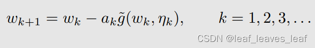

这里与之前介绍的基于模型的强化学习和不基于模型的强化学习一样，有模型的时候不需要数据，没有模型就需要数据

------

#### 2.说明性实例（llustrative examples）

**刚才我们通过例子看到 RM 能找到那个解，下面分析为什么能找到解**

**g(w)=0 的解 w\* 标在下图上，要求的就是这个最优解 w\***

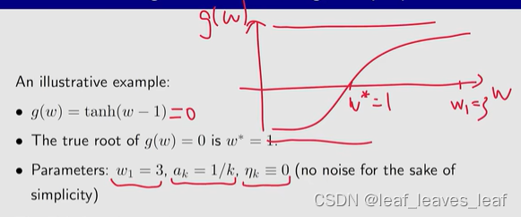

思路基本上是，我给一个 w 看一下输出，如果我发现输出是大于 0 的，那么 g(w) 就小一点，然后输出就会小一点，一直小到输出等于 0 的时候，w 就停止了。但是主要的精髓是每次小要小多少，这个就是 RM 算法给出的，小 ak×g 这么多

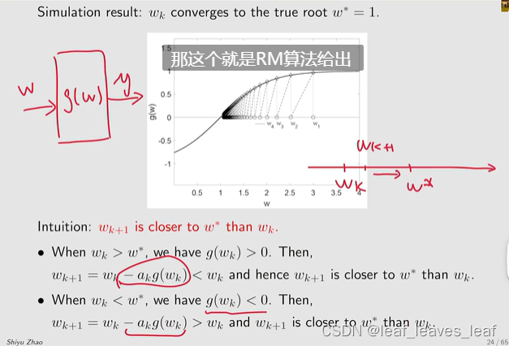

------

#### 3.收敛性分析（Convergence analysis）

上述分析 RM 算法为什么能够收敛是直观的，但并不严谨。下面给出了严格的收敛条件。

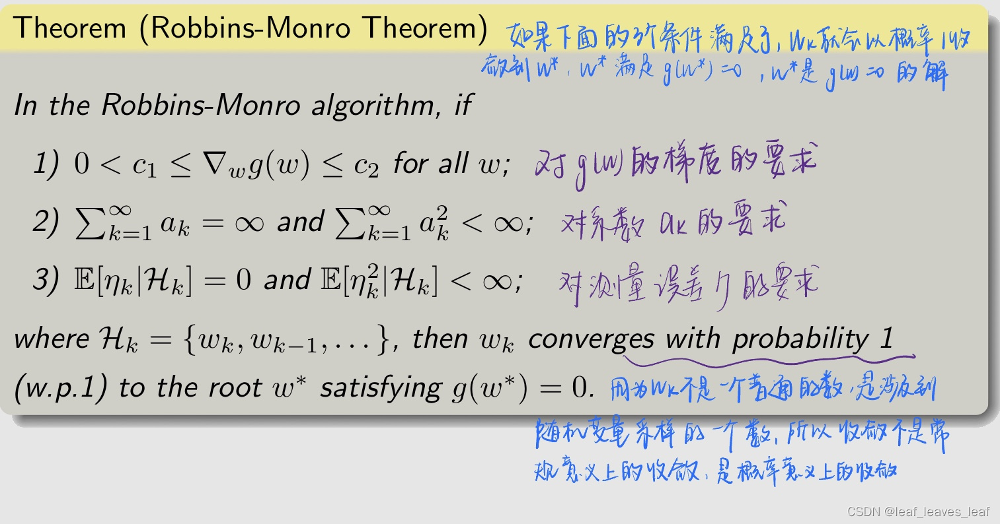

**对三个条件的解释：**

**下面对第二个条件再进行进一步的讨论，因为在未来的 Temporal-Difference learning 中，以及在看论文的时候也会经常看到这个条件：**

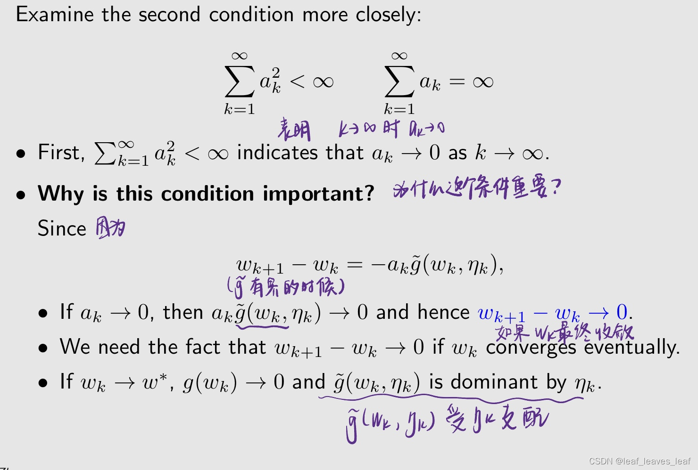

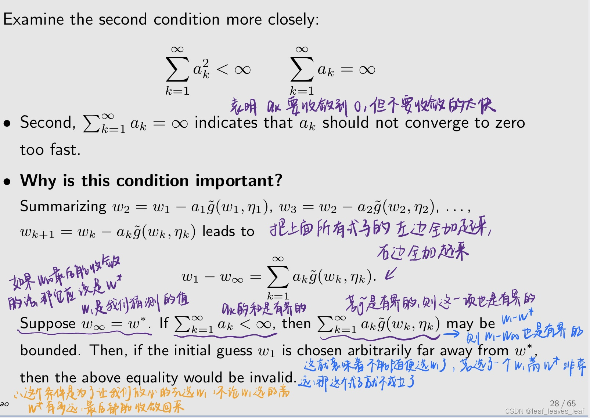

**什么样的 ak 满足条件 2 呢？**

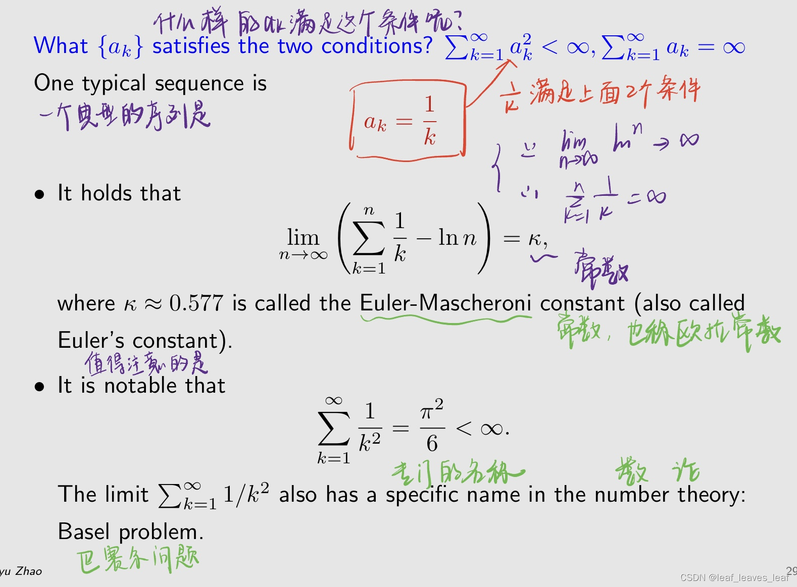

------

在 RM 算法中，三个条件若是有一个不满足，算法可能无法运行。

-   例如，g(w) = w*3 - 5 就不满足梯度有上界的第一个条件（does not satisfy the first condition on gradient boundedness），因为 g'(w) = 3w*2，当 w->∞ 的时候，g'(w) = 3w*2 也趋向于 ∞。如果初始猜测不错，算法可以收敛（局部）。否则，算法就会发散。

在实际中，虽然 1/k 满足条件 2，但是我们不总是让 ak =1/k，也不总是让 ak 趋向于 0。在许多 RL 算法中，ak 通常被选为一个足够小的常数。虽然在这种情况下第二个条件无法满足
在这种情况下，算法仍能有效运行。

-   如果 ak=1/k，当 k 比较大的时候，后面进来的测量或者数据起到的作用就非常小了，在实际中问题比较复杂，我们希望未来进来的数据仍然能够有用，所以不会让 ak 趋于 0，而是让它趋于非常小的一个数

------

#### 4.在平均值估计中的应用（Application to mean estimation）

把 RM 算法应用到 mean estimation 问题中

回忆之前（第一部分）介绍的 mean estimation 算法：**（当时在 αk ≠ 1/k 的时候，这个算法的收敛性没法得到证明）**

我们知道：

**接下来，我们将证明该算法是 RM 算法的一个特例。**然后，它的收敛性自然也就水到渠成了。

------

下面介绍一个更加复杂的 stochastic sequence 的收敛性的证明

-   这是一个比 RM 定理更普遍的结果定理。它可以用来证明RM定理
-   它还可以直接分析均值估计（mean estimation）问题。
-   它的推广扩展可用于分析 Q-learning 和 TD 学习算法的收敛性。

>   第一部分（激励性实例中）介绍的 mean estimation 算法是第二部分介绍的 RM 算法的特殊情况

------

### 四.随机梯度下降（stochastic gradient descent，SDG）

>   SGD 是 RM 算法的特殊情况，mean estimation 算法也是 SGD 的特殊情况

#### 1.算法描述

**接下来，我们将介绍随机梯度下降（SGD）算法：**

-   SGD 在机器学习领域和 RL 中得到广泛应用。
-   SGD 是一种特殊的 RM 算法。
-   均值估计（mean estimation）算法是一种特殊的 SGD 算法。

**接下来看一下 SGD 算法要解决的问题是什么：**

假设我们的目标是解决以下优化问题：
$$
\min_{w} \, J(w) = \mathbb{E}[f(w, X)]
$$

-   目标函数 J，是 w 的函数，目标是要找到最优的 w，要优化 w 使得目标函数达到最小。
-   目标函数是 f 的期望，f 是 w 和随机变量 X 的函数。随机变量 X 的概率分布（probability distribution）已经给定，但我们还不知道。期望是对 X 求期望
-   w 和 X 可以是标量或矢量。函数 f(*) 是一个标量。

**求解这个问题有多种方法，下面给出三种方法：**

**方法1：梯度下降（gradient descent，GD）**

因为我们的目标是最小化一个目标函数，所以要用梯度下降；如果目标是最大化一个目标函数，就要用梯度上升。
$$
w_{k+1} = w_k - \alpha_k \nabla_w \mathbb{E}[f(w_k, X)] = w_k - \alpha_k \mathbb{E}[\nabla_w f(w_k, X)]
$$
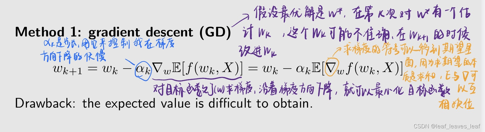

缺点：难以获得期望值（expected value）。对此有两种解决方法：第一种方法，如果有模型就可以求出来；第二种方法，如果没有模型，用数据求

**方法2：批量梯度下降（batch gradient descent，BGD）**

接下来看看没有模型，用数据如何求

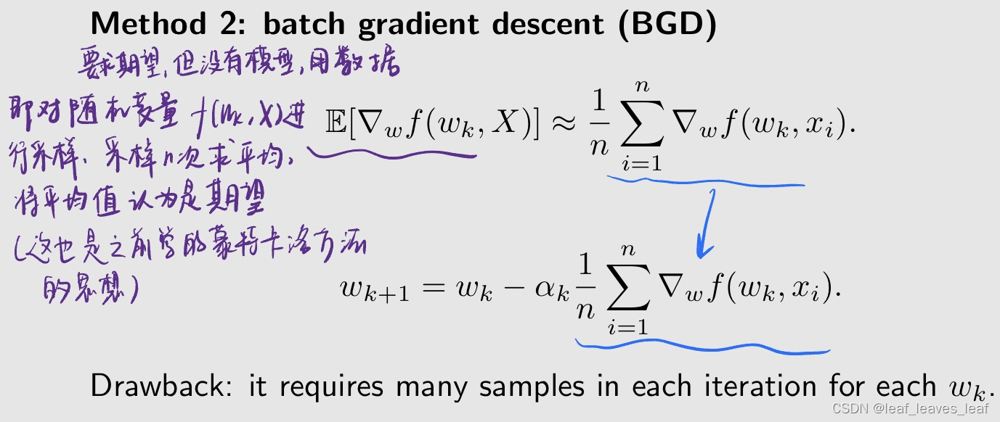

缺点：每次迭代都需要对每个 wk 进行多次采样。在每次更新 wk 的时候都要采样 n 次或者多次。这在实际中还是不实用，那么来到了方法3

**Gemini**：[为什么说没有模型还能求出梯度](https://gemini.google.com/share/39161822e160)

**方法3：随机梯度下降（stochastic gradient descent，SGD）**

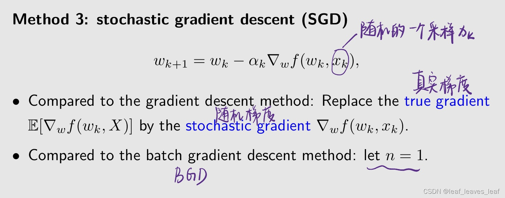

在 batch gradient descent 中，要采样很多次，如果采样越多，对期望估计的就越准，但是问题是也需要很多数据；在 stochastic gradient descent 中，只用了一个数据，估计的肯定是不精确的。之后会介绍它究竟不精确到什么程度，还能否解决优化问题？

#### 2.实例和应用（Example and application）

考虑下面这样一个例子

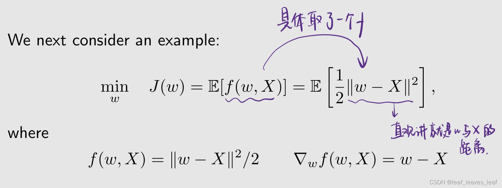

有三个问题：

**问题1：证明最优解为 w\* = E[X].**

**问题2：写出解决这个问题的 GD 算法。**

**问题3：写出解决这个问题的 SGD 算法。**

先知道 gradient descent，GD 算法，知道里面要有期望，把期望去掉就直接得到 SGD

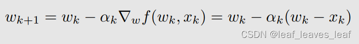

请注意：

-   它与我们在最开始介绍的均值估计（mean estimation）算法相同。
-   最开始（激励性实例）介绍的均值估计（mean estimation）算法就是假设有一个 X，我要求它的 E[X]，有一组的对 X 的采样 {xi}，把 xi 一个一个放到上面那个图片的算法里，最后就能得到 xi 的平均值，进而近似得到 E[X]。在那个里面，αk =1/k，我们知道 wk 确实是非常精确的前 k 个 xi 的平均值。后面我们又提到了 αk ≠1/k 的时候也是可以解决的，因为这个算法是一个特殊的 SGD 算法，**它的问题的描述是不一样的，之前是描述求 E[X]，现在它描述为一个优化问题，它们是殊途同归的。**
-   该均值估计（mean estimation）算法是一种特殊的 SGD 算法。

------

#### 3.收敛性分析（Convergence analysis）

为什么 SGD 能够是有效的

SGD 的基本思路就是从 GD 出发， GD 中的期望 E 是不知道的，干脆把它去掉，用一个采样来近似这个 E，这个就是 SGD。用的这个采样有一个名字，叫 stochastic gradient；GD 中的期望叫 true gradient

用 stochastic gradient 去近似 true gradient，那么它们之间肯定是存在一个误差的，他俩之间的关系式如下：

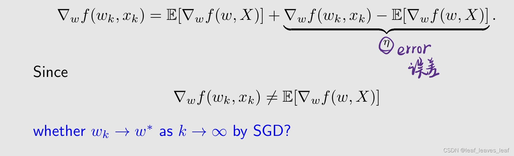

stochastic gradient 肯定不是准确的，在这种情况下，用 SGD 是否能找到最优解 w* 呢？答案是肯定的，下面看一下怎样去找。

------

分析的基本思想是证明 SGD 是一个特殊的 RM 算法，RM 算法在满足一定条件下是可以收敛的，我们就知道 SGD 在满足什么条件下也是能够收敛的（若是不依赖于 RM 算法，直接去证明 SGD 的收敛性，会非常复杂）

下面看看如何证明 SGD 是一个特殊的 RM 算法：

SGD 要解决的问题是去最小化下面这样一个目标函数（objective function）

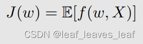

这个优化问题可以转化为一个寻根问题（a root-finding problem），就是求解一个方程的问题，因为上面的目标函数要达到最优的话，必要条件是它的梯度（gradient）等于 0：

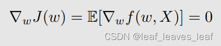

如果让 g(w) 等于梯度（gradient），那么求解上上个图片的最优问题就变成了求解一个方程 g(w)=0 的问题。

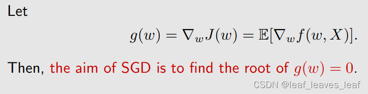

那么 g(w)=0 可以用一个 RM 算法来求解。为了求解 RM 算法需要用到数据，也就是 g(w) 算法的表达式我们不知道，但是**我们有一些测量**，这个测量用 g~ 表示，g~ 是 w 和噪音的函数。在这里面，g~ 是 stochastic gradient：

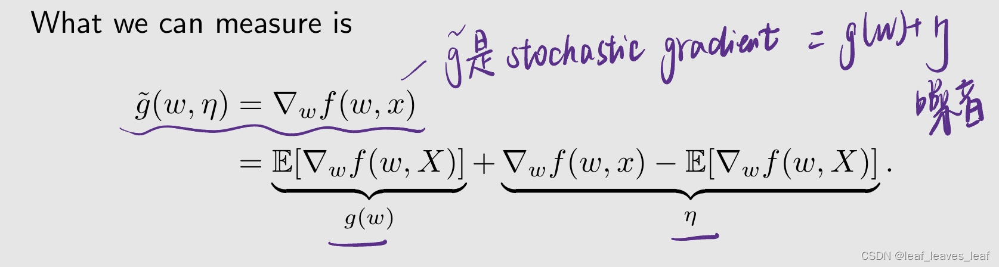

所以，求解 g(w)=0 的 RM 算法是：

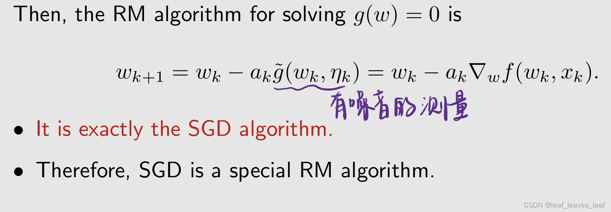

所以这个 RM 算法就是一个 SGD 算法，反过来说，SGD 算法是求解这样一个特殊问题的 RM 算法，相应的收敛性也可以用 RM 算法的收敛性结论来分析。

------

由于 SGD 是一种特殊的 RM 算法，那么 RM 算法的收敛性也可以应用到 SGD 的收敛性分析当中，它的收敛性自然也就不言而喻了。有下面一个结论：

------

#### 4.收敛模式（Convergence pattern）

分析它在收敛过程中有意思的行为

**问题：**SGD 是把 GD 当中的 true gradient 用 stochastic gradient 来代替，stochastic gradient 是有随机性的，会不会造成 SGD 的收敛随机性比较大呢。由于随机梯度（stochastic gradient）是随机的，因此近似是不准确的，那么 SGD 的收敛速度是慢还是随机的？

为了回答这个问题，我们考虑了随机梯度（stochastic gradient）和批量梯度（batch gradient）之间的相对误差（relative error）：（分子是两者的绝对误差，分母是）

注意到：

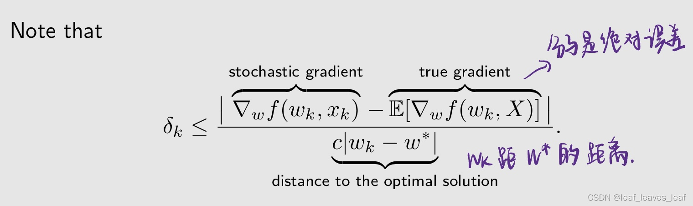

上式表明，SGD 的收敛模式非常有趣。

-   当 wk 距离 w* 比较远的时候，分母比较大，若分子是有限的，那么相对误差（relative error）比较小，也就是 stochastic gradient 和 true gradient 比较接近，这时候SGD 和 GD 很类似，也就是它会大概朝这个方向接近目标；相反，如果 wk-w* 比较小的时候，整个上界比较大，wk 在 w* 的附近，这时候存在随机性
-   相对误差 δk 与 |wk - w∗| 成反比。
-   当 |wk - w∗| 较大时，δk 较小，SGD 的表现与普通的梯度下降（GD）相似。
-   当 wk 接近 w∗ 时，相对误差可能很大，收敛在 w∗ 附近表现出更大的随机性。

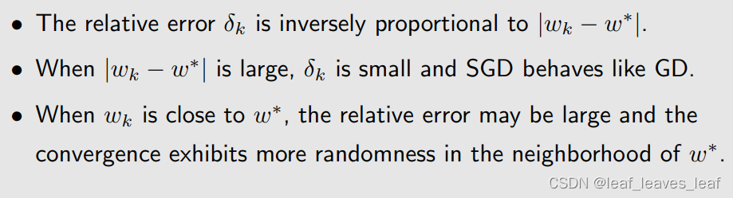

------

下面看一个例子：

-   设置 X∈R*2 表示平面上的一个随机位置。其在以原点为中心、边长为 20 的正方形区域内分布均匀。真实均值为 E[X] =[0,0]T（转置）。均值估计基于 100 个独立同分布的（iid）样本 {xi}，i=1-100。
-   在以原点为中心、边长为 20 的正方形区域内均匀随机采样 100 组，采集 100 组点。用这 100 组点跑刚才的 mean estimation 的算法，也就是 wk+1=wk-αk(wk-xk)，观察整个算法在收敛过程中呈现什么样的行为

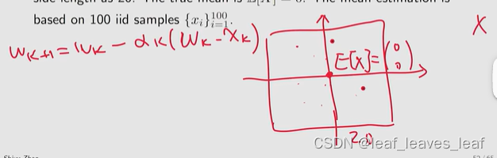

结果如下：

-   虽然初始猜测的平均值与真实值相距甚远，但 SGD 估计值可以快速接近真实值的邻域。
-   当估计值接近真值时，它表现出一定的随机性，但仍会逐渐接近真值。

------

#### 5.一种确定性表述（A deterministic formulation）

-   我们上面介绍的 SGD 公式（The formulation of SGD）涉及随机变量和期望值（random variables and expectation）。
-   我们经常会遇到不涉及任何随机变量（random variables）的确定性 SGD 公式（deterministic formulation of SGD）。

考虑下面的优化问题：

求解这个问题的梯度下降方法（gradient descent algorithm）是：

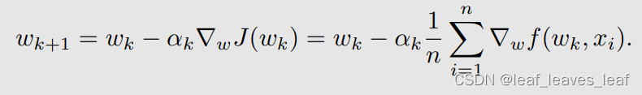

假设集合 {xi} 很大，我们每次只能获取一个数字 xi。在这种情况下，我们可以使用下面的迭代算法：把上式求平均的 xi 用 xk 代替

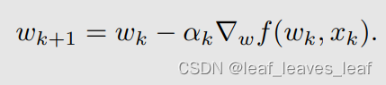

**问题1：**这个算法看起来与 SGD 非常类似，但这种算法是 SGD 吗？

-   在问题的描述中它就是一组 {xi}，它不涉及任何随机变量或期望值。

**问题2：**

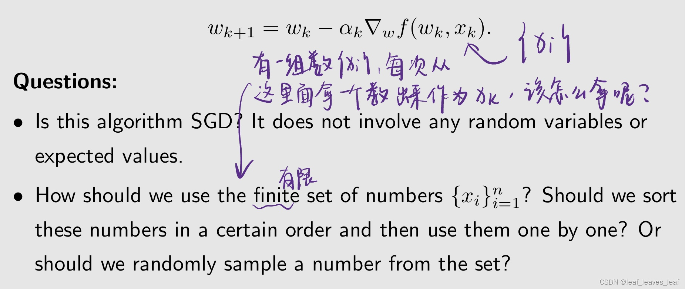

我们应该按照一定的顺序排列这些数字，然后一个一个地使用它们吗？还是随机抽样，还是以某种概率分布随机使用呢？能否重复使用一些数？

------

要快速回答上述问题，我们可以手动引入一个随机变量（introduce a random variable manually），将刚才一个不涉及随机变量的问题变成一个涉及随机变量的问题，将 SGD 的确定性公式（deterministic formulation）转换为随机公式（stochastic formulation）。

-   上式中的最后一个等式是严格等式，而不是近似等式。因此，该算法是 SGD 算法。
-   所以，从集合 {xi} 中抽取 xk，应该随机抽取而不应该排序，而且因为是随机抽取，所以集合里面的这些数字会被反复用到。
-   这里面没有随机变量，但是我通过强行引入一个随机变量，把它转化成了一个我可以得到的 SGD 算法的一个问题描述，

------

### 五.batch gradient descent，mini-batch gradient descent 和 stochastic gradient descent（批量梯度下降，微型批量梯度下降和随机梯度下降）（BGD，MBGD 和 SGD）

这里研究的问题依然是，有一个目标函数 J(w)，有 n 个采样 xi，我要用这样一组数据优化目标函数，有三种方法：BGD，MBGD 和 SGD

BGD 每次都要用到 n 个所有的采样，在这个基础上求平均，这个可以说最接近于真实的期望（expectation）；MBGD 不用所有的采样，每次只用全部采样中的一部分，选取一组数使用（总集合的子集），这组数的集合称为 Ik，这组数有 m 个，我在这一组数上进行平均；SGD 就是从集合 {xi} 中随机选择一个 采样出来。

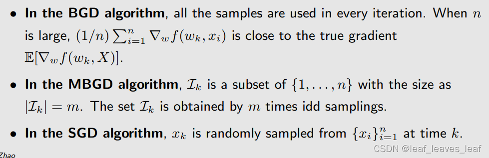

------

**比较 MBGD，BGD和 SGD**

-   与 SGD 相比，MBGD 的随机性更小，因为它使用了更多的样本，而不是像 SGD 那样只使用一个样本。用更多的数据去平均的话，会把噪音等等测量给平均掉。
-   与 BGD 相比，MBGD 的数据较少，它的随机性会更大一些，因为它无需在每次迭代中使用所有样本，因此更加灵活高效。
-   如果 MBGD 的 mini-batch m = 1，则 MBGD 变为 SGD
-   如果 MBGD 的 mini-batch m = n，严格来说，MBGD 不会变成 BGD，因为 MBGD 使用随机获取的 n 个样本，抽取的过程中可能一个采样抽取了好几次没有抽到，而 BGD 使用所有 n 个数字。特别是，MBGD 可以多次使用 {xi} 中的一个值，而 BGD 只使用每个数字一次。（这种差别很多时候可以忽略不计，但是最好从数学上能够明白）

------

下面用例子例证这三个算法：

有 n 个数字，我们的目标是求平均值，求平均值的问题可以等价为一个优化问题：

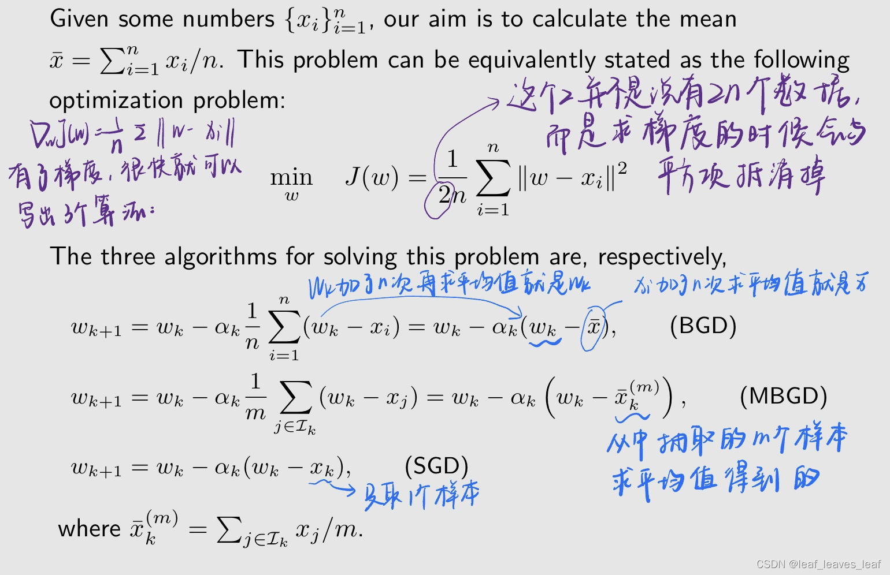

更进一步的，如果 αk =1/k，可以把 wk 显式的形式给求解出来，对于 BGD 的情况， 

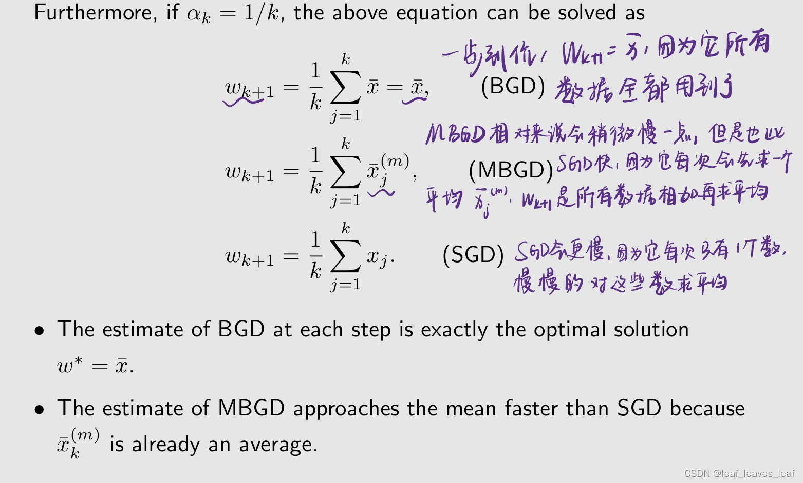

-   每一步对 BGD 的估计值正是最优解w ∗ = ¯x.
-   MBGD 的估计值比 SGD 更快接近平均值，因为x¯ (m) k 已经是一个平均值

------

下面通过一个仿真的例子看一下： 

与之前的仿真类似，有一个 20×20 的区域，要在里面均匀的采 100 个点，用这 100 个点的数据放到刚才的三个算法中，看一下它们的收敛情况。

红色的线是 SGD，可以看出它的收敛速度还可以；紫色的线和蓝色的线的的区别是 batch size 不同，紫色的线的 batch size 每次是 5 个，蓝色的线的 batch size 每次是 50 个，蓝色的线收敛速度更快。右图的横轴是迭代的次数，**纵轴是到达目标的距离。**

------

### 六.总结

1.  介绍了 mean estimation 算法，用一组数来求期望（expectation），之前我们只是简单的把这一组数求平均，就可以近似估计它的期望；这节课讲了一个迭代的算法，当我得到一个采样，就计算一次，这样就不用等所有的采样全部拿到了再计算，会更加高效。
2.  介绍了非常经典的 SA 领域的 RM 算法，要求的是方程 g(w)=0 的最优解 w*，但是不知道 g(w) 的表达式，只知道给一个 w 能测出来输出，而且这个输出的有噪音或者有误差的，输出用 g~ 表示，所以 RM 算法是怎么样用含有噪音的测量来估计 w*
3.  介绍了 SGD 算法，知道目标函数 J(w)，还知道它的一个梯度的采样，就可以用 stochastic gradient 这个算法让最后的 wk 趋于最优值 w*

这些结果是有用的：

-   我们将在下一章中看到，时序差分学习算法（temporal-difference learning algorithms）可以被视为随机近似算法（stochastic approximation algorithms），，因此具有类似的表达式。
-   它们是重要的优化技术，可应用于许多其他领域。 