# 强化学习的数学原理 课程笔记 07 value function approximation

## 一.内容概述

上节课介绍了 Temporal difference learning，本节课仍然介绍 Temporal difference learning，但是上节课用的是 tabular representation，也就是基于表格的方式，这节课会介绍基于函数的方式。

并且这次会引入神经网络，会介绍神经网络是怎么进来的，扮演什么角色。本节课还会介绍 Deep Q learning 

下节课将会介绍 policy gradient 的方法，之前学的全都是基于值的（value based），下次课会介绍基于策略的（policy based）

**课程大纲：**

**1.激励性例子：**曲线拟合（Motivating examples: curve fitting）

通过一个曲线拟合的例子展示如何从一个表格的形式引入函数的近似

**2.状态值估计的算法（Algorithm for state value estimation）：**这一节讲的是给定一个策略，如何进行 policy evaluation，也就是我估计出它的 state value，具体包括：

-   如何建立一个 objective function 
-   怎么去做优化（优化算法：Optimization algorithms）
-   应该用什么样的函数近似（函数近似值的选择：Selection of function approximators）
-   示例：Illustrative examples
-   故事概述：Summary of the story
-   理论分析：Theoretical analysis

这一节不会介绍如何顾及 action value，如何得到最优策略等等，但是它占的分量很重，因为它会揭示 value function approximation 非常基本的想法，明白了这个之后，之后的算法就很简单了

下面会介绍三个算法

**3.带有函数近似值的 Sarsa：Sarsa with function approximation：**把之前的 Sarsa 推广到把它与 value function approximation 结合起来

**4.带有函数近似的 Q-learning：Q-learning with function approximation：**把 Q learning 与 value function approximation 结合起来

**5.Deep Q learning**

**6.总结：summary**

------

## **二.激励性例子：**曲线拟合（Motivating examples: curve fitting）

到目前为止，我们学到的 state value 和 action value 都假设的是它们用表格的形式表示出来。不论是在贝尔曼公式还是在之前的算法中。

-   这个表格其实就对应一个 q table，也就是 q_π(s, a)，q_π(s, a) 有两个索引，一个是 s 一个是 a，代表了表格的横向和纵向，然后可以把 q_π 的值放到表格中去。

-   类似的，如果是状态值（state value） v_π(s)，其实就对应了一个一维的表格。
-   在编程的时候，我们把这些表格存储成向量、矩阵或数组。
-   **使用表格的好处：**直观，便于分析
-   **使用表格的坏处：**难以处理大型或连续的状态（state）或动作空间（action space）。总之，当 state space 或 action space 比较大的时候，会遇到两个方面的问题： **1）存储**它们的值的时候会面临问题；**2）泛化能力有问题：**即，当你有很多的 state action pair，你必须全都访问到它们，才能估计出它们的值，但是因为有太多了，不可能全都访问到，这个时候我可能估计不出他们的值，但是之后如果我们把函数近似引入进来的话，这两个问题就能被解决了。

>   -   有的同学可能会说，一个连续空间可以通过表格或者网格的方式离散化，但离散化总是存在问题的，当你离散的很密的时候，那你离散的网格有太多了，处理起来很吃力；当离散的很稀疏的时候，不能很好的近似一个连续空间
>   -   状态连续之后state value也会变得连续，为了保证连续原来的更新方法不再适用
>   -   连续之后就可以很方便地去训练神经网络，loss function就是action value

------

**考虑一个例子：**

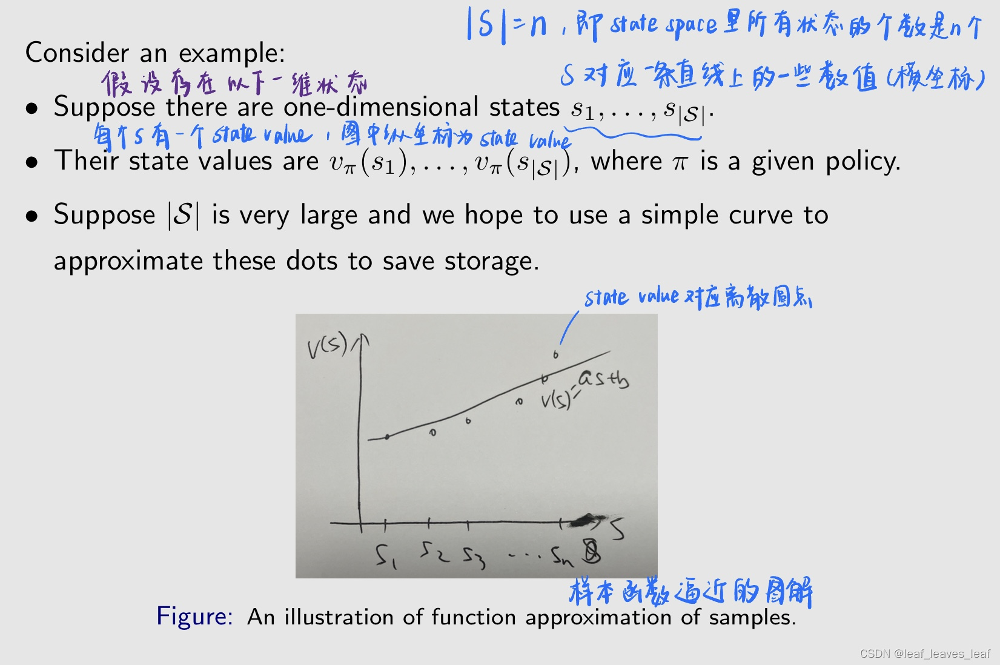

-    假设状态空间 |S| 非常大，状态的个数很多，如果我们要把它全部存储下来，要花很大的内存。我们希望用一条简单的曲线来逼近这些点，把这些离散的点串起来，然后用这个曲线来代表这些点，以节省存储空间。之所以要用曲线，因为这个曲线对应的参数个数很少，我只需要存储比较少的参数，就能来表示所有的这些状态的 state value

>   -   没错就是最小二乘
>   -   函数拟合，神经网络就用在这里了
>   -   不一定是二维的，深度网络可以实现多维曲线的拟合

**首先，我们用最简单的直线来拟合这些点。**

假设直线方程为

 **用直线进行拟合的好处：**

-    表格表示法（The tabular representation）需要存储 |S| 个 state value，非常多。现在，我们只需存储两个参数 a 和 b。
-    每次我们想使用 s 值时，都可以计算 φT(s)w。
-    这样的好处不是免费的。它需要付出代价：状态值（state value）无法准确表示，近似并不精确。比如这个离散的点，它并不是一个严格的直线，但是你非要用一条直线去拟合，那在很多点上，你所估计出来的 v hat 和 v_π(s) 还是有比较大的区别的 。因此，这种方法被称为 "值近似（value function approximation）"。

**表格法和函数法的区别**：

差异 1：如何检索状态值

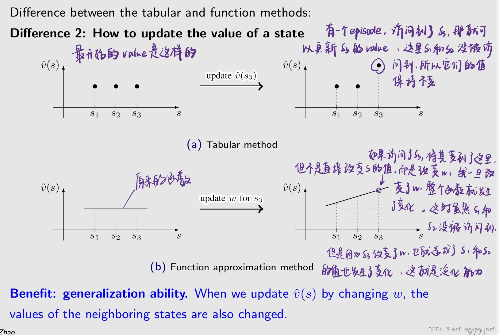

这就是泛化能力，我不需要把所有的状态全都访问到，我访问其中的一些，那么相邻的这些它的值自然也就能够被比较准确的估计出来了。

------

**其次，因为用直线拟合不是很准确，所有我们还可以用二阶曲线来拟合这些点：**

>   -   就是用一个函数拟合这些点，不用存储大量的数据，只需要知道一个函数的参数就可以了，但是这会有一个问题就是，当维度不够的时候会出现不准确的情况
>
>   什么意思，对w不也是非线性的吗？
>
>   -   线性，所有w都是一阶的。

------

**第三，我们甚至可以使用更高阶的多项式曲线或其他复杂曲线来拟合点。**

-    优点：可以更好地近似，可以更准确的拟合这些点。
-    缺点：需要更多参数。

------

**快速总结：**

value function approximation 的 idea 是我用一个函数 v hat 来拟合 v_π(s)，这个函数里面的参数有 s 和 w，所以这个函数被称为 parameterized function，w 就是 parameter vector

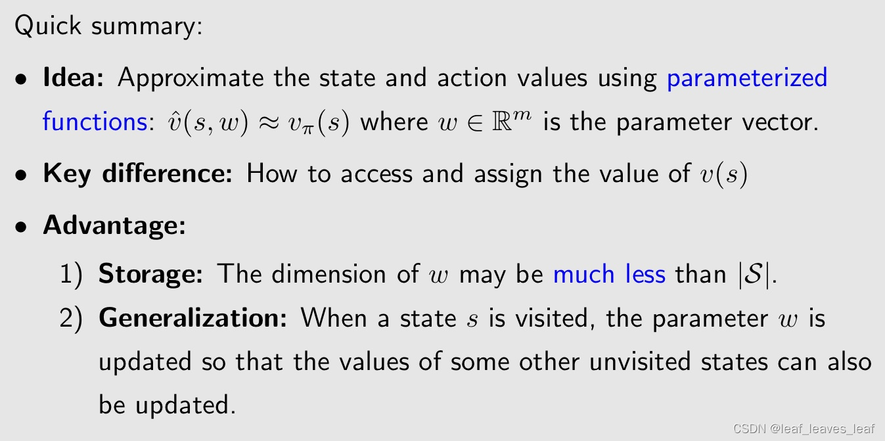

**这样做的好处：**

-   **节省存储：**w 的维度可能远小于状态 s 的个数 |S| 个。如果我有非常多的状态，就要存储非常多个 state value，但是现在我只需要存储 w 就行了，w 的维数很低
-   **泛化能力：** 当一个状态 s 被访问时，参数 w 更新，这样其他一些未访问状态的值也会被更新。在这种情况下，学习到的值可以被泛化到没被访问到的状态

>   就是用一个函数来代替数据点

------

## 三.状态值估计的算法（Algorithm for state value estimation）

### 1.目标函数（objective function）

**以更正式的方式介绍：**

-   v_π(s) 是 s 的真实的 state value，v hat 是它的一个估计值，我们的目标是让估计值尽可能接近真实值
-   当这个 v hat(s,w) 函数的结构确定的时候，比如之前我们知道它是一个线性的函数，是一个直线抛物线或者说是一个神经网络，当神经网络的结构确定的时候，剩下我们可以调节的就是 w。我们要做的就是找到一个最优的 w 使得 v hat 尽可能就接近 v_π
-   这个问题其实就是一个 policy evaluation 的问题，就是你给我一个策略，我要找到一个近似的函数 v hat，尽可能就去接近它真实的 state value。之后我们会再推广得到 action value，然后再推广得到怎么样去做 policy improvement，再找到最优的策略

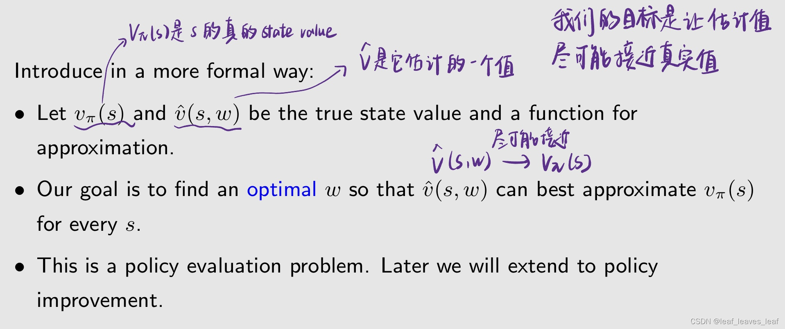

>   注意：这一节的目的是估计一个给定策略的状态值，是做policy evaluation！

**下面我们的目标是找到最优的 w，我们需要两步：** 

-   第一步是定义一个目标函数（The first step is to define an objective function）
-   第二步是推导出优化目标函数的算法（The second step is to derive algorithms optimizing the objective function.）

------

**目标函数如下：** 

value function approximation 这种方法的目标函数 J(w)，w 是我们要优化的参数：

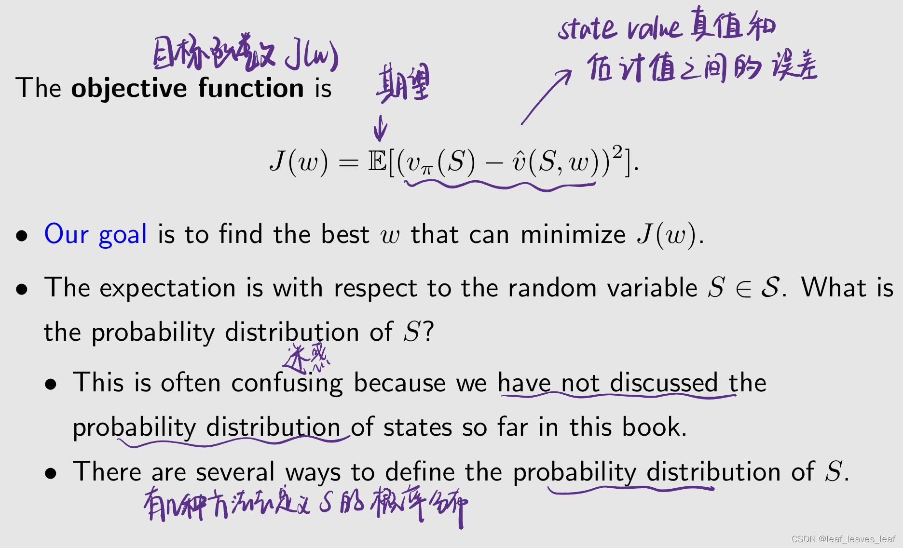

-   我们的目标是找到最优的 w 然后去优化（最小化）目标函数 J(w)
-   期望是关于随机变量 S∈ S 的。这里面的 S 是一个随机变量，随机变量一定是有 probability distribution 的，那么 S 的概率分布是什么呢？
-   上面问 S 的概率分布的这个问题也可以按如下的问法：上面的公式中有一个求期望 expectation，而 expectation 本质上就是做 average，我对所有的状态求一个平均，那么这个平均应该怎么平均呢？

------

**有几种方法可以定义 S 的 probability distribution，下面介绍两种：**

**第一种是非常值观也最容易想到的，就是平均分布（uniform distribution）：**

-   也就是说，通过将每个状态的概率设为 1/|S|，将所有状态视为同等重要（equally important）。那么我给每个状态求平均时候的权重都是一样的，那么我一共有 n 个状态，所以每一个人的概率或者权重就是 1/n
-   在这种情况下，目标函数变成了：（求出期望）

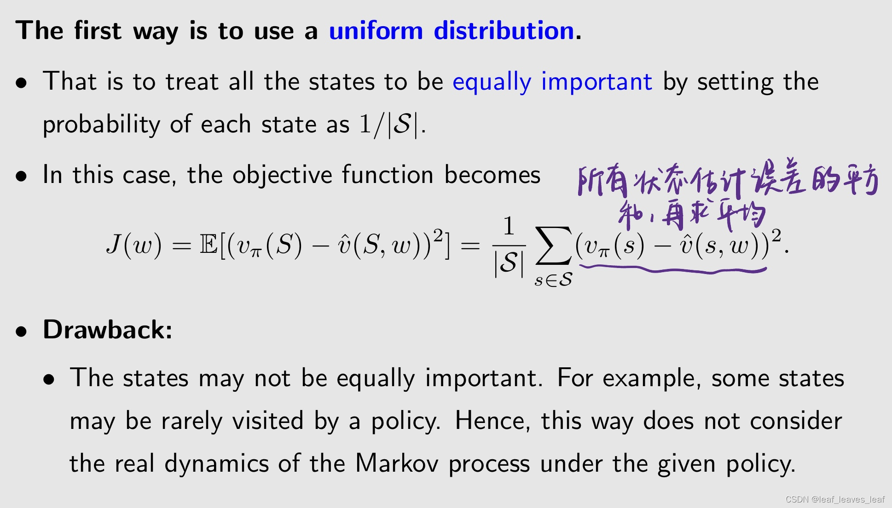

**缺点：**

-   这里我们假设各种状态都同等重要，但是实际上各种状态的重要性可能不尽相同。比如我们的目标是从某一状态出发到达目标状态，那么目标状态和接近于目标的那些状态更加重要，但是相反有一些状态离目标状态非常远，可能就不太重要，我肯定希望给那些重要的状态更大的权重，更大的权重意味着他们的估计误差会更小，而不重要的状态权重比较小，即使它的估计得误差比较大也没太大关系，反正可能不会访问到他或者很少访问到它。
-   实际上各种状态的重要性可能不尽相同。例如，有些状态可能很少被策略访问。因此，这种方法没有考虑给定策略下马尔可夫过程的真实动态。

------

**基于上面对缺点的考虑，我们引入第二个概率分布，平稳分布（The second way is to use the stationary distribution.）**

平稳分布是本课程中经常使用的一个重要概念。简而言之，它描述了马尔可夫过程的长期行为（it describes the long-run behavior of a Markov process.）

long-run behavior 就是我从某一个状态出发，然后我按照策略采取 action，然后我不断地去和环境进行交互，然后我一直采取这个策略，采取非常多次之后，我就达到了一种平稳的状态，在那个平稳的状态下我能够告诉你，在每一个状态 agent 出现它的概率是多少。之后会通过一个例子更清晰的了解，现在我们就先知道反正它是一个概率分布。

>   这里我根据chatgpt的回答，我的理解是平稳状态时（平稳分布下）agent在每个状态的停留概率。

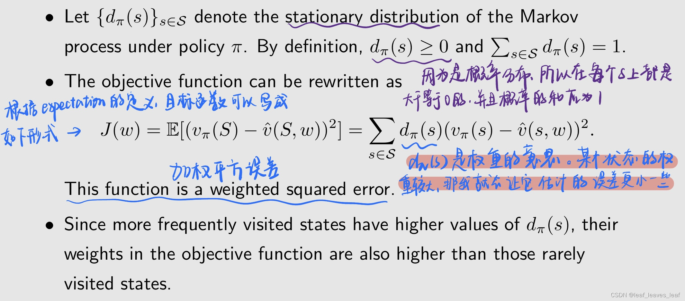

-   该函数是一个加权平方误差
-   dπ 还有一个意思是：它在达到平稳状态后，agent 出现在那个状态的概率，或者那个状态被访问的概率是多大。如果它很大，那么权重就比较大，意味着我希望那个状态它的估计误差比较小
-   由于经常访问的状态具有较高的 dπ(s) 值，因此它们在目标函数中的权重也高于那些很少访问的状态。

------

**关于平稳分布（stationary distribution）的更多解释：**

-    分布（distribution）： 状态的概率分布。如果是在求加权平均的时候，可以认为它实际上就是那个状态的权重
-    平稳（stationary）： 长期行为（long-run behavior）。也就是我从现在出发然后执行某个策略，又跑了很多很多步之后，所达到的一种概率的分布，那时候已经达到平稳的状态了。
-    总结：当智能体按照策略运行很长时间后，智能体处于任何状态的概率都可以用这个分布来描述。

**备注**

-   平稳分布又称稳态分布或极限分布。（Stationary distribution is also called steady-state distribution, or limiting distribution.）
-   理解值函数近似法至关重要。（It is critical to understand the value function approximation method）
-   它对下一讲的策略梯度法也很重要（It is also important for the policy gradient method in the next lecture）。特别是在定义 objective function 的时候，就会出现这个 distribution

------

**下面通过一个例子展示一下：**

-   给定如下左图所示的策略，它是一个探索性策略，因为每一个 action 都有正的概率去选到，但是它也有比较大的一个概率去选择某一个特定的 action，所以它有一定的倾向

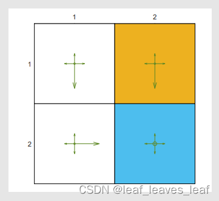

-   下面要做的事情是我让 agent 从一个状态出发然后跑很多次，就根据这个策略，我们看看有什么样的事情发生。假如我有一个很长的 episode，从一个状态出发，这个 episode 会访问每一个状态很多次，假设它访问 s 的次数我用 n_π(s）表示
-   那么 d_π(s）可以被估计如下：

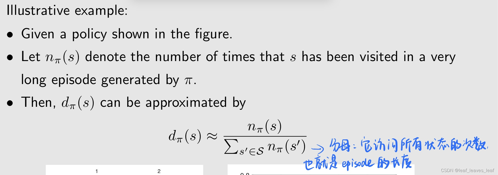

-   d_π(s）这个比值用下面的右图表示，这个比值可以来近似 stationary distribution。下图横坐标是 episode 的步长，现在跑了一个 episode，一共有 1000 步，纵坐标就是上面的比值。访问不同的状态所得到的比值，或者说那个状态被访问的概率是不同的。在开始的时候波动比较大，但是随着 step 越来越多，最后都趋向了平稳。它们的每一个比值或者说概率最后都会收敛到一个具体的值
-   所以 stationary 就是平稳，long-run 就是我跑很多次最后会趋向于平稳

-   上面紫色的线代表 s4，也就是在跑很多次之后，s4 被访问到的次数除以整个 episode 的长度最后趋向了一个比值，这个比值相比于其它的状态比较大，这是因为在每一个状态他都有一个比较大的概率选择某一个特定的 action，然后无论从哪个点出发，这些 action 都能有比较大的概率跑到 s4。最后跑了很多步之后，agent 在 s4 出现的概率比较大

>   -   用频率去近似概率
>   -   这里的s指代的是具体的一个方格是吗？比如s1.然后从是s1出发到达target的一个轨迹成为episode的一个步长？
>   -   这里的s是指具体的方格或者说是state
>   -   这里的一个episode应该表示的是一次迭代吧，这个迭代里有很多步

注意到，上面右图画了很多星号，星号代表理论值，也就是说我不需要跑很多次就能找到 d_π(s），下面来看一下怎么找：

------

收敛值是可以预测的，因为它们是 dπ 的项：

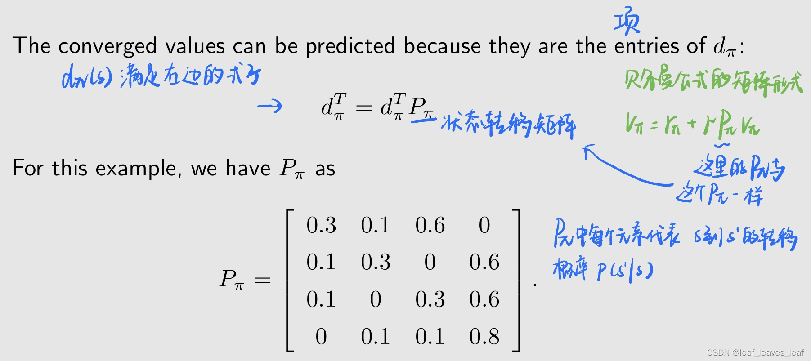

>   -   为什么满足这个式子？
>   -   平稳过程的收敛值
>   -   马尔科夫链在稳态分布下，对分布更新波动趋近于0
>   -   这里的状态转移是由policy决定的，所以仍然是model-free
>   -   Epsilon-greedy算每个行为对应的状态转移概率
>   -   用马尔科夫链能解释，然后迭代计算一下

dπ 是 Pπ 左边的一个特征向量（eigenvector），并且它对应的特征值（eigenvalue）等于 1。所以，可以计算出特征值 1 的左特征向量是：

------

### 2.优化目标函数的算法（Optimization algorithms）

有了目标函数，下一步就是对其进行优化。当优化了这个函数，那么也就找到了最接近真值的state value，完成了policy evaluation 

提到优化，我们的第一反应应该是梯度方法，即梯度下降或者梯度上升，这里我们要 minimize objective function，所以要用梯度下降方法

为了最小化目标函数 J(w)，我们可以使用梯度下降算法：

真实梯度为（The true gradient is）：

这个真实梯度需要计算一个期望 expectation，如何避免呢？我们可以用 stochastic gradient 来代替 true gradient

>   -   为什么用J的梯度？
>   -   因为要让J(w)最小化呀
>   -   这里理解为用梯度下降求极小值的算法就可以了
>   -   梯度看不懂可以直接用 J(w_k+1) - J(w_k) / w_k+1 - w_k

------

我们可以用随机梯度来替代真实梯度（We can use the stochastic gradient to replace the true gradient）：

-   这种算法无法实现，因为它需要真实的状态值 v_π(st)，而 vπ 是需要估计的未知数。
-   我们可以用一个近似值来代替 vπ(st)，这样算法就可以实现了。

------

我们可以用一个近似值来代替 vπ(st)，这样算法就可以实现了。在此，我们有两种方法

**第一种方法是蒙特卡洛的方法，蒙特卡罗学习与函数逼近（Monte Carlo learning with function approximation）**

从 st 出发我有一个 episode，然后沿着这个 episode 我有一系列的 reward，我得到的 discounted return 就是 gt，设 gt 为从 st 开始的折扣回报。然后，gt 可用来逼近 v_π(st)，作为 v_π(st) 的估计值。这个就是蒙特卡罗的基本思想。算法变为蒙特卡罗的方法再加上 value function approximation

 

因为我们前面只介绍了两种 model free 的方法，一个是蒙特卡罗。一个是 TD learning，所以很自然的：

**第二种方法是把 TD 算法和 value function approximation 相结合，带函数逼近的 TD 学习（TD learning with function approximation）**

根据 TD 学习的精神，rt+1 + γvˆ(st+1, wt) 可以看作是 v_π(st) 的近似值。然后，算法变为

------

**伪代码：**

这个优化算法它只能估计给定策略的 state value 状态值，之后我们才会推广到估计 action value，再推广到怎么和 policy improvement 相结合得到能够搜索最优策略的算法。求解 state value 的算法能够帮助我们理解 value function approximation 的方法的核心思想，这对理解后面介绍的其他算法非常重要。

------

### 3.函数近似值的选择（Selection of function approximators）

之前我们提到了要用一个函数 v hat 去逼近 v_π

一个重要的问题尚未得到解答： 如何选择函数 vˆ（s，w）？有两种方法

**第一种方法是使用线性函数（linear function），这也是之前广泛使用的方法，这时候 v hat 是一个线性的函数，表达式为：**

这里，φ(s) 是特征向量（feature vector），可以是多项式基、傅里叶基（polynomial basis, Fourier basis）......（详见拙著）。我们已经在激励性示例中已经介绍了如何基于多项式来设计 feature vector，并将在后面的示例（illustrative example）中再次看到。

**第二种方法是使用神经网络作为非线性函数近似器，使用神经网络逼近这样一个函数，这种方法目前被广泛使用。**

也就是我不知道这个神经网络的表达式，但是我可以输入一个 s，然后它就能够输出一个 v hat（s,w）。神经网络的输入为状态，输出为 vˆ(s,w)，网络参数为 w。神经网络可以认为是 w 的一个非线性函数 

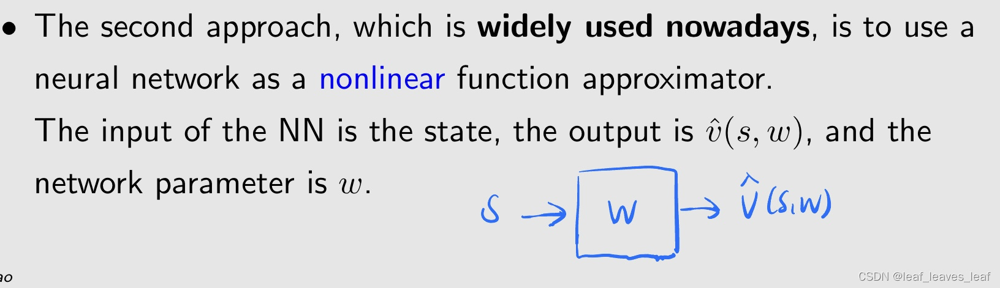

------

**Linear function approximation**

**下面我们再看一下线性的情况：TD-Linear**

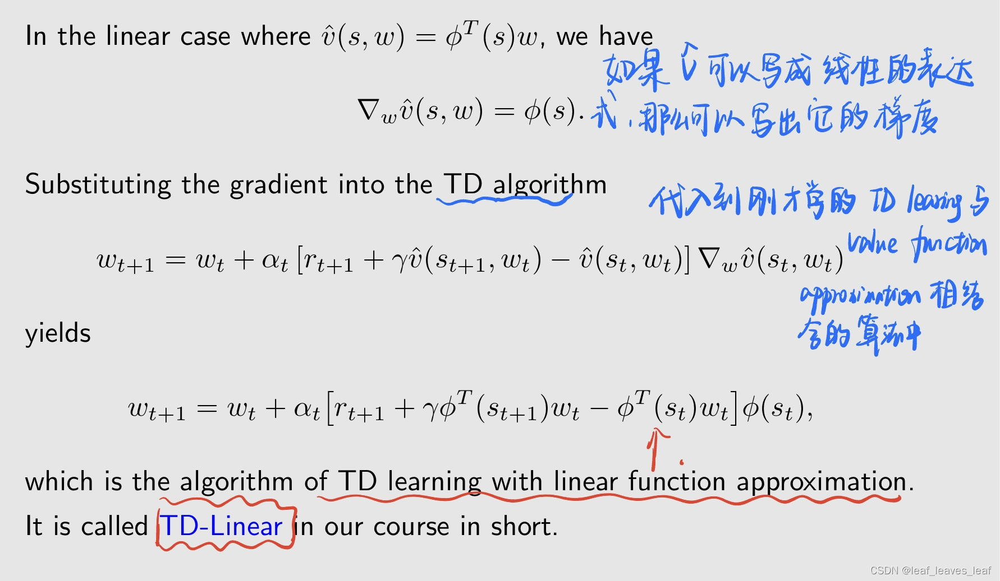

------

**Linear function approximation 的缺点：**

-   难以选择合适的特征向量（feature vector）。这个需要你对问题有很好的理解，很难选择出来很鲁棒的，很好的 feature vector
-   这也是 Linear function approximation 慢慢被神经网络所取代的一个重要原因，这个是传统机器学习(深度学习)被现在的深度学习所取代的原因也是类似的

**Linear function approximation 的优点：**

-   在线性情况下，TD 算法的理论特性比在非线性情况下更好理解。如果用非线性的神经网络去做，那么理论性质不好分析
-   虽然 Linear function 不能近似的实现所有的函数，但他还是有比较强的表征能力的
-   表格表示法（the tabular representation）只是线性函数逼近的一种特例（ a special case of linear function approximation），从这个意义上讲，线性函数逼近仍然很强大， Linear function approximation 可以把 tabular 和 value function approximation 统一起来。

------

接下来，我们将证明表格表示法是线性函数逼近的一种特例（We next show that the tabular representation is a special case of linear function approximation）

首先，考虑状态 s 的特殊特征向量：

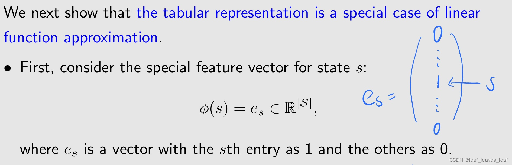

其中，es 是一个向量，第 s 项为 1，其他项为 0。如果我们选取这样的 feature vector，就会看到它最后的 value function 就变成了一个 Table

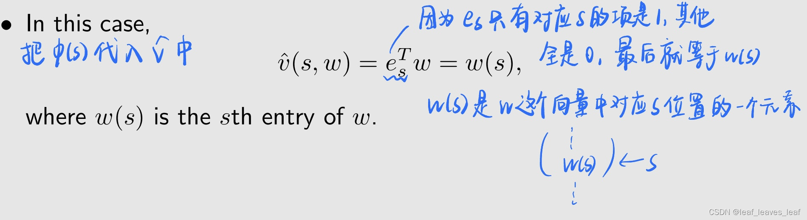

这时候 v hat 变成了一个向量或者说一个一维的表格，我要找 s 对应的 v hat，就直接去这个表格或者这个向量里边找对应 s 的位置的值

>   是所有状态的值，对应一个向量

------

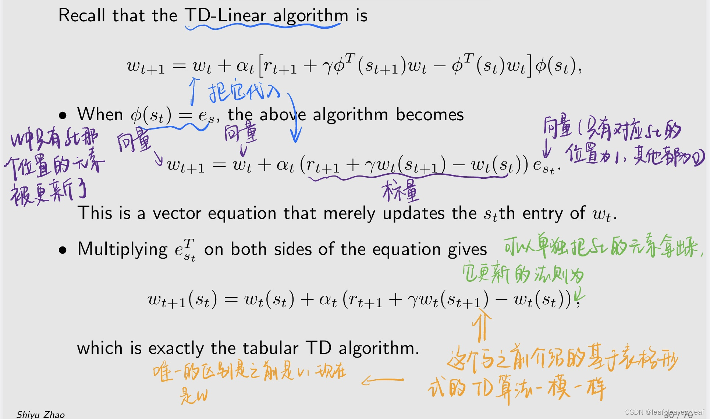

>   -   在这个特殊的情况下，选取的w以及对应的w(s)就是V和v(s)了
>   -   wt=[…,wt(st-1),wt(st),wt(st+1),…], 乘以es=[…,0,1,0,…]，等于wt(st)
>   -   也不用真理解，就知道这是个特殊情况就行
>   -   t和维度无关，只表示t时刻访问的状态，弄清楚这个应该挺好理解吧

------

### 4.例子（Illustrative examples）

考虑 5*5 的网格世界

-   对任意 s,a 给定一个探索性策略，在每一个状态对 5 个 action 都有相同的概率是 0.2
-   我们的目标是估算该策略的状态值 state value（policy evaluation 问题），对每一个状态我都要计算出它的 state value
-   总共有 25 个状态值，如果用表格的方法，我需要存储 25 个 state value。接下来我们将证明，使用 TD-linear 的方法，我们可以使用少于 25 个的参数来近似这 25 个状态值。

地面实况（Ground truth）：

因为我们要求 state value，那么我们可以先用基于模型，求解贝尔曼公式的方法得到，之后再用 TD-linear 的方法比较，看看 TD-linear 是否能够很好的求出 state value

这里面非常重要的一个工具就是我们要把这个二维的表格画成三维的复杂曲面，这个三维曲面的横轴和纵轴对应表格里的横轴和纵轴，三维曲面的高度就是表格里的值

-   真实状态值和 3D 可视化

>   -   这个初始的是怎么求得啊 原始定义吗
>   -   就用第一堂课讲的贝尔曼公式解，就是矩阵计算而已
>   -   求解贝尔曼公式得到的。直接用贝尔曼公式暴算
>   -   用policy interation或者value iteration，迭代求解，得到最优的state-value.算法开始的时候会给每个状态一个初始的state-value,然后迭代进行优化
>   -   25纬的State 并不多

下面我们用 TD-linear 要做的就是，需要得到一个函数，那个函数对应一个曲面，那个复杂的曲面和这个曲面越接近越好

为了实现这样的目标我们需要数据，因为没有模型。经验样本：

-    按照给定的策略生成 500 个 episodes
-    每个 episode 有 500 步，每个 episode 出发的 state-action pair 是随机选择的，并且遵循均匀分布。

为了比较，我们首先用基于**表格形式的 tabular TD algorithm（简称 TD-Table）**算一下，它所得到的 state value 绘制出来的曲面如下，与刚才的三维曲面非常接近。通过右图可知，随着越来越多的 episode，误差会逐渐减小到 0

>   -   tabular TD是离散的，但是linear TD是连续的
>   -   tabular就是上一章的TD，算出来应该跟实际值理论上一模一样

**接下来，我们将展示 TD-Linear 算法的结果。看它是否也能很好的估计出来 state value 呢？**

要用 TD-linear，第一步就是要建立它的 feature vector，我们的思路是要建立一个函数，这个函数也对应一个曲面，那个曲面能够很好的拟合真实的 state value 对应的曲面，函数对应的曲面最简单的情况就是平面，所以这时候我们选择 feature vector如下：

在这种情况下，近似的 state value v hat 为：

这个公式显然在三维空间中是一个平面，w1，w2，w3 是它的参数

值得注意的是，φ(s) 也可以定义为 φ(s) = [x, y, 1]T，feature vector 中元素的顺序并不重要。

把刚才的 feature vector 待入之前学的 TD linear 算法，可以得到：

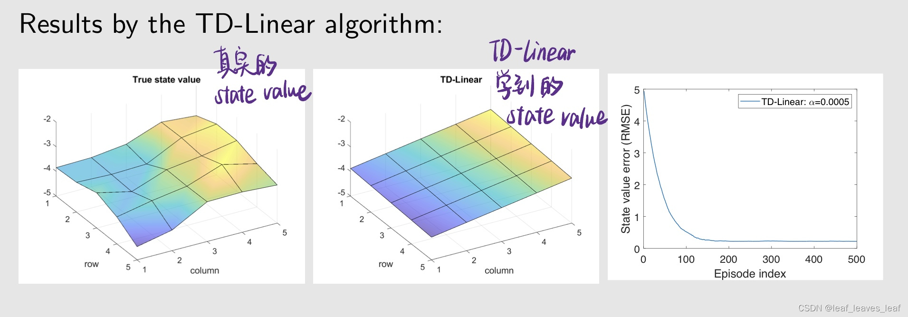

可以看出：

-    趋势是正确的，左边的值小，右边的值大，但在很多具体的点上，state value 的估计并不准确。由于近似能力有限，所以存在误差！从右图也可以看出来，虽然最后收敛了，但是收敛的误差并不是 0。
-    我们试图用一个平面来逼近一个非平面的曲面，这是很难的

------

为了提高近似能力，想更好的去拟合，就不能再用平面了，要用更复杂的高阶的曲面，这时候对应的 feature vector 的阶数也会更高，也会需要更多的 w 参数

例如，我们可以选择 feature vector 如下：

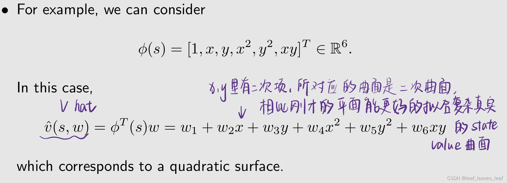

相当于一个二次曲面。

我们还可以进一步再增加 feature vector 的维数以及相应参数的个数，把 x,y 的三次方也加入，对应的 v hat 是一个三维空间中的三维曲面，它的拟合能力可能会更强一些

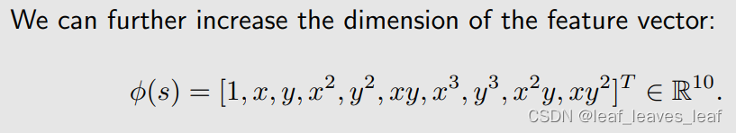

------

使用高阶特征向量（feature vector）的 TD-Linear 算法得出的结果

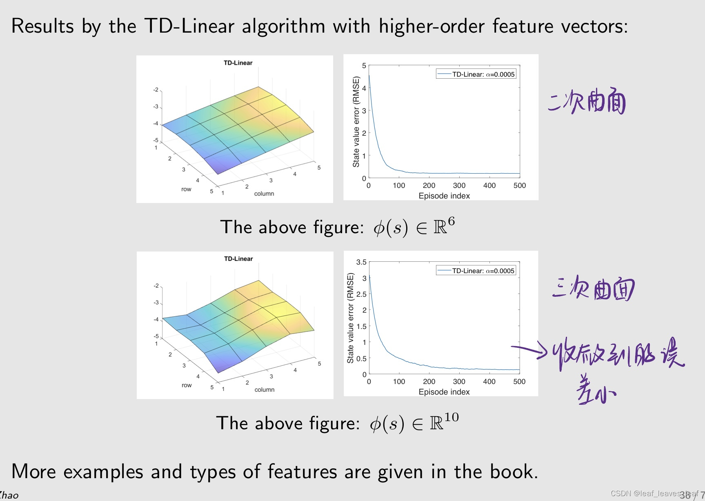

 使用更多的参数就可以得到更好的拟合效果，但是参数的个数不能过多，如果很多的话，那么最后就和 tabular 的情况没有区别了。

在线性 linear 的情况也并不意味着不断增加参数的个数就能够把最后的拟合误差减小到 0，因为它毕竟还是个线性的函数，函数的结构已经定了，即使再增加的话也不一定更好

这也是我们现在为什么广泛使用神经网络的原因，因为神经网络从理论上来说，可以近似任何一个非线性的函数

更多的例子和 feature vector 的选择可以看书

>   -   这就是神经网络
>   -   神经网络最大的特点是非线性，这里都是线性的
>   -   理论上维数够多就能完美拟合，但是参数越多就导致有时候不如表格数据少，带来权衡的问题
>
>   神经网络参数不是更多吗？
>
>   -   神经网络参数再多也有限，比连续状态无限多个参数好
>   -   参数多，但是可以炼出来

------

### 5.小结（summary）

到此为止，我们讲完了利用值函数逼近进行 TD 学习的故事。

1)   这个故事是从目标函数开始的：

目标函数表明这是一个策略评估（policy evaluation）问题。

2）然后对 objective function 进行优化，使用的算法是梯度下降（gradient descent）

问题是，上面算法里的 v_π(st) 我们不知道，我们可以按下面步骤替换 v_π

3）在算法中，未知的真值函数被近似值取代，从而产生了算法：

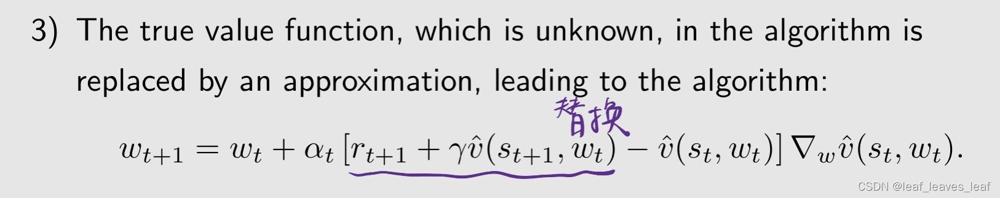

替换后所对应的算法就是 TD learning 和 value function approximation 相结合所得到的算法

**虽然这个故事有助于理解基本思想，但在数学上并不严谨。因为在第二步到第三步中做了替换，这种替换可能有问题**

**事实上，严格来讲，步骤三的算法并不是在 minimize 步骤一的 objective function，而是在 minimize 另外一个，之所以这里用这个故事来讲，是因为这样更好理解。下面给出解释**

>   随机梯度取代目标函数的真实梯度，后用TD算法给出的估计值取代状态值，最后对特征值的估计值进行线性/神经网络估计近似替代

------

### 6.理论分析（Theoretical analysis）

步骤三的算法并不是在 minimize 步骤一的 objective function，而是在 minimize 另外一个

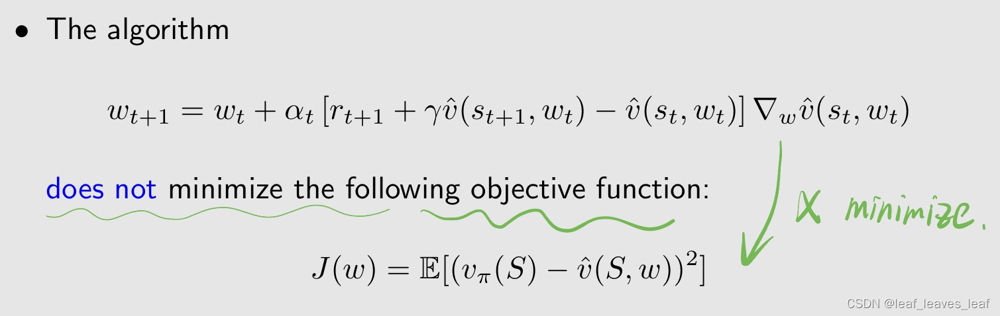

**实际上可能有多个 objective function**

上面这个就是刚才给出的 objective function 

>   -   D为度量矩阵或Gram矩阵——《矩阵理论第一章》
>   -   相合与对角阵D？！
>   -   D可以理解成协方差矩阵 信息矩阵

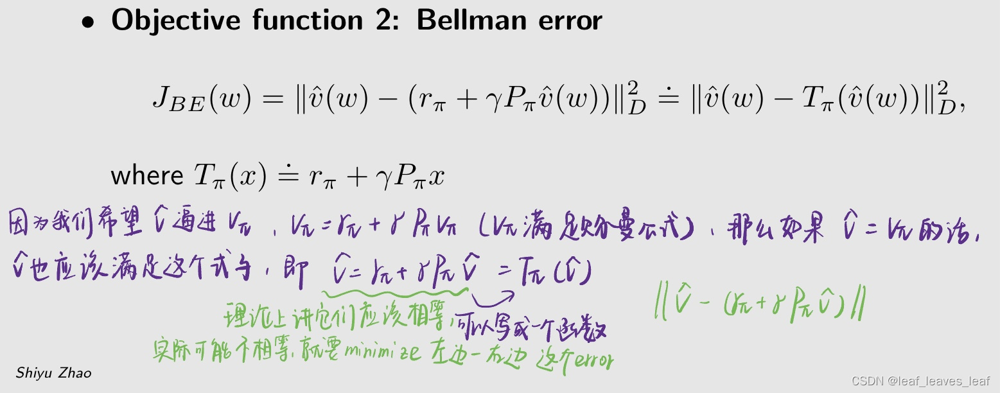

乘以投影矩阵，投影到 v hat 当你改变所有的 w 所组成的一个空间，这时候这个 error 可能等于 0，可能最优值是 0

The TD-Linear algorithm minimizes the projected Bellman error.

------

## **四.带有函数近似值的 Sarsa：Sarsa with function approximation**

四五六部分主要在讲算法，第三节在讲思想。第三节做的事情是来估计一个策略的 state value，下面 Sarsa 的部分我们要估计 action value，Q learning 和 deep Q learning 是要估计 optimal action value

到目前为止，我们仅仅考虑了状态值估计问题。也就是说，我们希望 

为了寻找最佳策略，我们需要估算动作值。

**带有值函数近似的 Sarsa 算法为：**

这个算法为什么是这样的，在干什么样的事情，我们不用介绍了，因为上一节第三节介绍过了

------

这个算法实际上还是在做 policy evaluation，也就是你给我一个策略 π，我能够估计出来它的 action value，下面我们会把这个和 policy improvement 相结合，这样就能搜索最优策略

**伪代码：**

任务是我从一个状态出发，要到目标状态，找到一个好的路径过去即可

在 value update 步骤中，我们并不是直接去更新 q hat(st,at)= 什么，而是我们要去更新它的 参数 parameter w，这是和之前 tabular Sarsa 的唯一区别

>   这里面take action a_(t+1)是为了干什么?
>
>   -   a_(t+1)算法中Value update的过程会用到，用来计算TD target
>   -   就是为了知道a_t+1是什么，然后就可以用到q_hat(s_t+1, a_t+1, w_t)里
>
>   q_hat可能是线性，可能是高阶形式吧？就看我们怎么选

>   要用参数 w，再带入 s 和 a 算一下函数值 q，这不就成了在线训练网罗了么

------

**例子：**

把 Sarsa 和 linear function approximation 相结合（Sarsa with linear function approximation）

任务是我从一个状态出发，要到目标状态，找到一个好的路径过去即可

------

## 五.**带有函数近似的 Q-learning（Q-learning with function approximation）**

与 Sarsa 类似，tabular Q-learning 也可以扩展到值函数逼近的情况。

Q learning 和 value function approximation 相结合的算法如下：

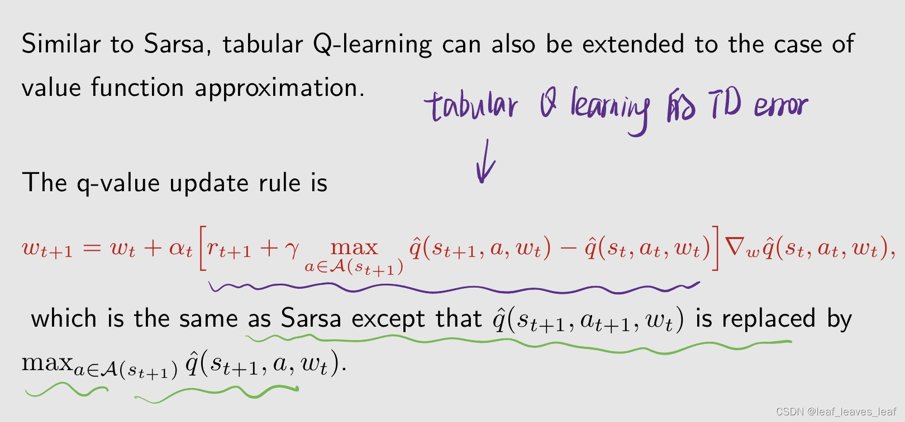

------

下面介绍伪代码，给一个 on policy 的版本，后面介绍 deep Q learning 的时候，会给一个 off policy 的版本。因为 Q learning 既可以 on policy，也可以 off policy

任务是从一个状态出发，要找到目标状态

>   这就就是把值更新换成了神经网络训练吧
>
>   是的，本来就是用神经网络来拟合这个q

------

例子：

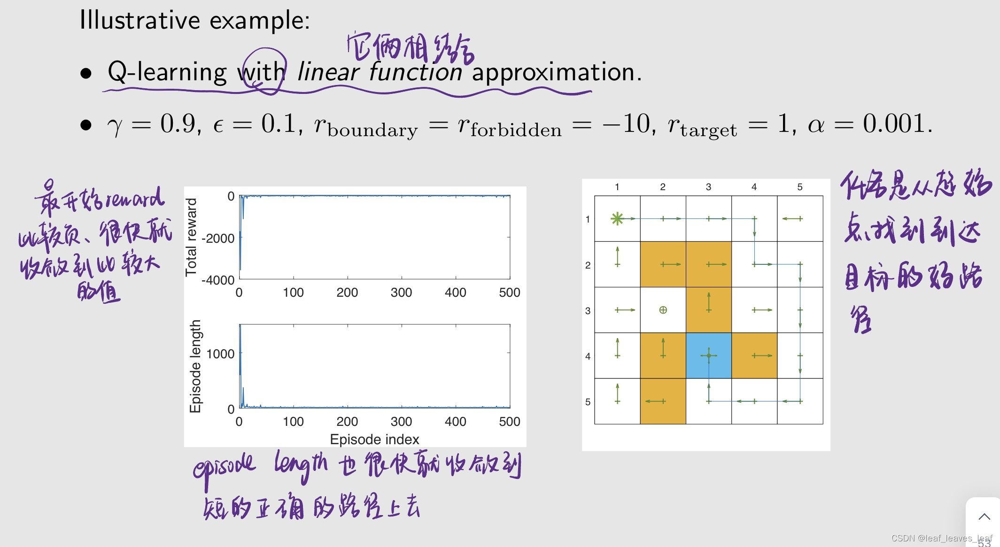

>   -   是啊 就只是把q收敛的过程换成w修正的过程
>   -   如果把phi设计的很复杂，这里肯定就overfitting了

------

## 六.**Deep Q learning**

 深度 Q 学习或深度 Q 网络（DQN）：

Deep Q-learning or deep Q-network (DQN):

-    将深度神经网络引入 RL 的最早和最成功的算法之一。
-    神经网络的作用是作为非线性函数近似器（The role of neural networks is to be a nonlinear function approximator）

>   就是用来拟合action value的

与下面的算法不同，下面算法是 Q learning with function approximation，那么为什么不能用这个算法，还要介绍 deep Q learning 呢？

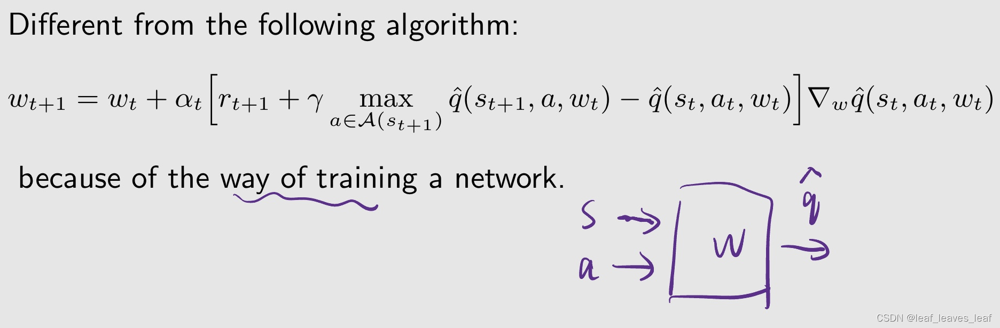

其实用这个给公式也可以，但是我们要对神经网络进行很底层的运算，我要计算出它的梯度然后直接赋值，对参数 w 进行修改。但是现在神经网络的工具包已经很成熟了，对我们而言就是一个黑盒，把数据送进去就能选择非常合适的参数和非常底层的算法做很好的训练。从这个角度来说，我们不再会用很底层的方法来做，而是会用接下来介绍的 deep Q learning

------

训练神经网络，需要一个 loss function 或者说 objective function

------

有了 objective function 就要进行优化，用梯度下降方法！

如何最小化目标函数？梯度下降法！

-    如何计算目标函数的梯度？（How to calculate the gradient of the objective function?）很棘手！但这也是 deep Q learning 的一个重要贡献
-    这是因为，在这个目标函数中

------

为了实现这个技巧，在 deep Q learning 中引入了两个 network，network 其实就对应 function

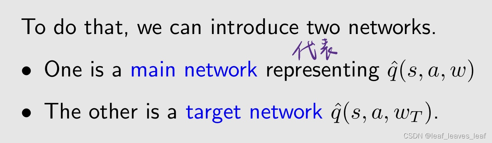

main network 的 w 一直在更新，有新的采样进来的话就会被更新，但是 target network 不是一直更新的，它是隔一段时间之后会把 main network 的 w 给赋值赋过来

我们有两个 network，把两个 q 区分开来，就得到如下的 objective function。在这种情况下，目标函数退化为：

在优化的时候我先假设红色的 w_T 固定不动，计算对另一个蓝色的 w 的梯度再去优化 J。它的思想是这样的：假设有一个 w_T 保持不动，我可以去更新 main network 的 w，更新了一段时间之后用它来赋值给 w_T，然后在基于这个 w_T 保持不动，再继续更新这个 w，所以最后 w_T 和 w 都能收敛到最优的值

------

基于刚才的 objective function，可以计算处 gradient，这里只有蓝色的 q 的梯度，关于红色 q 就没有梯度了

-   深度 Q-learning 的基本思想是使用梯度下降算法来最小化目标函数。
-   然而，这样的优化过程会演化出一些重要的技巧，值得特别已关注。

>   因为最终两个w必然是一样的

------

下面介绍一些技巧

**第一个技巧：**

使用了两个网络，而非一个网络，就是 main network 和 target network

**为什么会使用两个网络？**

-   因为在数学上计算梯度很复杂，所以我们先固定一个再去计算另一个，这样就需要两个网络，两个函数来实现

**具体实现细节：**

-   让 w 和 wT 分别表示主网络和目标网络的参数。它们初始设置为相同。
-   在每次迭代中，我们都会从重放缓冲区（replay buffer）（稍后会解释）中提取一批迷你样本 （mini-batch）{(s, a, r, s0)} 。replay buffer 中包含了很多的 experience/sample。我们会从这个集合中拿出一些 sample 用来做训练

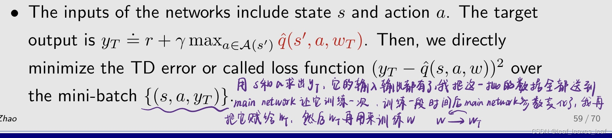

------

**第二个技巧：**

经验回放（Experience replay）

**什么是经验回放？**

-    在收集数据，收集经验样本（experience/sample）的时候是有先后顺序的。在收集到一些经验样本后，在使用的时候，我们不会按顺序使用这些样本。
-    相反，我们会将它们存储在一个名为重放缓冲区（replay buffer） B.= {(s, a, r, s0)} 的集合中。集合里的每一个元素就是一个 experience/sample。它是从 s 出发 take action a，得到的 reward 是 r，跳到的下一个状态时 s'
-    每次训练神经网络时，不是说谁先来的就先用谁训练。而是把他们全混在一起，从重放缓冲区集合中抽取一小批随机样本来训练。
-    拿过来再用的过程就叫 experience replay，经验已经在那里了，再用一次就叫回放。样本的抽取（或称为经验重放）应遵循均匀分布，也就是每个数据点被拿到的概率应该相同

**为什么 deep Q-learning 需要经验重放？为什么重放必须遵循均匀分布？**

在 objective function 中有几个随机变量：R,S',S,A。我要对这些随机变量求 expectation，需要知道他们的分布。

-   首先看（S,A）的分布，我们把（S,A）看作索引，当成一个随机变量（就是编程里面的字典），它就服从一个分布 d，之后会说这个分布 d 是什么
-   当 S 和 A 给定了之后，R 和 S' 要服从系统的模型，这里不过多讨论
-   假设状态-行动对（S，A）的分布是均匀的。为什么要均匀分布呢？其他的分布比如高斯分布行不行？我想给一些（S,A）更大的权重，那么在采样的时候当然也要更多次的去运用到他们，它的一个问题就是你要有先验知识，要知道谁是重要的，谁是不重要的。如果没有这个先验知识，就要一视同仁，所有的（S,A）的概率都应该是相同的，这时候就是均匀分布

>   优先采样的数据学习率低了，正好抵消掉了

-   然而，由于样本是由某些策略随之产生的，因此收集的样本并不均匀。也就是说数学上要求（S,A）是均匀分布，但是我采集数据的时候它一定是有先后顺序并且是按照其他的概率分布采集的，这时候怎么办呢？
-    我们可以不按照它的先后顺序进行使用，也就是用经验回放（experience replay）的方法，我把所有的 sample 拿到一起然后进行打散，然后从里面均匀的采样，这样就可以打破不同 sample 之间的相关性（correlation）。也就是说，为了打破后续样本之间的相关性，我们可以使用经验重放技术，从重放缓冲区中统一提取样本。
-    这就是为什么需要经验重放（experience replay）以及为什么要进行均匀采样的数学原因。

------

**问：为什么表格式 Q-learning 不需要经验回放？（Question: Why does not tabular Q-learning require experience replay?）但是现在和 value function 相结合却需要呢？**

回答：之前根本没有涉及到（s,a) 的分布，无均匀分布要求。

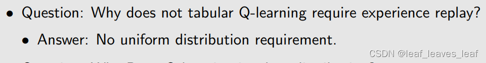

>   distribution的引入是因为要定义一个标量的目标函数

**问：为什么deep Q-learning 涉及到（s,a）的分布？（Question: Why Deep Q-learning involves distribution）而 tabular Q learning 不涉及（s,a）的分布呢？**

回答：deep Q learning 是 value function approximation 的方法，这一大类的方法都在做 optimization，也就是他要有一个 scalar 的 objective function 然后去做优化，这个 scalar 的 objective function 是一个 expectation，里面涉及很多东西，包括（S,A），所以要求解目标函数那里面肯定要涉及到（S,A）的分布。基于表格的 Q learning 是在求解贝尔曼最优公式，就是对于每个（s,a）都有一个式子组成这一组的式子，把它求出来，就可以求出最优的 action value

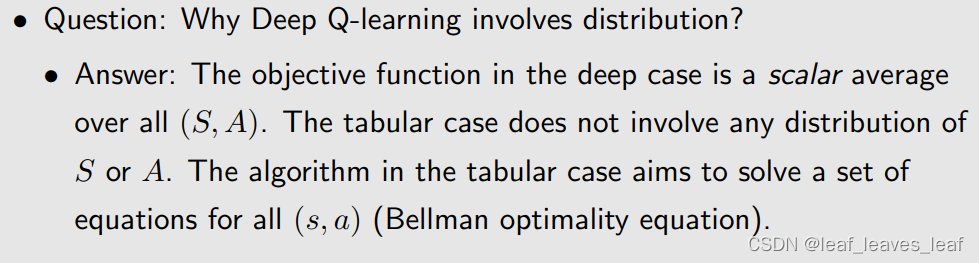

>   -   一个是直接求q(s,a)这个时候用的都是s，a。J(w)求解时用到了S,A，那此时你需要采样s,a表示S,A。采样时如何采样，使数据均匀分布
>   -   我的理解是，S和A在DQN中是随机变量，tabular中不是，只有随机变量需要考虑分布
>   -   贝尔曼公式里的期望是对转移概率和策略取的啊，这里的期望是对状态出现的概率
>   -   那是一组(s,a)元组，利用每个采集的元组去更新对应的旧的(s,a)我又不需要知道(s,a)的分布怎么样，只需要获取足够多样本就行
>   -   这一部分可能是在用函数拟合的时候不同数据会对同一个拟合函数产生影响，所以希望概率高的状态影响大一点所以在使用数据的时候按概率使用，而表格的情况下不同的数据在修正不同表格的值，所以不会受分布影响
>   -   一个是迭代求解方程组，一个是做拟合 
>   -   emm我感觉不管是什么算法，把S A当随机变量的话，它们的概率分布是客观存在的，只取决于算法里有没有用到
>   -   表格形式本质是一种离散分布，理论上我们是知道全部（s，a）的数据，这个分布的全部信息我们是了解的，因此不用对于分布进行假设
>   -   连续空间中sa是无限多，因此需要某些先验信息，而无信息情况下就使用平均分布的假设
>   -   就是一个求解公式，一个求解期望，期望需要分布
>   -   因为值函数是为了预测，因此需要假设分布并采样

**问：能否在表格式 Q-learning 中使用经验回放？**

回答：可以，因为 tabular Q learning 也是 off-policy 的算法，off-policy 不管是怎么得到的数据，给一个（s,a），就去更新那个（s,a）对应的 q 即可。而且用 experience replay 有好处，它可以让你的 sample 更加 efficient，因为同一个 sample 可以用多次，因为是在一个 replay buffer 中均匀采样，总是可能对一个 sample 采样很多次，这样就可以充分的重复利用，而 tabular Q learning 有些浪费数据。

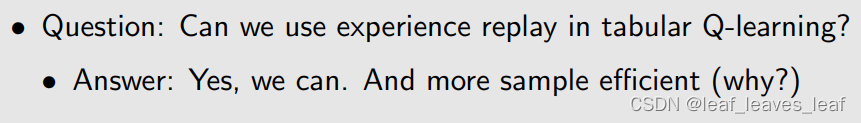

>   之前的 Q learning 仿真一个 episode 需要 10 万步，实际上我根本不需要这么多步数，只需要每个 state-action pair 能够被访问到就可以了，访问很多次和访问一次是没有太大区别的，因为他是确定性的环境，所以只要能够访问一次就可以了，可以反复用这一次的经验。当然如果是 stochastic 就另当别论
>
>   之前是按照时序来的，那我访问一次，之前所有的经验全都丢掉了，这在一定程度上是一种浪费

------

deep Q learning 伪代码：off policy 的版本 

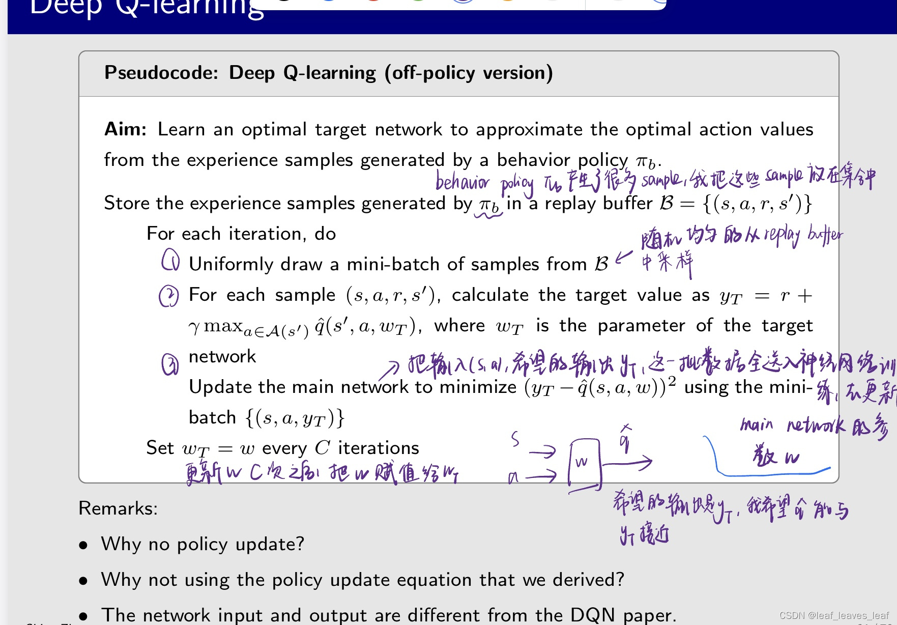

**问题1：为什么这里没有 policy update？只是在进行 value update？**

回答：因为这里是 off policy 的，如果是 on policy 的后面要加上一条做 policy update，然后在下一个 iteration 中你的新的策略要去生成数据。但是现在因为已经有数据了，所以不需要这么做。当然也可以在后面加上一条去更新策略，但是你的策略是没用的，所以也可以在所有的 q 全部计算完之后，一次性的只计算一次 policy，就得到了最优的 policy

>   -   神经网络里面的BP（反向传播）其实就是梯度下降的过程，等效那个梯度
>   -   训练神经网络时把yT视为label，qhat视为输出做监督学习
>   -   就是说梯度下降那块已经属于神经网络黑盒那块，跟算法没关联了

**问题2： 为什么不使用我们推导出的策略更新方程呢？Why not using the policy update equation that we derived?**

之前给的一个 policy update equation，就是有一个目标函数里面有两个 w，我要固定一个 w 然后求另一个 w 的梯度，我们计算出来了一个梯度，为什么不用那个梯度呢？

因为那个算法比较底层，它可以指导生成现在的算法，但是现在神经网络的工具包已经很成熟了，对我们而言就是一个黑盒，我们要遵循神经网络训练的时候黑盒的特性，更好的高效训练。把数据送进去就能选择非常合适的参数和非常底层的算法做很好的训练。

>   不是minimize目标函数的那个梯度下降的函数
>
>   不用那个梯度怎么更新w啊？
>
>   -   梯度的计算已经在神经网络更新的时候进行了，这部分工作现有的工具已经帮我们做了，我们只需要给他提供yT。
>   -   tips: 此处可直接使用现有神经网络库中的训练函数（不仅仅是梯度下降 还有更多算法
>   -   实际是用了梯度的，只是没有用公式显式的计算吧
>   -   最小化(y_T-q(s,a,w))^2的时候已经更新w了
>   -   是啊，minimize的时候神经网络梯度下降肯定已经用到那个更新式子了
>   -   神经网络里面的BP（反向传播）其实就是梯度下降的过程，等效那个梯度
>   -   训练神经网络时把yT视为label，qhat视为输出做监督学习
>   -   就是说梯度下降那块已经属于神经网络黑盒那块，跟算法没关联了

**问题3： 网络输入和输出与 DQN 原论文不同。 The network input and output are different from the DQN paper.**

原文是 on policy，我们这里是 off policy，原文更加高效。我们这里要输入五次（s,a）才能得到五个 q hat，再去求哪个最大，但是原文只用输入一次 s 就能直接得到了这 5 个 a 对应的 q，再去求哪个最大

------

用刚才的伪代码举例：

-   本例旨在学习每对状态-行动的最优行动值。This example aims to learn optimal action values for every state-action pair.
-   一旦获得最佳行动值，就能立即获得最佳贪婪策略。Once the optimal action values are obtained, the optimal greedy policy can be obtained immediately

仿真设置

-    使用了一个 episode 来训练网络。
-    如图（a）所示，该 episode 由一个探索性的 behavior policy 生成。这个策略就是对每个 action 给的概率都是 0.2
-    该 episode 只有 1,000 个步骤！tabular Q learning 需要 100,000 步。
-    我们使用一个具有单个隐藏层的浅层神经网络作为 qˆ（s, a, w）的非线性近似值。隐藏层有 100 个神经元。虽然是叫 deep Q learning，但是如果是在做函数的拟合，很多时候不需要是深的，我们这里只用了三层，输入输出和隐藏层

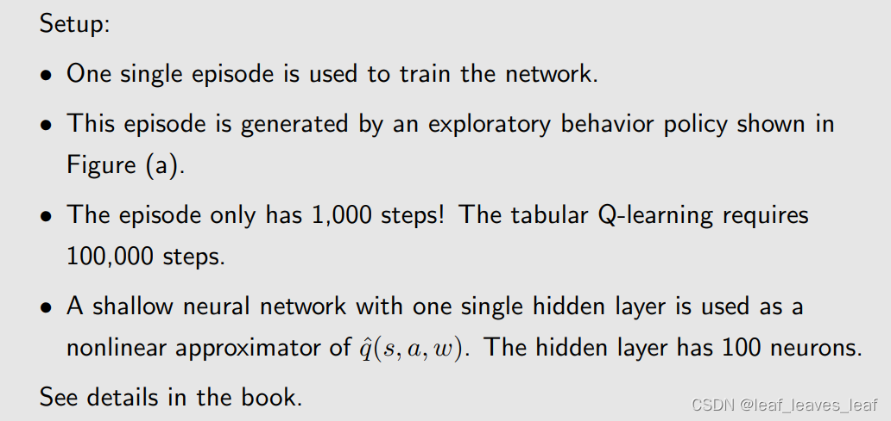

用 behavior policy 跑 1000 步，中间的图 b 就是最后得到的 episode，基本上所有的 state action pair 都被访问到了，但是有的访问多有的访问少。

把这个送入刚才的伪代码中，最后输出得到的最优策略就是图 c

横轴是 iteration 的 index

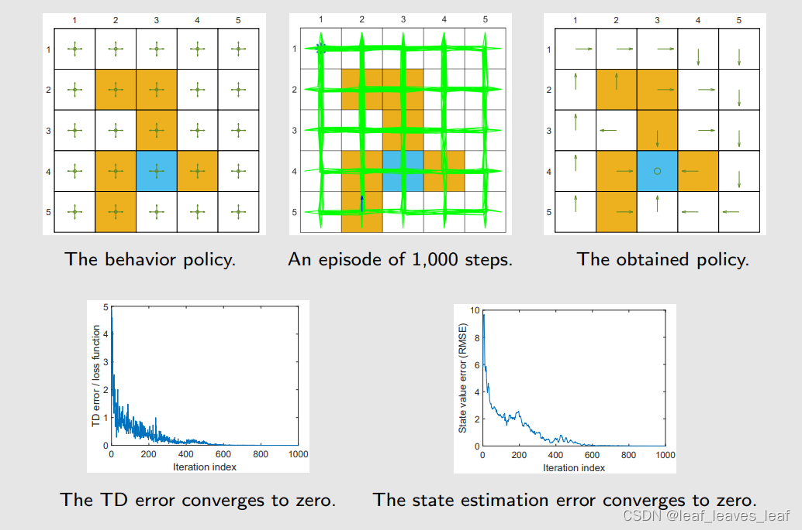

这个例子的目的是，只需要很少的数据量就可以得到相同结果。因为基于 value function approximation 本身就有很好的泛化能力，并且这里还用了 experience replay，所以你的经验可能会被反复用到，效率更高

------

只跑 100 步呢

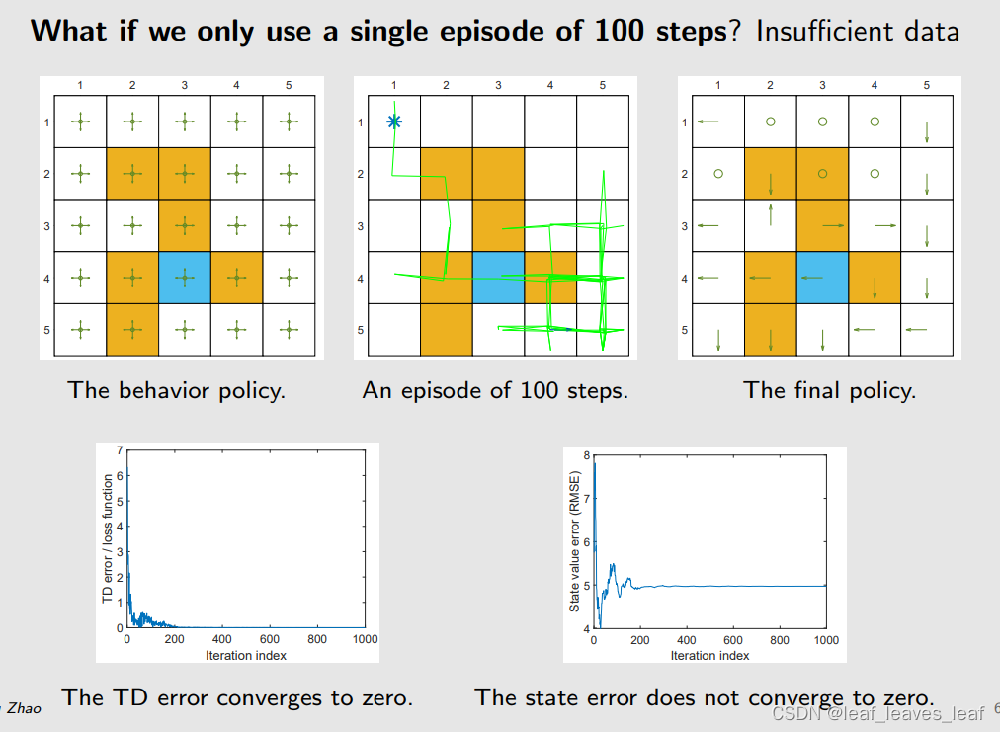

再强大的算法也得有好的数据

------

## 七.总结

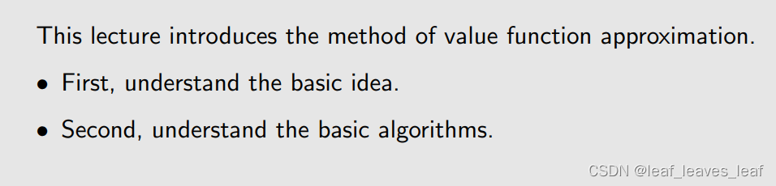